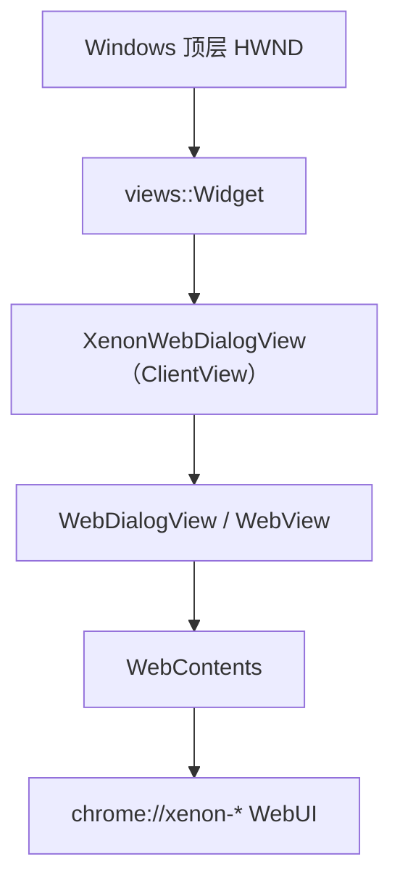
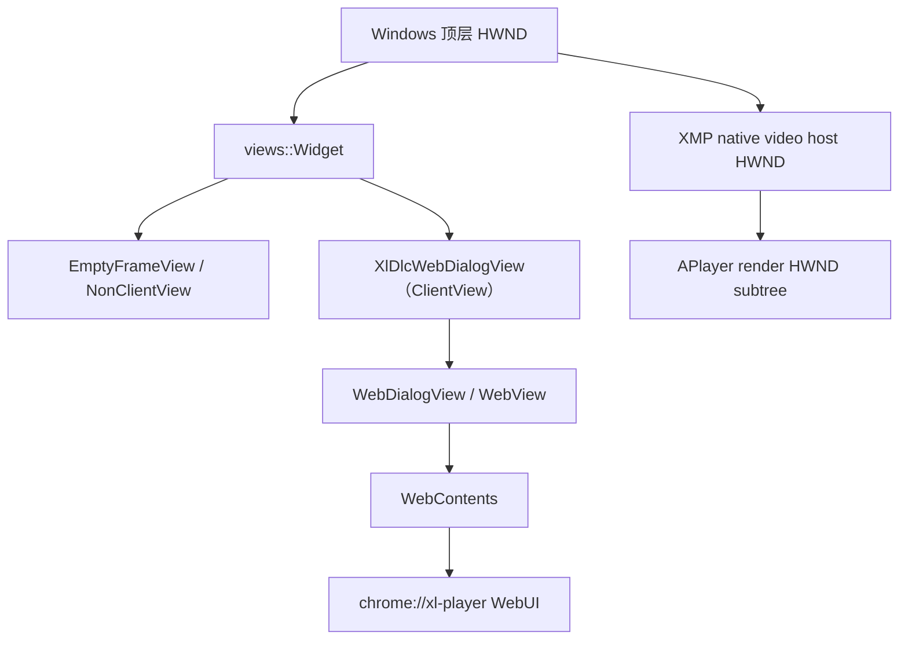
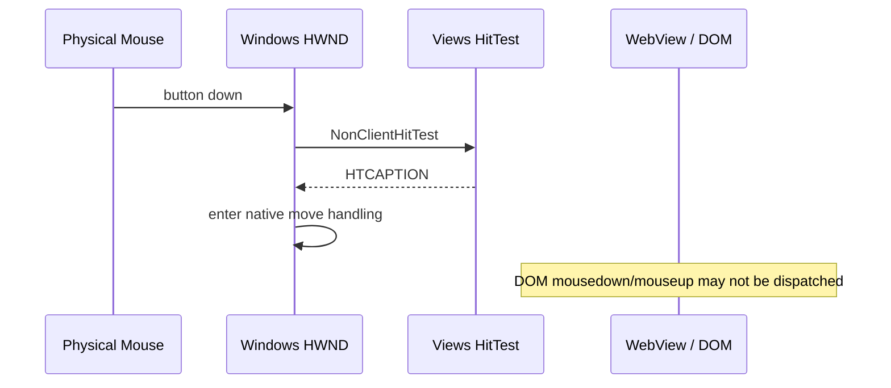
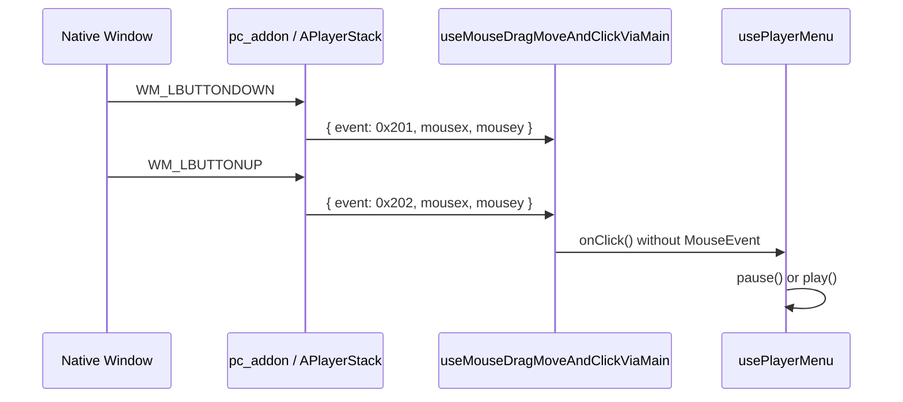

# XenonWebDialog / Chromium WebDialog 拖动与鼠标事件透传流程

本文先以 `XenonWebDialog` 说明通用 `WebDialog` 的 WebUI、拖动区域、无边框缩放和模态事件流程，再以 xl-player 说明如何扩展出“视频区域拖动窗口”和“单击暂停/播放”并存的 native 消息桥。

> 这里的“鼠标透传”不是单一机制。需要区分 DOM 事件传播、`-webkit-app-region` 窗口命中，以及 Browser C++ 主动向 WebUI 转发 native window message。

---

## 1. 相关代码

| 层次 | 文件 | 职责 |
|------|------|------|
| Xenon WebDialog | `xenon_overlay/chrome/browser/ui/xenon_web_dialog.{h,cc}` | 通用窗口创建、drag/no-drag 命中、无边框缩放、阴影、模态事件拦截 |
| Xenon WebUI | `xenon_overlay/resources/webui/login/login.css` | 登录窗口标题栏 drag、控件 no-drag |
| Xenon WebUI | `xenon_overlay/resources/webui/xenon/index.css` | Xenon 主窗口标题栏 drag、窗口按钮 no-drag |
| WebDialog / Views | `xunlei/chrome/browser/ui/views/dlc/xl_dlc_web_dialog.cc` | 创建播放器 Widget、维护拖动区域、命中测试、点击/拖动识别 |
| WebUI PageHandler | `xunlei/chrome/browser/ui/webui/xl_player_page_handler.{h,cc}` | Browser 与 `chrome://xl-player/` 的 Mojo 通道 |
| WebUI 兼容层 | `xunlei/resources/webui/xl-player/backend.ts` | 模拟 Electron/native addon API，分发 window message |
| 播放器前端 | `player-comp/impl/aplayer-stack.ts` | 将 native 参数包装成前端 `WndMessageEvent` |
| 点击识别 | `player-comp/ui/composables/useMouseDragMoveAndClickViaMain.ts` | 区分单击、双击、拖动 |
| 播控动作 | `player-comp/ui/xmp-player/compositions/usePlayerMenu.ts` | 调用 `pause/play/toggleFullScreen` |

关键消息值：

| 消息 | 值 | 前端含义 |
|------|----|----------|
| `WM_LBUTTONDOWN` | `0x0201` / `513` | 鼠标左键按下 |
| `WM_LBUTTONUP` | `0x0202` / `514` | 鼠标左键抬起；用于完成单击计数 |
| 播放器拖动消息 | `1536` | 原版约定：本次操作已进入拖动，不再触发点击 |

---

## 2. 窗口与渲染层级

`XenonWebDialog` 和播放器都不是普通网页标签，而是独立的 Views Widget。通用 Xenon 层级：



播放器在该模式上增加 native 视频窗口和消息桥：



WebUI 位于播控层，负责标题、菜单、进度、选集和点击来源；XMP native HWND 负责视频画面。两者通过 HWND 层级、D3D 合成和透明区域共同显示。

因此鼠标事件可能在以下位置终止：

1. Windows 非客户区命中测试。
2. Views 根 View。
3. WebView / Renderer DOM。
4. XMP native 子窗口。

不能只看 DOM `event.target` 判断物理鼠标最终走了哪条路径。

---

## 3. `-webkit-app-region` 如何变成拖动区域

前端使用两类 CSS：

```css
.draggable {
  -webkit-app-region: drag;
}

.none-draggable {
  -webkit-app-region: no-drag;
}
```

`XenonDraggableRegionsEnabler` 在构造、主 frame 创建和 `DOMContentLoaded` 时调用 `WebContents::SetSupportsDraggableRegions(true)`。Renderer 解析 CSS 后，通过 `DraggableRegionsChanged(...)` 上报给 Browser。`XenonWebDialogView` 和 `XlDlcWebDialogView` 都将区域保存到 `SkRegion draggable_region_`：

- `drag`：`SkRegion::kUnion_Op`
- `no-drag`：`SkRegion::kDifference_Op`

最终区域是多次 union/difference 后的结果，不等于某个元素的 `getComputedStyle(...).webkitAppRegion`。

### 3.1 XenonWebDialog 基准命中流程

`XenonWebDialogView::NonClientHitTest()` 的处理顺序：

1. 无边框且允许缩放时，先计算边框和四角 resize hit。
2. 原生缩放路径返回 `HTLEFT/HTTOP/...`。
3. 自绘阴影路径返回 `HTCLIENT`，后续由 Views 手动缩放。
4. 将 View 坐标减去 `GetInsets().left()/top()`，得到 WebUI 内容坐标。
5. 内容坐标位于 `draggable_region_` 时返回 `HTCAPTION`。
6. 其余区域走 `WebDialogView::NonClientHitTest()`。

`ShouldDescendIntoChildForEventHandling()` 对 resize 边框和 drag 区域返回 `false`，避免 WebView 抢走应由窗口层处理的事件。drag 区域判断也必须减去 `GetInsets()`；自绘阴影通过 empty border 占据外围空间，而 `DraggableRegionsChanged()` 给出的坐标属于 WebUI 内容区。

### 3.2 xl-player 特化命中流程

`XlDlcWebDialogView::NonClientHitTest()` 的处理顺序：

1. 四角和边框返回 `HTTOPLEFT/HTLEFT/...`，交给系统缩放。
2. 播放视频区域返回 `HTCLIENT`，由根 View 接收鼠标并区分点击/拖动。
3. 其它 `draggable_region_` 返回 `HTCAPTION`，交给系统窗口拖动。
4. 其余区域走 `WebDialogView::NonClientHitTest()`。

`ShouldDescendIntoChildForEventHandling()` 对缩放边框和拖动区域返回 `false`，避免 WebView 抢走这些事件。

### 3.3 为什么菜单按钮仍然有效

菜单、音量、进度条等元素带 `.none-draggable`，会从 `draggable_region_` 中扣除。命中这些区域时，事件继续进入 WebView，最终成为正常 DOM 鼠标事件。

---

## 4. XenonWebDialog 的无边框缩放与模态事件

### 4.1 DWM 和自绘阴影分支

| 窗口模式 | 阴影/圆角 | resize 实现 |
|----------|-----------|-------------|
| `frame=true` | Chromium 原生 frame | 基类处理 |
| `frame=false, dwm=true, Win11+` | DWM 圆角；窗口保持 opaque | `NonClientHitTest()` 返回 `HT*`，Windows 原生缩放 |
| `frame=false` 且不能使用 DWM 圆角 | translucent 窗口、自绘 `ui::Shadow` | resize 区返回 `HTCLIENT`，Views 捕获鼠标并手动 `SetBounds()` |

Windows translucent HWND 会被 Chromium 移除 `WS_THICKFRAME`。此时即使返回 `HTLEFT/HTTOP`，也可能只有缩放光标而窗口不动，因此 `UseManualResize()` 走以下流程：

1. `OnMousePressed()` 保存 resize hit、屏幕起点和窗口初始 bounds，并调用 `SetCapture()`。
2. `OnMouseDragged()` 根据屏幕坐标差修改对应边界。
3. 最小尺寸至少为 `64x64`；自绘阴影模式还要加两侧 shadow margin。
4. `OnMouseReleased()` 或 `OnMouseCaptureLost()` 清理状态并释放 capture。

圆角外侧通过圆心距离排除，避免透明圆角区域错误出现 resize 光标。

### 4.2 自绘阴影和坐标系

自绘阴影通过 `SetBorder(CreateEmptyBorder(margin))` 把 WebUI 内容向内缩。三套坐标需要明确：

| 坐标 | 用途 |
|------|------|
| Widget/View 坐标 | resize hit、鼠标事件 |
| WebUI 内容坐标 | `SkRegion draggable_region_` |
| 屏幕坐标 | 手动 resize、窗口移动 |

因此 drag/no-drag 命中使用 `point - GetInsets()`；手动缩放使用 `ConvertPointToScreen()`，不能混用。

### 4.3 自定义窗口模态

`modalType=window_custom` 时，delegate 对 Chromium 声明 `kNone`，并在 parent Aura window 安装 `ModalEventBlocker`：

- dialog 内事件放行。
- parent 客户区 mouse/touch/key 事件标记 handled，并激活 dialog。
- parent 非客户区不拦截，保留系统标题栏行为。
- blocker 随 delegate 析构，从 parent 移除 pre-target handler。

这属于“父窗口输入屏蔽”，与 drag 区域阻止事件下沉到 WebView 是两套独立机制。

### 4.4 与 xl-player 的差异

| 能力 | XenonWebDialog | xl-player WebDialog |
|------|----------------|---------------------|
| CSS drag/no-drag | 支持 | 支持 |
| resize | DWM 原生或 Views 手动缩放 | 播放器自己的边框命中流程 |
| 普通 drag 区 | `HTCAPTION`，交给系统 | `HTCAPTION`，交给系统 |
| 视频区点击/拖动并存 | 无此业务 | `HTCLIENT` + C++ 点击/拖动状态机 |
| native 鼠标消息桥 | 无 | Mojo → `backend.ts` → 原版前端 |
| 自定义 window modal | `ModalEventBlocker` | 无此流程 |

因此不应把 xl-player 的 `0x201/0x202/1536` 转发直接下沉到通用 `XenonWebDialog`。通用类负责窗口机制；播放器特化类负责业务协议。

---

## 5. `player-screen-container` 的作用

`player-screen-container` 来自原版 `XmpScreenMirror.vue`：

```vue
<div ref="$screenContainer" class="player-screen-container">
  <div v-if="currentDevice" class="player-screen">
    ...
  </div>
</div>
```

特点：

- 外层容器始终存在。
- 未投屏时容器为空。
- 投屏时才创建 `.player-screen` 子节点。
- Browser 运行时该透明容器可能覆盖整个播放区域，成为 `elementFromPoint()` 的首个元素。

它不是 Browser 版新增元素。Browser 与 Electron 的差异主要在物理鼠标如何从窗口层进入前端。

---

## 6. 为什么 drag 区域收不到 DOM 点击

当播放区域最终属于 `app-region: drag` 时：



这里不是 Vue 的 `click.stop` 消费事件，而是 Chromium/Windows 在 DOM 之前将其作为窗口拖动处理。

CDP `Input.dispatchMouseEvent` 会直接向 Renderer 注入事件，绕过物理窗口命中测试。因此“CDP 点击成功、物理点击失败”通常说明问题发生在 Win32/Views 命中层，而不是播放器的 `pause()` 实现。

---

## 7. Electron 原版的点击路径

Electron 原版同时监听：

1. DOM `mousedown/mouseup`。
2. native `attachWndMessageEvent`。

透明播放区域可能不产生 DOM 事件，但 native 层仍可回传窗口消息：



`onClick()` 不带 DOM `MouseEvent`，因此不会进入 `target.matches('.xmp-player')` 一类 DOM target 过滤。这是 Browser 版应保持的原版行为。

---

## 8. Browser 版消息桥

### 8.1 C++ → Mojo

`XlPlayerPageHandler::BroadcastPlayerWindowMouseMessage(event, x, y)` 将 C++ 鼠标状态发送到现有通道：

```text
xunlei-player:window-message
```

payload：

```json
{
  "event": 513,
  "mousex": 540,
  "mousey": 337,
  "sysKeyList": [],
  "keyStr": "",
  "keyid": 0
}
```

### 8.2 Mojo → backend

`backend.ts` 的 `pageCallbackRouter.onIpcEvent` 收到通道后调用：

```text
emitWndMessageEvent(payload)
```

然后按 Electron native addon 的六参数签名调用 `attachWndMessageEvent` 注册的 callback。

### 8.3 backend → 原版前端

`AplayerStack.attachWndMessageEvent` 将六参数重新包装为：

```ts
{
  event: message,
  mousex: x,
  mousey: y,
  sysKeyList,
  keyStr,
  keyid,
}
```

之后进入原版 `useMouseDragMoveAndClickViaMain`，前端业务代码无需修改。

---

## 9. 点击与拖动如何共存

选定方案不再给 `.player-screen-container` 注入 `no-drag`。播放区域仍允许拖动，但由 C++ 根 View 手动区分操作类型。

### 9.1 状态机

```mermaid
stateDiagram-v2
    [*] --> Idle
    Idle --> Pressed: left down / send 0x201
    Pressed --> Click: left up before threshold
    Click --> Idle: send 0x202
    Pressed --> Dragging: movement >= SM_CXDRAG or SM_CYDRAG
    Dragging --> Dragging: send 1536 once / RunMoveLoop
    Dragging --> Idle: move loop ends / send 0x202
```

前端已有对应逻辑：

- 没收到 `1536`：`WM_LBUTTONUP` 进入单击/双击计数。
- 收到 `1536`：设置 `isDraged = true`，抬起时不调用 `onClick()`。

### 9.2 C++ 处理步骤

1. `OnMousePressed`
   - 仅处理视频播放区域左键。
   - 记录按下时屏幕坐标。
   - 发送 `WM_LBUTTONDOWN`。
   - 捕获鼠标。

2. `OnMouseDragged`
   - 与起点比较。
   - 未达到 `SM_CXDRAG/SM_CYDRAG`：继续等待。
   - 达到阈值：发送 `1536`，释放捕获并调用 `Widget::RunMoveLoop()`。

3. `OnMouseReleased`
   - 未进入 move loop：发送 `WM_LBUTTONUP`，形成点击。
   - move loop 返回：使用当前屏幕坐标换算新的窗口客户区坐标，再发送 `WM_LBUTTONUP`。

4. 生命周期保护
   - `RunMoveLoop()` 是嵌套消息循环，返回前窗口可能关闭。
   - 调用前保存 `WeakPtr<XlDlcWebDialogView>`，返回后先检查对象是否仍存活。
   - `OnMouseCaptureLost()` 清理未进入 move loop 的按下状态。

### 9.3 区域划分

| 区域 | 命中结果 | 行为 |
|------|----------|------|
| 2px 缩放边框 | `HTLEFT/HTTOP/...` | 系统缩放 |
| 顶部 70px header | `HTCAPTION` | 系统拖动/标题栏行为 |
| 视频播放区域 | `HTCLIENT`，不下沉 WebView | C++ 区分点击与拖动 |
| `.none-draggable` 菜单/按钮 | WebView | 正常 DOM 交互 |

---

## 10. 为什么不采用 backend `no-drag` 方案

曾验证过以下方案：

1. backend 给 `.player-screen-container` 注入 `-webkit-app-region: no-drag`。
2. capture 监听 DOM `mousedown/mouseup`。
3. 转成 `0x201/0x202` 发给原版前端。

优点：实现简单，物理点击可立即进入 WebView。

缺点：`no-drag` 会从窗口拖动区域中扣除整个视频区域，导致“可点击，但不能从视频区域拖动窗口”。DOM 无法在事件到达前决定本次操作是点击还是拖动。

因此此方案仅适用于“不要求视频区拖窗”的窗口，不适合 xl-player。

---

## 11. 验证方法

### 11.1 构建和启动

```powershell
autoninja -C .\out\release_64 chrome
G:\xl-browser\src\out\release_64\XunleiBrowser.exe --remote-debugging-port=9222
```

注意 Chromium 单实例机制。若安装版已经运行，再启动 `out/release_64` 可能只会激活旧进程。

检查主进程路径：

```powershell
Get-CimInstance Win32_Process -Filter "Name='XunleiBrowser.exe'" |
  Select-Object ProcessId, CommandLine
```

必须确认测试的是 `out/release_64/XunleiBrowser.exe`，或确认新产物已经复制到安装目录。

### 11.2 日志

Browser 日志：

```text
[XlPlayerMouse] event=513 x=... y=...
[XlPlayerMouse] event=1536 x=... y=...
[XlPlayerMouse] event=514 x=... y=...
```

DevTools console：

```text
[player_electron_backend] native window message: { event, mousex, mousey }
```

播放动作日志：

```text
[player_electron_backend] pauseMedia called
[player_electron_backend] resumeMedia called
```

### 11.3 预期矩阵

| 操作 | 消息序列 | 预期 |
|------|----------|------|
| 视频区单击 | `513 → 514` | 暂停或继续播放 |
| 视频区拖动 | `513 → 1536 → 514` | 窗口移动，不切换播放状态 |
| 视频区双击 | 两组 `513/514` | 原版前端切换全屏 |
| 点击菜单按钮 | 无 C++ 播放区消息 | 按钮自己的 DOM 行为 |
| 拖动 header | 系统 `HTCAPTION` | 移动窗口 |
| 拖动边框 | 系统 resize hit test | 调整窗口大小 |

---

## 12. 排障顺序

1. **确认二进制路径**：先排除启动了旧安装版。
2. **检查 Browser 日志**：是否有 `513/514/1536`。
3. **检查 backend 日志**：确认 Mojo 消息进入 Renderer。
4. **检查消息序列**：只有 `513` 没有 `514`，优先查 capture/release。
5. **检查拖动阈值**：普通点击出现 `1536`，优先查坐标系或阈值判断。
6. **检查 DOM 控件区域**：按钮产生 C++ 消息，说明 `no-drag` 区域未正确从 `SkRegion` 扣除。
7. **不要用 CDP 注入代替物理点击结论**：CDP 绕过 Windows/Views 命中流程。

---

## 13. 结论

- `app-region: drag` 是 Browser 窗口命中规则，不是普通 DOM 样式。
- `XenonWebDialog` 的 drag/no-drag 坐标属于 WebUI 内容区，自绘阴影存在时必须扣除 View insets。
- 无边框缩放需区分 DWM 原生路径和 translucent HWND 的 Views 手动路径。
- 拖动区域中的物理点击可能在进入 Renderer 前被消费。
- `pointer-events`、DOM `stopPropagation()` 无法修复发生在 Win32/Views 层的问题。
- `no-drag` 能恢复 DOM 点击，但会失去对应区域的系统拖动能力。
- 要同时支持点击和拖动，应在 Browser C++ 根 View 中按系统阈值区分，再复用 Electron 原版 `0x201/0x202/1536` 协议通知前端。
- 保持 window-message 协议一致，可以最大限度复用原版前端并减少行为分叉。
