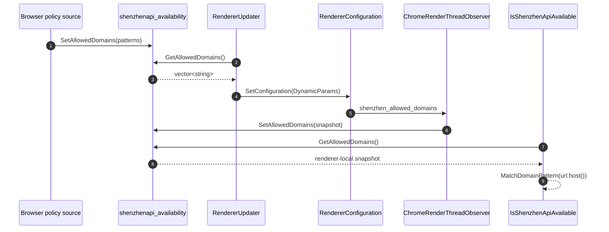

# `chrome.shenzhen` 动态域名校验架构

## 1. 目标与边界

`chrome.shenzhen` 是仅向授权网页暴露的私有扩展 API。可用性检查发生在
Renderer 的扩展绑定生成阶段，因此必须满足：

- Browser Process 是策略事实源；
- Renderer 可以同步、低成本地完成域名匹配；
- 域名列表不通过子进程命令行传播；
- Renderer 收到的列表只是策略快照，不能代替 Browser 对高权限操作的最终校验；
- 配置不落入普通网页可访问的 JavaScript 对象。

当前默认规则为 `*.so.com`。规则支持精确域名、`*.domain` 子域形式和显式的
`*`；修改默认值或引入远端配置时仍应遵循最小授权原则。

## 2. 进程架构

```text
Browser Process
  shenzhenapi_availability
    base::Lock + process-local vector<string>
    GetAllowedDomains()/SetAllowedDomains()
             |
             | RendererConfiguration.SetConfiguration(DynamicParams)
             | Mojo associated interface
             v
Renderer Process
  ChromeRenderThreadObserver::SetConfiguration()
    -> SetAllowedDomains(snapshot)
    -> renderer process-local, locked storage
             |
             v
  IsShenzhenApiAvailable(url)
    -> GetAllowedDomains()
    -> MatchDomainPattern(url.host(), pattern)
    -> 决定是否生成 chrome.shenzhen 绑定
```

白名单不再出现在：

```text
--shenzhen-allowed-domains=...
```

Renderer 仍然必须获得规则才能执行本地同步检查，因此“移出命令行”不是保密机制。
它解决的是进程列表暴露、参数长度、转义和把命令行误当配置总线的问题。

## 3. 数据流与时序



`RendererUpdater::InitializeRenderer()` 在 Renderer 初始化时发送完整
`DynamicParams`，所以新 Renderer 总能获得 Browser 当前快照。若运行中调用 Browser
侧 `SetAllowedDomains()`，调用方还必须触发对应 Profile 的
`RendererUpdater::UpdateAllRenderers()`；单独修改 Browser 内存不会跨进程自动广播。

## 4. 关键实现

### 4.1 策略存储与匹配

文件：

- `chrome/common/extensions/shenzhenapi_availability.h`
- `chrome/common/extensions/shenzhenapi_availability.cc`

同一份代码被编译进 Browser 和 Renderer，但两者地址空间独立。`base::NoDestructor`
避免 exit-time destructor，`base::Lock` 保护进程内读写。匹配规则：

| pattern | 匹配结果 |
|---|---|
| `example.com` | 只匹配 `example.com` |
| `*.example.com` | 匹配根域及其任意层级子域 |
| `*` | 匹配任意 host，仅限明确调试场景 |

匹配使用 URL 解析后的 `url.host()`，不对原始 URL 字符串做前后缀判断，避免
`example.com.attacker.test` 一类混淆。

### 4.2 Browser 到 Renderer 配置

`chrome/common/renderer_configuration.mojom` 的 `DynamicParams` 增加：

```mojom
array<string> shenzhen_allowed_domains;
```

`chrome/browser/profiles/renderer_updater.cc` 从 Browser 本地存储创建快照，并通过
已有的 `chrome.mojom.RendererConfiguration` associated interface 发送。该通道已有
Profile、Renderer 生命周期和重连管理，不需要为域名列表创建命令行开关。

### 4.3 Renderer 接收

`chrome/renderer/chrome_render_thread_observer.cc` 在 `SetConfiguration()` 中把数组写入
Renderer 自己的 `shenzhenapi_availability` 存储。扩展 feature availability 回调随后
只做进程内加锁、复制和域名匹配，不在 JS 绑定检查期间发同步 Mojo。

### 4.4 绑定注册

- `chrome/common/initialize_extensions_client.cc` 注册 delegated availability check；
- `chrome/common/extensions/api/_api_features.json` 将 `web_page` 场景交给该检查；
- `extensions/renderer/native_extension_bindings_system.cc` 允许为网页生成
  `shenzhenapi` 绑定；
- `IsShenzhenApiAvailable()` 最终决定当前 URL 是否可用。

## 5. 与 `PrefProxyConfigTracker` 的关系

`components/proxy_config/pref_proxy_config_tracker.h` 有架构参考价值，但不应直接复用：

| 方面 | 可借鉴 | 不适用原因 |
|---|---|---|
| 所有权 | Browser 持有配置事实源 | Shenzhen API 不是 proxy config |
| 生命周期 | 观察配置变化并向目标服务推送 | 目标是 Renderer，不是 Network/IO proxy service |
| 线程模型 | UI 线程管理、目标线程消费 | API availability 必须在 Renderer 同步判断 |
| 传输 | 使用类型化接口传递结构化配置 | 不能使用 `net::ProxyConfigService` 类型和实现 |

当前不需要持久化，因此采用进程内存储和 `RendererConfiguration`。如果以后策略来自
用户 Pref、企业 Policy 或云端并需要动态更新，可以参照 tracker 思路新增 Browser
侧 owner：用 `PrefChangeRegistrar` 观察变化，归一化规则后调用
`RendererUpdater::UpdateAllRenderers()`。不要让 Renderer 直接读取 PrefService。

## 6. 安全与维护约束

- 子进程命令行不得包含域名 allowlist。
- Browser 下发前应完成去空、去重、大小写和非法 pattern 校验；Renderer 的匹配函数
  仍需防御异常输入。
- Renderer 快照不能作为敏感数据；沙箱进程本身可以观察自己的内存和 API 行为。
- 高权限 API 的 Browser 实现仍需校验调用来源，不能只相信 Renderer 是否生成绑定。
- 新配置字段应加入类型化 Mojo struct，不增加逗号拼接的字符串参数。
- 动态更新必须同时更新已有 Renderer，或明确声明只对新进程生效。

## 7. 验证

至少覆盖以下场景：

1. Renderer 命令行不含 `shenzhen-allowed-domains`。
2. `so.com` 和子域按 `*.so.com` 规则获得 API。
3. 相似后缀、无关域名和 opaque origin 无法获得 API。
4. 多 Profile/多 Renderer 初始化均收到自己的配置消息。
5. 配置为空时默认拒绝，而不是隐式开放。
6. 配置更新时，已有 Renderer 与新 Renderer 行为一致。
