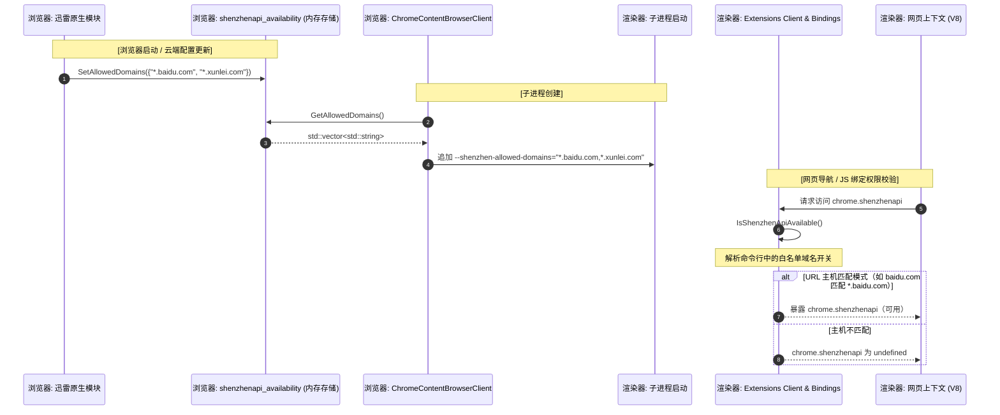

# `chrome.shenzhenapi` 动态域名校验架构设计文档

本文档详细描述 `chrome.shenzhenapi` 在 `H:\chromium_142\src` 中的架构设计、实现细节及编码规范合规性。

---

## 1. 概述

`chrome.shenzhenapi` 是一个高安全性的私有扩展 API 命名空间。为实施严格的安全边界，系统在运行时按域名动态控制访问权限。

与传统的持久化 JSON 配置方案不同（传统方案容易被本地用户查看或被恶意扩展篡改），本系统采用 **纯内存、线程安全的 C++ 存储模型**，并通过 **沙箱进程命令行传播** 将白名单传递到渲染进程。

---

## 2. 核心架构与数据流

Chromium 的多进程沙箱架构将高权限的 **浏览器进程 (Browser Process)** 与低权限的 **渲染进程 (Renderer Process)**（负责运行网页上下文）分离。

由于渲染进程处于严格沙箱中，**无法直接访问磁盘或 PrefService**。为实现同步的 JS 绑定权限校验，白名单域名在进程启动时通过命令行参数安全地传递。

### 2.1 完整生命周期与数据流



---

## 3. 编码规范与合规性

本实现严格遵循 **Google C++ 风格指南** 和 **Chromium 编码规范**。

### 3.1 静态变量清理（退出时析构器）

* **规范要求**：Chromium 禁止拥有非平凡析构器的静态或全局变量，因为它们会产生 exit-time destructors，影响关机速度并可能导致关闭时崩溃。
* **合规措施**：所有静态容器均使用 `base::NoDestructor<T>` 包装，彻底消除退出时析构器。

```cpp
std::vector<std::string>& GetAllowedDomainsStorage() {
  static base::NoDestructor<std::vector<std::string>> domains([]() {
    return std::vector<std::string>{"*.baidu.com"};
  }());
  return *domains;
}
```

### 3.2 线程安全与数据竞争

* **规范要求**：对全局状态的多线程读写访问必须进行同步。
* **合规措施**：通过静态 `base::Lock` 包装保护，使用 `base::AutoLock` 实现基于作用域的 RAII 加锁/解锁。

```cpp
std::vector<std::string> GetAllowedDomains() {
  base::AutoLock lock(GetAllowedDomainsLock());
  return GetAllowedDomainsStorage();
}
```

### 3.3 沙箱进程隔离

* **规范要求**：渲染进程在脚本执行期间绝不能阻塞在同步 Mojo 调用上，以避免线程卡顿（Jank）。
* **合规措施**：在渲染进程启动时从 `base::CommandLine` 一次性读取白名单，并缓存在线程安全的本地静态内存区域中，保证亚微秒级的同步校验性能。

### 3.4 头文件包含与格式

* **规范要求**：Chromium 头文件包含必须按照字母分类严格排序（本地头文件在前，然后是系统头文件、base 库、标准库目录）。
* **合规措施**：按规范格式组织：

```cpp
#include "chrome/common/extensions/shenzhenapi_availability.h"

#include <string>
#include <vector>
#include "base/command_line.h"
#include "base/no_destructor.h"
...
```

---

## 4. 文件级技术实现参考

### 4.1 头文件：`chrome/common/extensions/shenzhenapi_availability.h`

定义设置/获取白名单及命令行开关常量的公共接口。

```cpp
namespace extensions::shenzhenapi_availability {
Feature::FeatureDelegatedAvailabilityCheckMap CreateAvailabilityCheckMap();
std::vector<std::string> GetAllowedDomains();
void SetAllowedDomains(const std::vector<std::string>& domains);
extern const char kShenzhenAllowedDomainsSwitch[];
}
```

### 4.2 源文件：`chrome/common/extensions/shenzhenapi_availability.cc`

处理核心校验回调和域名主机模式匹配：

* 若在渲染进程中，解析 `--shenzhen-allowed-domains` 命令行参数。
* 若在浏览器进程中，从线程安全的 C++ 内存存储查询 `GetAllowedDomains()`。
* 通配符匹配支持直接域名（如 `baidu.com`）和子域名（如 `*.baidu.com`）。

### 4.3 构建集成：`chrome/common/extensions/BUILD.gn`

将可用性检查文件编译进 `:extensions` source set。

```gn
  public = [
    ...
    "shenzhenapi_availability.h",
  ]
  sources = [
    ...
    "shenzhenapi_availability.cc",
  ]
```

### 4.4 钩子注册：`chrome/common/initialize_extensions_client.cc`

在 `CombineAllAvailabilityCheckMaps()` 中注册特性校验回调，使扩展 Feature Provider 在启动时自动将校验映射绑定到 `"shenzhenapi"` API 特性。

### 4.5 命令行传递：`chrome/browser/chrome_content_browser_client.cc`

在 `AppendExtraCommandLineSwitches()` 中拦截子进程创建，当 `process_type == switches::kRendererProcess` 时，将白名单域名追加到渲染进程的命令行参数中。

### 4.6 JS 绑定钩子：`extensions/renderer/native_extension_bindings_system.cc`

将 `"shenzhenapi"` 添加到 `kWebAvailableFeatures[]` 列表中，使 V8 能为网页生成对应的绑定。

### 4.7 特性配置：`chrome/common/extensions/api/_api_features.json`

确保 `"shenzhenapi"` 使用委托可用性检查：

```json
  "shenzhenapi": [
    {
      "dependencies": ["permission:shenzhenapi"],
      "contexts": ["privileged_extension"]
    },
    {
      "channel": "stable",
      "contexts": ["webui"],
      "matches": ["chrome://shenzhenapi/*"]
    },
    {
      "channel": "stable",
      "contexts": ["web_page"],
      "requires_delegated_availability_check": true,
      "matches": ["<all_urls>"]
    }
  ],
```

---

## 5. 开发指南：动态更新与集成

若需在运行时从浏览器进程中的其他高权限原生 C++ 模块动态更新白名单域名，引入头文件并调用 `SetAllowedDomains()`：

```cpp
#include "chrome/common/extensions/shenzhenapi_availability.h"

// 示例：收到云端下发的新配置时的回调
void OnCloudConfigReceived(const std::vector<std::string>& new_whitelisted_domains) {
  // 在内存中安全地更新白名单域名
  extensions::shenzhenapi_availability::SetAllowedDomains(new_whitelisted_domains);
}
```

此操作会立即更新浏览器进程的本地内存。后续新创建的网页标签页（渲染进程）将在启动时自动接收更新后的域名列表。

---

## 6. 安全设计要点

| 安全考量 | 设计决策 |
|---|---|
| 白名单不可被用户/扩展通过磁盘文件篡改 | 纯内存存储，不使用 PrefService 或 JSON 文件持久化 |
| 渲染进程沙箱限制 | 通过命令行参数在进程启动时单向传递，渲染进程不可修改 |
| 多线程数据竞争 | `base::Lock` + `base::AutoLock` RAII 锁保护 |
| 退出时析构器 | `base::NoDestructor<T>` 包装静态变量 |
| 白名单生效时机 | 仅对更新后新创建的渲染进程生效，已有进程不受影响 |
