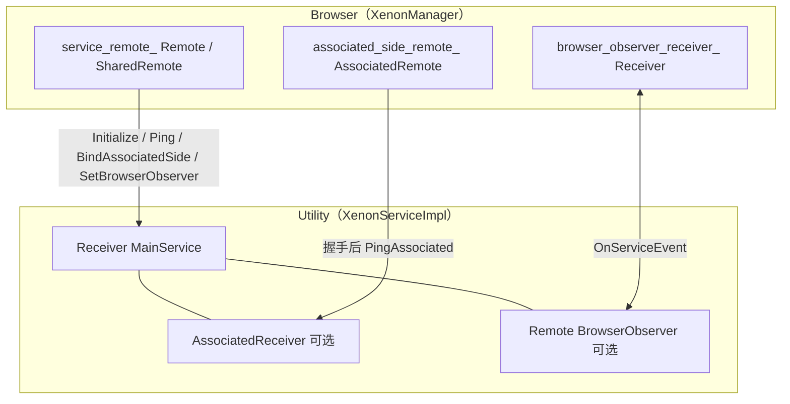
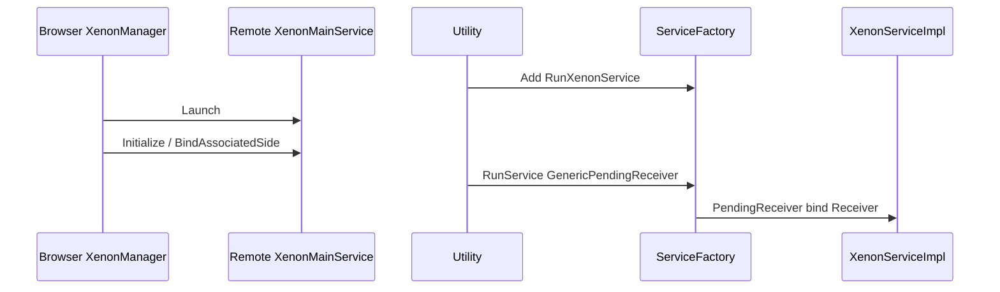

# Xenon Overlay 架构与实现参考

面向 **`feature/xenon-overlay`**：Browser / Utility **Mojo**、**WebUI**、**组件扩展** 与 **`chrome.xenonPrivate`**、**`XenonWebDialog`**、提醒与 Bubble UI、资源与 **Buildflags** 等。由口述备忘整理，文末保留提交列表与生成说明。

> 单点 API 说明见同目录 [`chrome_xenon_private_api.md`](./chrome_xenon_private_api.md)（`window.xenon` / Broker 见 [`xenon_page_api_browser_interface_broker.md`](./xenon_page_api_browser_interface_broker.md)）。**AI 分层与附录索引** 见 [`xenon_ai_integration.md`](./xenon_ai_integration.md)；**流程导向的 Brave Leo/Local AI 与 Xenon 对照** 见 [`xenon_ai_brave_components_reference.md`](./xenon_ai_brave_components_reference.md)。

---

## 目录

1. [总览](#1-总览)
2. [集成点：`XenonBrowserMainExtraParts`](#2-集成点xenonbrowsermainextraparts)
3. [**专题：三种 Mojo 客户端 `Remote` / `SharedRemote` / `AssociatedRemote`**](#3-专题三种-mojo-客户端remote--sharedremote--associatedremote)  
   · [3.6 三种 Browser↔Utility 路径归纳（主接口 / Associated / Observer）](#36-三种-browserutility-路径归纳主接口--associated--observer)
4. [Mojo 服务：`XenonMainService` 全链路](#4-mojo-服务xenonmainservice-全链路)
5. [WebUI](#5-webui)  
   · [AI 集成与分层](./xenon_ai_integration.md) · [流程：Brave 组件与 Xenon 对照](./xenon_ai_brave_components_reference.md)
6. [内置扩展（Component Extension）](#6-内置扩展component-extension)  
   · [独立文档：`chrome.xenonPrivate` 用法与接入](./chrome_xenon_private_api.md)  
   · [6.5 扩展与 Browser 原生对接的可选路径](#65-扩展与-browser-原生对接的可选路径)  
   · [6.6 添加自定义 Extension API 的详细步骤](#66-添加自定义-extension-api-的详细步骤)  
   · [6.7 示例：`chrome.xenonPrivate` 涉及文件](#67-示例chromexenonprivate-涉及文件)
7. [`XenonWebDialog`](#7-xenonwebdialog)
8. [提醒 / Tip UI](#8-提醒--tip-ui)
9. [`XenonCommonBubble`](#9-xenoncommonbubble)
10. [资源与构建](#10-资源与构建)
11. [Buildflags](#11-buildflags)
12. [可背诵要点与 FAQ](#12-可背诵要点与-faq)
13. [分支提交列表](#13-分支提交列表)

---

## 1. 总览

Xenon 是 **打进 Chrome 多进程模型** 的 overlay，而非独立 exe：

| 层次 | 职责 |
|------|------|
| **Browser** | `BrowserMainExtraParts`：WebUI、pak、`XenonManager`、提醒观察者等 |
| **Utility** | `ServiceFactory` + `XenonServiceImpl`，与 Browser **Mojo** 通信 |
| **资源** | `grd` → `xenon_resources.pak`；安装器在 Linux/macOS 带入包内 |
| **扩展** | **§6**：`ComponentLoader` 装载内置目录；与 Utility / 页面 Mojo **分离**；自定义扩展↔Browser API **未实现** |

**一句话**：Browser 编排 + Utility 隔离服务 + GRIT 资源 + 可选内置扩展。

---

## 2. 集成点：`XenonBrowserMainExtraParts`

**文件**：`xenon_overlay/chrome/browser/xenon_browser_main_extra_parts.{h,cc}`  
**挂载**：`chrome/browser/chrome_browser_main.cc` → `AddParts(std::make_unique<XenonBrowserMainExtraParts>())`

| 钩子 | 用途 |
|------|------|
| `PostProfileInit`（且 `is_initial_profile`） | 加载 pak、注册 WebUI、`XenonManager::EnsureServiceStarted`、提醒子系统、补 `OnBrowserAdded` |
| `PostMainMessageLoopRun` | 移除 `BrowserList` 观察者并 `reset`，避免退出时 `ObserverList` 析构顺序触发 `CHECK` |

`PostProfileInit` 内还会 `Ping` 自检（主接口通路）。**Mojo 客户端形态**见 **§3**。

---

## 3. 专题：三种 Mojo 客户端 `Remote` / `SharedRemote` / `AssociatedRemote`

Browser 侧与 Utility（或其它进程）通信时，常见 **三类「客户端句柄」**。它们解决的是 **不同问题**：是否独占一根 pipe、是否跨序列共享、是否与另一条接口 **严格同序**。

### 3.1 总览对比

| 类型 | 底层与主连接关系 | 序列约束 | 可复制 | 典型目的 |
|------|------------------|----------|--------|----------|
| **`mojo::Remote<I>`** | 独占一根 **MessagePipe** 的 **client 端** | **固定一条 `SequencedTaskRunner`**，**不可拷贝** | 否（可 `Unbind` 出 `PendingRemote`） | 默认 IPC：单所有者、单序列发请求 |
| **`mojo::SharedRemote<I>`** | 内部仍是一个 **`Remote`**，包在 **线程安全转发** 里 | **每个拷贝在各自序列上使用**；消息 **post 到绑定的 `bind_task_runner`** | **是**（共享同一连接） | 多线程/多对象都要调同一远端，避免手写到处 `PostTask` |
| **`mojo::AssociatedRemote<I>`** | **不单独占新 pipe**：复用 **已有主接口** 所在 **同一根 pipe** 的多路复用端点 | 由 `BindNewEndpointAndPassReceiver(task_runner)` 等指定；须先 **经主接口完成 associate** | 可移动，语义上常 **每序列一份** | 与 **主接口消息 FIFO 交错有序** 的第二条（或多条）接口 |

**服务端对应**（概念）：`Receiver<I>`、`AssociatedReceiver<I>`；传递中的 **未绑定** 形态：`PendingRemote` / `PendingReceiver`、`PendingAssociatedRemote` / `PendingAssociatedReceiver`。

---

### 3.2 `mojo::Remote<I>` — 场景、创建、使用

**使用场景**

- **最常见**：一个对象（或一条序列）独占一条连接，发 mojom 方法、收异步回调。
- Xenon：`features.gni` 里 **`enable_xenon_manager_shared_remote` 默认为 `true`**（可在 `args.gni` 覆盖为 `false`）。为 `false` 时 `XenonManager::service_remote_` 为 **`mojo::Remote<XenonMainService>`**；为 `true` 时为 **`mojo::SharedRemote`**（见 **§3.3**、**§11**）。

**创建 / 绑定方式（常见几种）**

1. **`ServiceProcessHost::Launch<I>(Options)`**（你们用的）  
   - 内部：`Remote<I> r;` → `Launch(r.BindNewPipeAndPassReceiver(), …)` → `return r`。  
   - 得到 **已绑 client** 的 `Remote`，**绑定序列** = 调用 `Launch` 时的 **`SequencedTaskRunner::GetCurrentDefault()`**（`PostProfileInit` 上调用时一般为 **UI 线程**）。

2. **本地建新管**  
   - `Remote<I> r;`  
   - `PendingReceiver<I> recv = r.BindNewPipeAndPassReceiver();`  
   - 把 `recv` 交给对端 `Receiver::Bind`。

3. **消费已有 `PendingRemote`**  
   - `Remote<I> r(std::move(pending_remote));` 或 `r.Bind(std::move(pending_remote));`  
   - 常见于 **上一条 Mojo 调用** 或 **Clone** 传来的句柄。

**使用方法**

- 发调用：`r->Method(args, std::move(callback));`（须 **`r.is_bound()`**）。
- 断开：`r.set_disconnect_handler(...)`；释放：`r.reset()`。
- **不要**跨线程并发操作 **同一个** `Remote` 实例；**不要**拷贝 `Remote`。

---

### 3.3 `mojo::SharedRemote<I>` — 场景、创建、使用

**使用场景**

- **多个序列**（IO、线程池、自建 `SequencedTaskRunner`）都要对 **同一连接** 发请求。
- Chrome 内参考：`services/network` 里部分 observer、`services/audio` 的 `AudioLog`、`blink` 里 `WidgetInputHandlerHost` 等（**多持有者 / 跨序列**）。

**创建 / 绑定方式**

1. 已有 **`PendingRemote<I>`**（或先从 **`Remote` `Unbind()`** 取出，注意 **无未完成 reply**）：  
   `SharedRemote<I> s(std::move(pending), bind_task_runner);`  
   或 `s.Bind(std::move(pending), bind_task_runner);`

2. **Xenon GN 开关**（`xenon_overlay/buildflags/features.gni`）：  
   **`enable_xenon_manager_shared_remote` 默认 `true`**。此时 `Launch` 返回的临时 `Remote` **`Unbind()` → `PendingRemote`** → **`SharedRemote::Bind(pending, content::GetUIThreadTaskRunner({}))`**，把 **底层 `Remote` 钉在 UI**，其它序列通过 **拷贝 `SharedRemote`** 发调用（内部 **post 到 UI** 再发 Mojo，回调再 **post 回调用方序列**）。

**使用方法**

- 与 `Remote` 类似：`s->Ping(...)`；**可拷贝** `SharedRemote` 到闭包、别的线程持有的结构体。
- **每个拷贝** 仍应在 **固定一条序列上** 使用，**不要**多线程同时碰 **同一个拷贝**。
- `set_disconnect_handler(handler, handler_task_runner)` 需指明回调跑在哪条 runner。  
- **`DuplicateServiceRemote()`**（Xenon）：返回 **再一份** `SharedRemote`，给非 UI 代码持有。

**代价**：比裸 `Remote` 多 **任务跳转** 与开销；能单序列搞定则 **不必** 上 `SharedRemote`。

---

### 3.4 `mojo::AssociatedRemote<I>` — 场景、创建、使用

**使用场景**

- 需要 **第二条（或多条）mojom 接口**，且与 **主接口** 上的消息 **严格 FIFO 同序**（同一条 **MessagePipe** 多路复用）。
- 典型：Renderer / Browser **Frame 宿主**、**导航关联接口** 等（Chrome `navigation-associated` 一类）。

**与 `Remote` 的本质区别**

- **`Remote`**：新开 pipe = **独立消息流**，与别的 pipe **无全局顺序保证**。  
- **`AssociatedRemote`**：**挂在已有主 `Remote/Receiver` 的 pipe 上**，与主接口 **共享排序**。

**创建 / 绑定（握手）— 以 Xenon 为例**

1. **前提**：主连接已建立 — `service_remote_`（`Remote` 或 `SharedRemote`）已 **`is_bound()`**。

2. **浏览器侧**（`XenonManager::SetupAssociatedSide`）：  
   - `associated_side_remote_.BindNewEndpointAndPassReceiver(task_runner)`  
     → 得到 **`PendingAssociatedReceiver<XenonAssociatedSide>`**（概念上「待送给对端的一端」）。  
   - **`service_remote_->BindAssociatedSide(std::move(pending_associated_receiver))`**  
     → 把 **receiver 端** 通过 **主接口** 发给 Utility，完成 **associate**。

3. **Utility 侧**（`XenonServiceImpl::BindAssociatedSide`）：  
   - `associated_receiver_.Bind(std::move(receiver));`  
   - `AssociatedReceiver` 构造时已 **`{this}`** 关联到实现对象。

**使用方法（绑定完成后）**

- **不再**调用 `BindAssociatedSide` 做日常业务；与 `Remote` 一样：  
  **`associated_side_remote_->PingAssociated(std::move(callback));`**  
- Xenon 封装：**`XenonManager::PingAssociated(callback)`**。

**注意**

- Mojom 需使用 **`pending_associated_remote` / `pending_associated_receiver`**；C++ 对应 **`PendingAssociatedRemote/Receiver`**。  
- 握手顺序需符合 Mojo 文档（例如 **先送出 `PendingAssociatedReceiver`，再依赖关联接口发调用**），避免死锁。  
- 主 pipe 断开，**关联端一并失效**；`OnDisconnected` 里应先 **`associated_side_remote_.reset()`** 再 **`service_remote_.reset()`**。

---

### 3.5 在 Xenon 中的组合（小结）

```
Launch → 主客户端：Remote 或 SharedRemote（GN）→ Initialize / Ping
                    ↓
        SetupAssociatedSide（GN）：主接口 BindAssociatedSide → PingAssociated
                    ↓
        SetupBrowserObserver（GN）：SetBrowserObserver → Utility 可 OnServiceEvent
```

| API（Browser） | 走的客户端类型 |
|----------------|----------------|
| `Ping` | `Remote` / `SharedRemote`（主接口 `XenonMainService`） |
| `PingAssociated` | `AssociatedRemote`（`XenonAssociatedSide`，GN 开） |
| `OnServiceEvent` | Browser 实现；Utility 经 **`Remote<XenonBrowserObserver>`** 调用（GN 开） |
| `DuplicateServiceRemote()` | 仅 SharedRemote 开关打开时：拷贝主 `SharedRemote` |

---

### 3.6 三种 Browser↔Utility 路径归纳（主接口 / Associated / Observer）

与 **§3.1**「句柄类型」正交：下表归纳 **业务上三条路径**——谁发起、走哪根 pipe、Utility 是否可主动通知 Browser。对应 GN 见 **§11**。



**对照表**

| 方式 | 使用场景 | 使用方法 | 实现细节 |
|------|----------|----------|----------|
| **① 主接口 `XenonMainService`** | Browser 编排：`Initialize`、`Ping`；经主 pipe 下发握手（`BindAssociatedSide`、`SetBrowserObserver`）。 | **Browser**：`EnsureServiceStarted` → `Initialize`；`Ping`、`service_remote_->…`。**Utility**：`Receiver<XenonMainService>`；`Ping` 内 `SimpleURLLoader` + 回调。 | **`Remote`** 单序列；**`SharedRemote`（默认）** 用 **`content::GetUIThreadTaskRunner`** 绑定，`set_disconnect_handler` 也要带 **同一 runner**。断开 **`OnDisconnected`**：`associated` / `observer receiver` / `service` 依次 `reset`。 |
| **② Associated `XenonAssociatedSide`** | 与主接口 **同 MessagePipe、FIFO 同序** 的第二条接口；可 **GN 整块关闭**（Browser 不建成员、不握手；Utility 侧不绑 `AssociatedReceiver`）。 | **Browser**：`SetupAssociatedSide` → `BindAssociatedSide`，之后 **`PingAssociated`**。**Utility**：`BindAssociatedSide` 里 `AssociatedReceiver::Bind`。 | **`enable_xenon_associated_side`**（默认 `true`）。`BindNewEndpointAndPassReceiver(runner)`：SharedRemote 分支下 **`runner` 为 UI**。关闭 flag 时 Utility **`BindAssociatedSide`** 丢弃 `PendingAssociatedReceiver`。 |
| **③ Observer `XenonBrowserObserver`** | **Utility → Browser** 推送（如 Ping 下载完成事件）；**独立**于 Associated 的第二根 client pipe（由 `SetBrowserObserver` 传入 `PendingRemote`）。可 **GN 关闭**（Browser 不继承接口、无 `Receiver`）。 | **Browser**：`Receiver` + **`InitWithNewPipeAndPassReceiver`** → **`SetBrowserObserver`**（`SetupBrowserObserver`）；**`OnServiceEvent`**。**Utility**：`Remote<XenonBrowserObserver>`，`is_connected()` 时 **`OnServiceEvent`**。 | **`enable_xenon_browser_observer`**（默认 `true`）。`Ping` 完成回调用 **lambda + `WeakPtr`**：避免 **成员 + `BindOnce` 第一个参数被当成 `this`**；并在 **`WeakPtr` 失效时仍 `Run` Mojo reply**（参考 Brave `EmailAliases` 里「保持 loader + callback 必达」思路）。**单测**：`TEST` 放在 **`namespace xenon`**，与 **`FRIEND_TEST_ALL_PREFIXES`** 同命名空间，避免 **`friend` 非限定名** 触发 Clang `-Wmicrosoft-unqualified-friend`。 |

**单元测试（无需启动 `chrome.exe`）**

- **目标**：`//xenon_overlay/chrome/browser:unit_tests`；`enable_xenon_service` 时 **`chrome/test:unit_tests`** 会 **deps** 该目标。
- **编译**：`autoninja -C out\Debug_64 unit_tests`
- **运行**：`out\Debug_64\unit_tests.exe --gtest_filter=XenonManagerTest.*`
- **用例**：`OnDisconnected` 后对 **`Ping` / `PingAssociated`** 断言固定错误串（不拉起真实 Utility 进程）。

---

## 4. Mojo 服务：`XenonMainService` 全链路

### 4.1 mojom

**文件**：`xenon_overlay/public/mojom/xenon_service.mojom`

- **`XenonMainService`**：`Initialize(URLLoaderFactory)`、`Ping`、`BindAssociatedSide`、**`SetBrowserObserver`**；`[ServiceSandbox=kUtility]`。  
- **`XenonAssociatedSide`**：`PingAssociated`（与主接口 **同 pipe**，见 **§3.4**）；实现与握手受 **`enable_xenon_associated_side`** 裁剪（**§3.6**、**§11**）。  
- **`XenonBrowserObserver`**：`OnServiceEvent(string)`，Browser 实现、Utility 持 **`Remote`**；受 **`enable_xenon_browser_observer`** 裁剪。  
- 接口全名示例：`XenonMainService::Name_` → **`xenon.mojom.XenonMainService`**（`module` + `interface`）。

### 4.2 Browser：`XenonManager`

**文件**：`xenon_overlay/chrome/browser/xenon_manager.{h,cc}`

- **`EnsureServiceStarted`**：`Launch` →（GN）`SharedRemote` 或 `Remote` → `disconnect_handler` → `Initialize` → **`SetupAssociatedSide()`**（flag 开，**§3.4**）→ **`SetupBrowserObserver()`**（flag 开）。  
- **客户端形态**详见 **§3**；**功能组合**见 **§3.6**；**GN** 见 **§11**（`enable_xenon_manager_shared_remote`、`enable_xenon_associated_side`、`enable_xenon_browser_observer`）。

### 4.3 Utility：注册与实现

- **`chrome/utility/services.cc`**：`RunXenonService` + `services.Add`。  
- **`XenonServiceImpl`**：`Receiver<XenonMainService>`；**`AssociatedReceiver<XenonAssociatedSide>`**、**`Remote<XenonBrowserObserver>`** 及 **`BindAssociatedSide` / `SetBrowserObserver` / `Ping` 内 Observer 通知** 均按 **`BUILDFLAG(ENABLE_XENON_* )`** 与 `features.gni` 一致。**`Ping`** 完成路径使用 **`base::BindOnce` + lambda + `WeakPtr`**（见 **§3.6** 表）。

### 4.4 `ServiceFactory` 分派与类型流

下面按时间顺序列出 **Utility 注册** 与 **Browser 起服务** 时的主要类型（与 `mojo/public/cpp/bindings/service_factory.h` 一致）。

**阶段 A — Utility 启动注册**

| 步骤 | 类型 / 说明 |
|------|-------------|
| `RegisterMainThreadServices(ServiceFactory&)` | 注册表 |
| `services.Add(RunXenonService)` | 工厂函数指针 → `Traits` 推出 `Interface` / `Impl` |
| 存入 `constructors_[Interface::Name_]` | `map<string, RepeatingCallback<…(GenericPendingReceiver)>>` |

**阶段 B — Browser**

| 步骤 | 类型 |
|------|------|
| `Launch<XenonMainService>(Options)` | 返回 `Remote`（内部已 `BindNewPipeAndPassReceiver`） |
| `Initialize` | `PendingRemote<URLLoaderFactory>` |
| `BindAssociatedSide` | `PendingAssociatedReceiver<XenonAssociatedSide>` |

**阶段 C — Utility 实例化**

| 步骤 | 类型 |
|------|------|
| `RunService(GenericPendingReceiver)` | 按名字查表 |
| `receiver.As<XenonMainService>()` | `PendingReceiver<XenonMainService>` |
| `RunXenonService` | `unique_ptr<XenonServiceImpl>` |
| `Receiver` 绑定 | 成员存活期派发 IPC |

**序列图（节选）**



**`ServiceFactory::Add` 编译期 vs 运行期**

- **编译期**：每个 `Add(Func)` 实例化模板，`ServiceFactoryTraits` 从 **`PendingReceiver<Interface>`** 解析 `Interface` / `Impl`。  
- **运行期**：`GenericPendingReceiver` + `interface_name` 查 `map`，再 **`As<Interface>()`** 恢复强类型。

### 4.5 `ServiceProcessHost::Launch` 与 `UtilityProcessHost`

| `Launch` 入口 | 作用 |
|---------------|------|
| `Launch(PendingReceiver<I>, Options)` | 包装为 `GenericPendingReceiver` + 沙箱 |
| `Launch<I>(Options)` → `Remote<I>` | 内部 `BindNewPipeAndPassReceiver` 再调上者 |
| `private Launch(GenericPendingReceiver, Options, Sandbox)` | 非 UI 则 `PostTask` 到 UI → `LaunchServiceProcess` → `UtilityProcessHost::Start` → `BindServiceInterface` |

**`UtilityProcessHost::Start`**：`StartProcess()`（多进程下 **`LaunchWithFileData`** 真正起子进程）→ `MaybeBindMojoInterfaces()`。

**`GenericPendingReceiver`**：`interface_name` + pipe handle；**`PendingReceiver`** 未绑定；**`Receiver`** 已绑定到实现（**§3** 与实现侧对称）。

---

## 5. WebUI

| 路径 | 作用 |
|------|------|
| `XenonWebUIController` + `xenon_page_handler` + mojom | 典型 WebUI + Mojo |
| `SimpleWebUIConfig` | 静态资源 + JS，无 Mojo |

工厂：`xenon_webui_controller_factory` 映射 URL。

**与 `window.xenon` 勿混**：`chrome://xenon-overlay/` 上既有 **帧级** `XenonPageHost`（`PopulateChromeFrameBinders`），也有 **WebUI 专用** `PageHandler`（`PageHandler.getRemote()` + `WebUIBrowserInterfaceBrokerRegistry`）。**`chrome_browser_interface_binders` 中 `PopulateChromeWebUIFrameBinders` 与 `WebUIBrowserInterfaceBrokerRegistry` 是两条不同机制**（前者把接口打进**全局帧** `BinderMap` + `RegisterWebUIControllerInterfaceBinder` 过滤控制器类型；后者为每个 WebUI 类型建 **PerWebUIBroker**）。生成物 **`xenon.mojom-webui.js` 的 BUILD/GRD/AddResourcePath 链路**、逐步接入清单见 **`docs/xenon_page_api_browser_interface_broker.md` §10**。

---

## 6. 内置扩展（Component Extension）

Xenon 内置扩展走的是 Chromium **组件扩展**管线：由 Browser 进程在 **Profile 就绪后** 调用 `extensions::ComponentLoader::Add`，把 **磁盘上的扩展目录**（manifest + JS/CSS/HTML）注册进 **`ExtensionRegistry`**。它与 **§4 `XenonMainService`（Utility）**、**页面内 `window.xenon`（Renderer Mojo）** 仍是 **不同通道**；此外本分支在 Chromium 中注册了 **embedder 私有扩展 API `chrome.xenonPrivate`**（步骤见 **§6.6–6.7**），供组件扩展在 **Browser 进程**执行自定义逻辑。

### 6.1 资源与产物路径

| 源码 | 运行时（相对 `DIR_MODULE`） |
|------|------------------------------|
| `xenon_overlay/resources/extension/manifest.json` 等 | `resources/xenon_extension/`（由 `xenon_overlay/resources/BUILD.gn` 的 `copy_extension` / macOS `bundle_data` 拷贝） |

默认配置里 **`builtin_path`** 为 `"resources/xenon_extension"`（见 `xenon_extension_manager.cc` 内 `CreateXenonConfig()`）。扩展为 **Manifest V3**：`background.service_worker`、`action.default_popup` 指向 `index.html` + `background.js`。

### 6.2 核心类与职责

| 类 | 文件 | 职责 |
|----|------|------|
| **`XenonExtensionManager`** | `xenon_extension_manager.{h,cc}` | **单例**；构造时 `RegisterExtension("Xenon Overlay Extension", CreateXenonConfig())`；对外封装 `LoadExtension*`、`FindExtension`、`ShowExtension`、`CheckForUpdates` |
| **`ComponentExtensionManager`** | 同上 | **可多扩展**：`RegisterExtension` 维护 `configs_`；路径解析、加载、更新逻辑 |
| **`ComponentExtensionConfig` / Builder** | 同上 | `extension_name`、`expected_extension_id`（预留校验）、`builtin_path`、`additional_builtin_paths`、`user_data_subdir`、`update_check_url` |

加载时 **`AddExtensionWithManifest`**：`extensions::ComponentLoader::Get(profile)->Add(std::move(manifest), path)`，与 Chrome 内置 PDF、翻译类组件扩展同一套机制。

### 6.3 启动与展示（与 Browser 的交接点）

**文件**：`xenon_browser_main_extra_parts.cc`

- **默认**（无 `--show-xenon-extension`）：`XenonExtensionManager::LoadExtensionFromDefaultPath(profile, callback)` → 异步在 **ThreadPool** 上 `DetermineBestExtensionPath`（内置路径 **vs** `Profile` 下 `user_data_subdir` 中的更新包，取 **较高 version**）→ UI 线程 **`ComponentLoader::Add`**。
- **`--show-xenon-extension`**：**不**走上述加载分支，改为 **`XenonWebDialog::ShowXenonOverlay`**（WebUI 浮层，见 **§7** 相关说明）。

**`ShowExtension`**（管理器 API）：在 **Registry** 里按 **`Extension::name()`** 匹配配置里的 `extension_name`，若找到则：

```text
XenonWebDialog::Show(context, extension->GetResourceURL("index.html"), width, height, title)
```

并在配置了 **`update_check_url`** 时触发 **`CheckForUpdates`**（`SimpleURLLoader` 拉更新 JSON → 下载 zip → `UnzipService` 解压到用户目录，下次启动路径优选新版本）。

### 6.4 扩展 JS 与「Browser」交互的现状

- **标准 API**：`chrome.runtime`、`storage`、`activeTab` 等。
- **Embedder API**：manifest 声明 **`"xenonPrivate"`** 后，可在 **service worker / popup** 调用 **`chrome.xenonPrivate.ping(callback)`**，进入 Browser 侧 **`XenonPrivatePingFunction`**（示例返回固定字符串，可改为调用 `XenonManager` 等）。

**通道对照（面试）**

| 通道 | 起点 | 终点 | 说明 |
|------|------|------|------|
| **`chrome.xenonPrivate.*`** | 扩展 JS | **Browser** `ExtensionFunction` | **`location: component`** 的私有 permission，与 Utility 无关 |
| **页面 `window.xenon`** | 普通网页 JS | Renderer Mojo → Browser | DataMask 等，**不是**扩展 API |
| **`XenonMainService`** | `XenonManager` | Utility | 见 **§4** |

扩展 **不会**自动接到 `XenonMainService`；若要在 `xenonPrivate` 里起 Utility 调用，需在对应 **`ExtensionFunction::Run()`** 内显式调 `XenonManager`（注意 **GN 依赖**避免循环）。

### 6.5 扩展与 Browser 原生对接的可选路径

在 Chromium 中常见做法如下（按侵入性大致递增）：

1. **不做原生桥接**  
   扩展只做 UI；需要调策略时 **打开或聚焦** 已有 **WebUI**（`chrome://…`），由 WebUI 的 **Mojo** 与 Browser 通信。扩展与 WebUI 之间仍可用 **URL 参数** 或 **`chrome.storage`** 等协调（需同 profile、注意安全边界）。

2. **Native Messaging**  
   在 manifest 中声明 **native host**，由单独二进制或已有 Browser 侧服务收发信息。适合「扩展 ↔ 本机进程」而非大块 UI。

3. **新增自定义 Extension API**（`chrome.xxx.*`）  
   在 `chrome/common/extensions/api` 增加 JSON schema，Browser 侧实现 **`ExtensionFunction`**；**注册**由 **`ChromeGeneratedFunctionRegistry`** 根据 schema + `*_api.h` 自动生成，无需手写 `RegisterFunction`。**完整步骤见 §6.6**，本仓库示例见 **§6.7**。

4. **`externally_connectable` + messaging**  
   限定 web origin 与扩展互发消息；适合与**指定 HTTPS 页面**联动，仍需页面侧配合。

**总结**：`xenon_extension_manager` 只负责 **装载与更新**；**扩展可调 Browser C++ 的 `chrome.*` API** 按 **§6.6** 在 `chrome/` 树内注册；**WebUI / 页面** 走 **Mojo**（§5、§7），不是同一套机制。

### 6.6 添加自定义 Extension API 的详细步骤

下面描述如何在 **Chromium / Chrome** 嵌入层新增 **`chrome.<命名空间>.<方法>`**（由 **Browser 进程**的 **`ExtensionFunction`** 执行）。本仓库的 **`chrome.xenonPrivate`** 即按此链路实现（文件索引见 **§6.7**）。

**与 WebUI 的区别**（勿混）：扩展里写的是 **`chrome.xxx`**；`chrome://xenon-overlay/` 里 **`PageHandler` Mojo** 是 **WebUI↔Browser**，**不经** Extension API registry。

---

#### 前置条件

- 构建需打开 **`enable_extensions`**（桌面 Chrome 默认满足）。
- 新 API 的 **permission 名**、**mojom 枚举值**、**直方图枚举值** 一经发布应避免 **删除或改序**（Chromium 有稳定性约定）。
- JSON 里 **`namespace`** 驼峰命名 → JS 为 **`chrome.<namespace>`**（如 `xenonPrivate` → `chrome.xenonPrivate`）。

---

#### 步骤 1：编写 API Schema（JSON）

- **路径**：`chrome/common/extensions/api/<file>.json`（与现有 `command_line_private.json`、`xenon_private.json` 并列）。
- **内容**：顶层为数组，内含对象：
  - **`namespace`**：驼峰，与 manifest 里 permission 字符串通常对应（如 permission `xenonPrivate` 对应 namespace `xenonPrivate`）。
  - **`functions`**：每个函数含 `name`、`type: "function"`、`parameters`（可省略）、`returns` 或 **`returns_async`**（扩展常见为异步回调）。
- **注意（易踩坑）**：若函数 **没有任何 `parameters`**，code generator **不会**生成 **`SomeFunction::Params`**。实现 **`Run()`** 时 **不要**写 `Foo::Params::Create(args())`；只使用生成的 **`Foo::Results`**（或同步返回类型）。有参数时再用 `std::optional<...::Params>` + `EXTENSION_FUNCTION_VALIDATE`。

---

#### 步骤 2：把 Schema 编进 Chrome API 编译列表

- 编辑 **`chrome/common/extensions/api/api_sources.gni`**，在 **`if (enable_extensions) { schema_sources_ += [ ... ] }`** 块中加入你的 **`"<name>.json"`**。
- （可选）**`chrome/common/extensions/api/generated_externs_list.txt`** 增加一行，供旧式 externs 生成。

保存后 **`function_registration("api_registration")`** 与 **`generated_types`** 会拾取该 JSON，在 **`//chrome/common/extensions/api`** 生成 **`chrome/common/extensions/api/<namespace_snake>.h`** 等（具体子目录规则与 json 文件名一致）。

---

#### 步骤 3：声明 API Feature 与 Permission Feature

- **`chrome/common/extensions/api/_api_features.json`**  
  为你的 **`namespace`** 增加一项，例如：
  - **`dependencies`**：`["permission:你的Permission名"]`（须与 manifest 中字符串一致，一般为 camelCase）。
  - **`contexts`**：多为 **`["privileged_extension"]`**（与现有 private API 一致）。
- **`chrome/common/extensions/api/_permission_features.json`**  
  增加 **`"你的Permission名"`** 对象，典型字段：
  - **`channel`**：`"stable"`
  - **`extension_types`**：`["extension", "legacy_packaged_app", "platform_app"]` 等
  - **`location`**：仅 **组件扩展** 使用时填 **`"component"`**（与 `commandLinePrivate`、`xenonPrivate` 同类）
  - **`platforms`**：如 **`["chromeos", "linux", "mac", "win"]`**，按需裁剪

未正确配置时，扩展侧会报 **API 不可用** 或 **permission 无效**。

---

#### 步骤 4：权限 ID（mojom）与 ExtensionPermission3 直方图

- 编辑 **`extensions/common/mojom/api_permission_id.mojom`**：在 **`APIPermissionID` 末尾**（注释 *Add new entries at the end* 之前）增加 **`kYourPermission = <下一个整数>`**。  
  **禁止** 删除或重排已有枚举项。
- 在仓库根目录执行：

```bash
python3 tools/metrics/histograms/update_extension_permission.py
```

  用于把 **`ExtensionPermission3`** 与 mojom 同步到 **`tools/metrics/histograms/metadata/extensions/enums.xml`**（若脚本失败再手工核对）。

---

#### 步骤 5：ExtensionFunction 直方图枚举（HistogramValue）

- 编辑 **`extensions/browser/extension_function_histogram_value.h`**：在 **`ENUM_BOUNDARY` 之前** 增加一项。
  - 命名规则（官方注释）：取 **`DECLARE_EXTENSION_FUNCTION`** 第一个字符串参数，把 **`.` 换成 `_`**，**全大写**。  
    例：`"xenonPrivate.ping"` → **`XENONPRIVATE_PING`**。
  - **禁止** 改动已有枚举条目的顺序或数值。
- 编辑 **`tools/metrics/histograms/metadata/extensions/enums.xml`** 中 **`<enum name="ExtensionFunctions">`**，增加对应 **`<int value="…" label="…"/>`**，**数值与 `.h` 一致**。
- （推荐）执行：

```bash
python3 tools/metrics/histograms/update_extension_histograms.py
```

---

#### 步骤 6：在 Chrome 里注册「权限字符串 → APIPermissionID」与安装提示文案

- **`chrome/common/extensions/permissions/chrome_api_permissions.cc`**  
  在 **`permissions_to_register[]`** 中加入一行：`{APIPermissionID::kYourPermission, "yourPermission", flags}`，**字符串与 manifest / _permission_features 一致**。
- **`chrome/common/extensions/permissions/chrome_permission_message_rules.cc`**  
  增加一条 **`ChromePermissionMessageRule`**：`IDS_EXTENSION_PROMPT_WARNING_...` + **`{APIPermissionID::kYourPermission}`**。
- **`chrome/app/generated_resources.grd`**  
  增加 **`IDS_EXTENSION_PROMPT_WARNING_...`** 的人类可读说明（安装/权限列表用）。

---

#### 步骤 7：Browser 侧实现 `ExtensionFunction` 并加入 GN

- **目录约定**：`chrome/browser/extensions/api/<api_dir>/`，且存在 **`<api_dir>_api.h`**（与 **`function_registration`** 的 **`impl_dir`** 探测规则一致；与 **`xenon_private`**、`command_line_private` 同级）。
- **头文件**：`class YourFunction : public ExtensionFunction`，并写  
  **`DECLARE_EXTENSION_FUNCTION("namespace.method", HISTOGRAM_ENUM_VALUE)`**（与 §5 直方图一致）。
- **实现文件**：`#include "chrome/common/extensions/api/<生成头>.h"`（一般为 json 基名对应命名空间），在 **`Run()`** 中解析参数（若有）、调用 Browser 逻辑，**`RespondNow` / `RespondLater`** 返回。
- **新建** **`BUILD.gn`**：`source_set`，`deps` 至少含 **`//chrome/common/extensions/api`**、**`//extensions/browser`**（按需追加 `//chrome/browser/...`）。
- **注册进 Chrome**：编辑 **`chrome/browser/extensions/api/BUILD.gn`**，在 **`group("api_implementations")`** 的 **`if (enable_extensions)`** 块内 **`deps += [ "//chrome/browser/extensions/api/<your_target>" ]`**。

**自动注册**：**无须**手写 `RegisterFunction`。**`ChromeExtensionsBrowserAPIProvider`** 会调用 **`ChromeGeneratedFunctionRegistry::RegisterAll`**，只要 schema 在 **`api_registration` 的 sources** 里且存在对应的 **`*_api.h`** 实现类，生成代码会挂上。

---

#### 步骤 8：单测 / 权限集合测试

- **`chrome/common/extensions/permissions/permission_set_unittest.cc`**  
  与其它 **`*Private`** 一样，对 **`kYourPermission`** 执行 **`skip.insert(...)`**，避免单测误报。

---

#### 步骤 9：扩展侧 manifest 与 JS

- **`manifest.json`** 的 **`permissions`**（或 **`optional_permissions`）** 数组中加入 **与 `_permission_features` 完全一致的字符串**（如 **`xenonPrivate`**）。
- **Service worker / popup** 中通过 **`chrome.<namespace>.<method>(...)`** 调用；异步 API 使用回调或 Promise（视生成绑定而定）。

---

#### 步骤 10：编译与手动验证

- 全量或增量编译 **`chrome`**（或至少包含 **`//chrome/browser/extensions/api`** 与 **`//chrome/common/extensions/api`**）。
- 用 **未禁用扩展** 的配置启动；在 **`chrome://extensions`** 打开 **Service Worker 控制台** 或通过 popup 调用新 API。
- **组件扩展**：若 permission 为 **`location: component`**，需确保扩展由 **`ComponentLoader`** 加载，否则 **`chrome.<ns>`** 可能仍不可见。

---

### 6.7 示例：`chrome.xenonPrivate` 涉及文件

| 类别 | 路径 |
|------|------|
| Schema | `chrome/common/extensions/api/xenon_private.json` |
| schema 列表 | `chrome/common/extensions/api/api_sources.gni` |
| Feature | `chrome/common/extensions/api/_api_features.json`、`_permission_features.json` |
| 权限 ID | `extensions/common/mojom/api_permission_id.mojom`（`kXenonPrivate`） |
| 直方图 | `extensions/browser/extension_function_histogram_value.h`（`XENONPRIVATE_PING`）、`tools/metrics/histograms/metadata/extensions/enums.xml` |
| 权限注册 / 文案 | `chrome/common/extensions/permissions/chrome_api_permissions.cc`、`chrome_permission_message_rules.cc`、`chrome/app/generated_resources.grd` |
| Browser 实现 | `chrome/browser/extensions/api/xenon_private/xenon_private_api.{h,cc}`、`BUILD.gn` |
| api_implementations | `chrome/browser/extensions/api/BUILD.gn` → `deps` 含 `xenon_private` |
| 单测 skip | `chrome/common/extensions/permissions/permission_set_unittest.cc` |
| 可选 externs | `chrome/common/extensions/api/generated_externs_list.txt` |
| 内置扩展 | `xenon_overlay/resources/extension/manifest.json`（`xenonPrivate`）、`background.js` / `index.html` / `main.js` |

**新增 `xenonPrivate` 下的第二个方法**：只改 **`xenon_private.json`** → 全量生成 → 新建 **`ExtensionFunction` 子类** + **`DECLARE_EXTENSION_FUNCTION`** + **直方图末尾新枚举** + **`enums.xml`**，**无需**再改 mojom 除非引入新 permission。

---

## 7. `XenonWebDialog`

`ui::WebDialogDelegate`；**`-webkit-app-region: drag/no-drag`** 与原生拖拽。

---

## 8. 提醒 / Tip UI

`XenonReminderNotificationManager`、`XenonReminderBrowserObserver`；per-`Browser` Widget；`Ctrl+Shift+R` 测试快捷键。

---

## 9. `XenonCommonBubble`

`views::BubbleDialogDelegate` + `CreateBubble`；`DIALOG_SHADOW`、`TOP_RIGHT`；`kColorBubbleBackground`；默认圆角；`toolbar_view` 测试入口。

---

## 10. 资源与构建

`xenon_resources.grd`、`resource_ids.spec`；`webui` TS；Linux 安装脚本、macOS `bundle_data`、Release 资源修复等。

---

## 11. Buildflags

**声明**：`xenon_overlay/buildflags/features.gni`（`declare_args()`）  
**生成头文件**：`xenon_overlay/buildflags/BUILD.gn` → `buildflags.h`（`ENABLE_XENON_*`）

| GN 参数 | 默认 | C++ 宏 | 作用 |
|---------|------|--------|------|
| `enable_xenon_service` | `is_win \|\| is_linux \|\| is_mac` | `ENABLE_XENON_SERVICE` | 总开关：`//chrome/browser`、`//chrome/utility` 是否依赖 xenon 目标。 |
| `enable_xenon_manager_shared_remote` | **`true`** | `ENABLE_XENON_MANAGER_SHARED_REMOTE` | `true` → `XenonManager` 用 **`SharedRemote`** + UI runner；`false` → **`Remote`**。 |
| `enable_xenon_associated_side` | **`true`** | `ENABLE_XENON_ASSOCIATED_SIDE` | `false` → 无 **`AssociatedRemote`** / **`SetupAssociatedSide`** / **`PingAssociated`**（头文件与实现侧条件编译）。 |
| `enable_xenon_browser_observer` | **`true`** | `ENABLE_XENON_BROWSER_OBSERVER` | `false` → Browser **不**实现 **`XenonBrowserObserver`**、无 **`Receiver`**、不调用 **`SetBrowserObserver`**；Utility **不**绑 observer **`Remote`**、**不**在 Ping 路径发 **`OnServiceEvent`**。 |

**单测目标**：`enable_xenon_service` 时存在 **`//xenon_overlay/chrome/browser:unit_tests`**；**`//chrome/test:unit_tests`** 在同等条件下 **`deps +=`** 该目标（见 **§3.6**）。

**其它**：`chrome/browser/BUILD.gn`、`chrome/utility/BUILD.gn` 在总开关下依赖 xenon；覆盖默认值请在 **`args.gni`** 中设置同名 `declare_args`。

---

## 12. 可背诵要点与 FAQ

**三句话**

1. Browser：`ExtraParts` 注册 WebUI、pak、`XenonManager`、提醒观察者、**组件扩展加载**（**§6**）。  
2. Utility：`services.cc` + `XenonServiceImpl` + `Receiver` / 可选 `AssociatedReceiver` / 可选 `Remote<Observer>`。  
3. 交付：GRIT + 安装包；扩展走 **标准 `chrome.*`**，**非** `XenonMainService`；**可按 GN 跑 `unit_tests` 做 `XenonManager` 轻量验证**（**§3.6**）。

**FAQ（方向）**

| 问 | 答 |
|----|-----|
| 为何 Utility 要 `URLLoaderFactory`？ | 网络在 Browser/Network Service；Utility 经 Mojo Clone 使用。 |
| `Remote` vs `SharedRemote`？ | 单序列用 `Remote`；多序列共享连接用 `SharedRemote`（§3）。 |
| `AssociatedRemote` 何时用？ | 要与主接口 **同 pipe 同序** 的第二条接口（§3.4）。 |
| Utility 怎样回调 Browser？ | **`XenonBrowserObserver`**：`SetBrowserObserver` 注册后 Utility 持 **`Remote`** 调 **`OnServiceEvent`**（§3.6）；可按 **`enable_xenon_browser_observer`** 关闭。 |
| `Ping` 失败？ | 进程是否起来、`disconnect_handler`、mojom 是否进 utility、沙箱日志。 |
| 内置扩展和 `window.xenon` 是一回事吗？ | **不是**。组件扩展可用 **`chrome.xenonPrivate`**（Browser `ExtensionFunction`，步骤 **§6.6–6.7**）；**`window.xenon`** 仍是页面 Mojo，二者不互通。 |
| 主程序与单测？ | 验证 **`XenonManagerTest`** 只需编/跑 **`unit_tests.exe`**，**不必**启动 **`chrome.exe`**（§3.6）。 |

---

## 13. 分支提交列表

**相对合并基线（示例 `c7285fe9ab469`）之后、Xenon 相关提交（新→旧）：**

| Commit | 摘要 |
|--------|------|
| `fd318006ccc91` | `XenonCommonBubble` 对齐头像菜单式 Bubble |
| `6cf642f2febde` | 提示 Web 卡片 |
| `6e44feb68d647` | Simple WebUI 无 Mojo |
| `bd6f29f184f33` | Linux 安装包 Xenon 资源 |
| `d8bee76e8427f` | macOS `bundle_data` |
| `2063d14f973fd` | Release 资源打包修复 |
| `970e4476907ba` | `ComponentExtensionConfig` Builder |
| `39b5b3839aa01` | 多内置路径、update URL |
| `1d128b6c8826f` | `ComponentExtensionManager` |
| `83e95e4b11487` | 扩展重构、WebDialog 拖拽 |
| `1a3796e5dd5f4` | 集成 Xenon Overlay |

---

*生成说明：随分支演进用 `git log` / `git diff` 增量更新 §13 与实现细节；Mojo 客户端以 `//mojo/public/cpp/bindings/*.h` 与当前 **`xenon_manager` / `xenon_service_impl` / `features.gni`** 为准；**§3.6** 与 **§11** 应与 `BUILDFLAG` 及 `xenon_manager_unittest.cc` 保持同步；**新增 Extension API** 时按 **§6.6** 核对 `api_permission_id.mojom`、直方图与 `_permission_features`，并运行 **`update_extension_permission.py` / `update_extension_histograms.py`**。*
