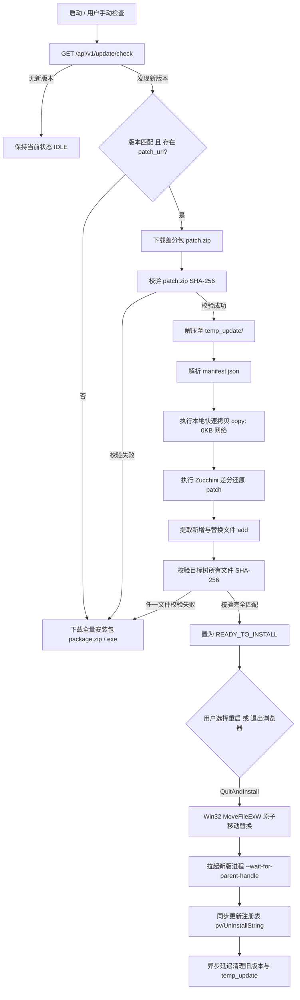
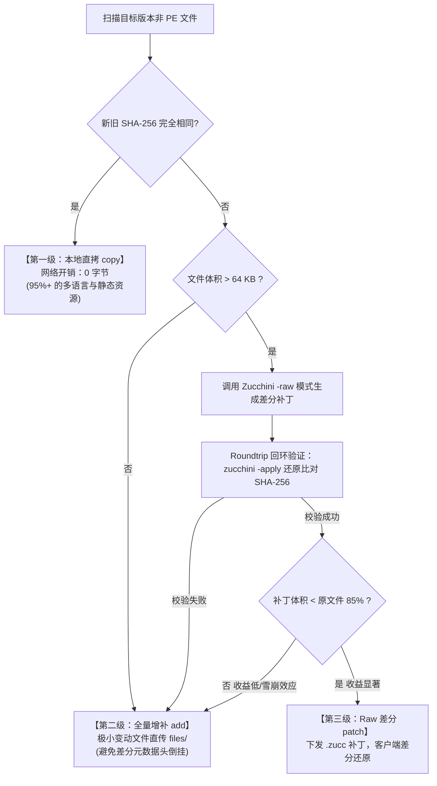
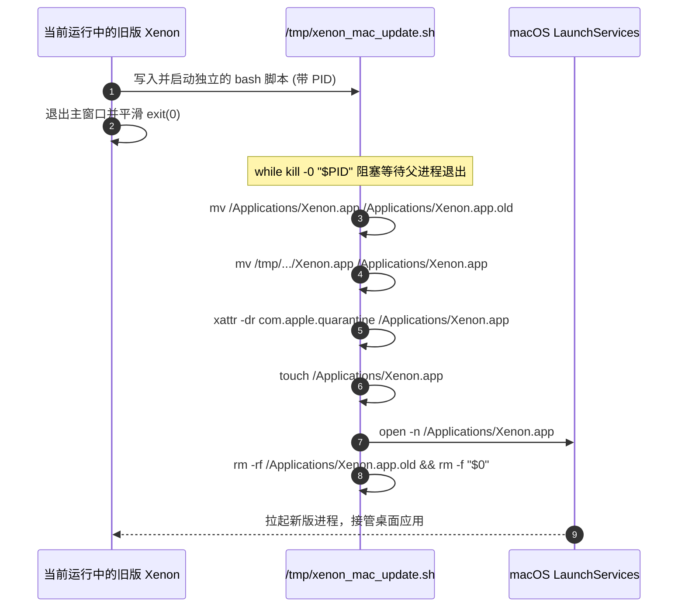

# Xenon 增量与全目录差分更新系统架构设计与工具链指南

面向 **`feature/xenon-updater`**：Chromium / Xenon Windows 桌面客户端的**全目录清单驱动差分更新**、**Zucchini PE 汇编感知与 Raw 增量算法**、**Win32 原生原子置换引擎**、**注册表动态同步**以及**发布自动化差分工具链**。

---

## 目录

1. [背景与演进动机](#1-背景与演进动机)
2. [全目录清单驱动差分架构](#2-全目录清单驱动差分架构)
   - [2.1 整体更新流程与状态机](#21-整体更新流程与状态机)
   - [2.2 清单契约格式 (`manifest.json`)](#22-清单契约格式-manifestjson)
   - [2.3 四类文件分类流转策略](#23-四类文件分类流转策略)
3. [差分算法与补丁技术深度](#3-差分算法与补丁技术深度)
   - [3.1 Zucchini PE 汇编指令感知差分原理](#31-zucchini-pe-汇编指令感知差分原理)
   - [3.2 资源文件与 Raw Delta 差分策略](#32-资源文件与-raw-delta-差分策略)
     - [3.2.1 三级漏斗分流架构](#321-三级漏斗分流架构)
     - [3.2.2 Zucchini -raw 模式底层算法原理](#322-zucchini--raw-模式底层算法原理)
     - [3.2.3 回环校验与保底回退机制](#323-回环校验与保底回退机制-roundtrip--fallback-guard)
     - [3.2.4 客户端统一无感知还原](#324-客户端统一无感知还原)
   - [3.3 补丁还原与 Chromium 原生集成封装](#33-补丁还原与-chromium-原生集成封装)
4. [Windows 原生原子置换与自更新引擎](#4-windows-原生原子置换与自更新引擎)
   - [4.1 运行中二进制替换攻防 (`MoveFileExW`)](#41-运行中二进制替换攻防-movefileexw)
   - [4.2 协同等待与免 Shell 重启 (`--wait-for-parent-handle`)](#42-协同等待与免-shell-重启---wait-for-parent-handle)
   - [4.3 两种生效生命周期：退出即安装 vs 立即重启](#43-两种生效生命周期退出即安装-vs-立即重启)
   - [4.4 历史版本异步清理与延迟删除 (`MOVEFILE_DELAY_UNTIL_REBOOT`)](#44-历史版本异步清理与延迟删除-movefile_delay_until_reboot)
5. [注册表动态同步与降级清理保护](#5-注册表动态同步与降级清理保护)
   - [5.1 安装模式自动探测 (`HKCU` vs `HKLM`)](#51-安装模式自动探测-hkcu-vs-hklm)
   - [5.2 核心键值同步 (`pv`、`UninstallString`、`Installer`)](#52-核心键值同步-pvuninstallstringinstaller)
6. [更新工具链规范与命令参考](#6-更新工具链规范与命令参考)
   - [6.1 工具链目录结构](#61-工具链目录结构)
   - [6.2 `make_directory_diff.js` 全目录差分打包工具](#62-make_directory_diffjs-全目录差分打包工具)
   - [6.3 `mock_update_server.js` 原生更新模拟服务](#63-mock_update_serverjs-原生更新模拟服务)
   - [6.4 `e2e_diff_test.js` 端到端自动化验证工具](#64-e2e_diff_testjs-端到端自动化验证工具)
   - [6.5 `trigger_restart.js` 立即重启与生效工具](#65-trigger_restartjs-立即重启与生效工具)
   - [6.6 `reset_env_1001.ps1` 本地基线一键重置工具](#66-reset_env_1001ps1-本地基线一键重置工具)
7. [端到端实战验证步骤](#7-端到端实战验证步骤)
8. [常见问题排查与 FAQ](#8-常见问题排查与-faq)
9. [macOS 平台全目录差分与增量更新适配设计](#9-macos-平台全目录差分与增量更新适配设计)
   - [9.1 App Bundle 物理目录树与版本规范](#91-app-bundle-物理目录树与版本规范)
   - [9.2 Mach-O 二进制与通用资源差分算法](#92-mach-o-二进制与通用资源差分算法)
   - [9.3 Code Signature (代码签名) 与 Apple 公证闭环](#93-code-signature-代码签名-与-apple-公证闭环)
   - [9.4 POSIX Inode 原生原子替换与平滑唤醒流程](#94-posix-inode-原生原子替换与平滑唤醒流程)
   - [9.5 工具链多平台命令参考](#95-工具链多平台命令参考)

---

## 1. 背景与演进动机

### 1.1 单文件硬编码补丁的严重缺陷
在早期更新原型设计中，仅针对 `xlbrowser.dll` 生成单文件 Zucchini 补丁。但在桌面浏览器产品的实际迭代中，这一模式暴露出多处致命短板：
1. **主程序及辅助进程无法更新**：根目录的 `xlb153.exe`、`chrome_proxy.exe` 以及版本目录下的 `chrome_elf.dll`、`chrome_pwa_launcher.exe`、`notification_helper.exe` 等核心组件若有安全修复或逻辑调整，单文件方案完全无法覆盖。
2. **增删资源文件导致客户端崩溃**：版本演进必然伴随多语言 `.pak`、WebUI 资源包、新增功能 dll（如 `eventlog_provider.dll`）的增删。如果仅替换单个 dll，客户端将因为缺失关键资源包或资源格式版本不匹配而在渲染/启动阶段崩溃。
3. **`Installer/setup.exe` 历史遗留版本倒挂**：Chromium 标准安装目录下，每个版本都拥有 `Installer/setup.exe`，用于执行控制面板卸载、系统注册表回滚和旧版本清理。如果更新时未同步升级该目录，会导致控制面板中的卸载命令调起旧版 `setup.exe`，引发版本号混乱甚至卸载残留。
4. **硬编码路径与不可扩展性**：在 C++ 代码中硬编码特定文件名或版本路径极其脆弱，无法适应多分支、多组件版本迭代。

### 1.2 全目录差分架构的设计目标
为了彻底解决上述痛点，Xenon 重构为**全目录清单驱动（Manifest-Driven）差分体系**：
- **目录级别全量覆盖**：递归感知 `Application/` 目录下包括当前版本子目录与公共可执行文件的所有变动；
- **智能增量差分**：对于不变文件（95%+），实现零网络传输；对于 PE 及大资源文件，实施高比例差分压缩；
- **原生无缝原子置换**：完全抛弃危险脆弱的 `.bat` / `.cmd` 脚本，采用 Windows 原生 `MoveFileExW` 和句柄继承协同重启；
- **环境自治自愈**：校验失败自动回退全量包，版本注册表随目录原子同步，历史废弃目录后台异步安全清除。

---

## 2. 全目录清单驱动差分架构

### 2.1 整体更新流程与状态机



### 2.2 清单契约格式 (`manifest.json`)
差分包根目录下必须包含一个机器生成的 `manifest.json`，严格定义从源版本（Base Version）到目标版本（Target Version）的重构映射：

```json
{
  "from_version": "1.0.0.1",
  "to_version": "1.0.0.2",
  "created_at": "2026-09-22T01:54:25.000Z",
  "files": [
    {
      "path": "1.0.0.2/chrome_elf.dll",
      "action": "patch",
      "type": "pe",
      "patch_file": "patches/1.0.0.2_chrome_elf.dll.zucc",
      "source_path": "1.0.0.1/chrome_elf.dll",
      "target_sha256": "3B87D78A69E02251B5A6517BA3BE...",
      "target_size": 2673896
    },
    {
      "path": "1.0.0.2/resources.pak",
      "action": "copy",
      "source_path": "1.0.0.1/resources.pak",
      "target_sha256": "8F3A2290B51CE119..."
    },
    {
      "path": "1.0.0.2/1.0.0.2.manifest",
      "action": "add",
      "target_sha256": "47318721BA9088...",
      "target_size": 218
    }
  ],
  "deletions": [
    "1.0.0.1/old_deprecated_component.dll"
  ]
}
```

### 2.3 四类文件分类流转策略

| 动作类型 (`action`) | 判定条件 | 网络传输开销 | 客户端处理行为 |
| :--- | :--- | :--- | :--- |
| **`copy`** | 新旧版本内容 SHA-256 完全一致 | **0 字节** | 直接从本地当前安装目录执行快速拷贝 (`base::CopyFile`) |
| **`patch`** | 文件内容变动，且属于 PE 或大资源文件（压缩收益明显） | **极小（约原文件 3%~7%）** | 使用本地旧文件作为 Base，结合 `.zucc` 补丁通过 Zucchini 还原 |
| **`add`** | 全新文件，或修改体积 < 64KB，或无差分收益文件 | **全量传输** | 从差分包内的 `files/` 目录直接拷贝至目标结构 |
| **`deletions`** | 旧版本存在但新版本已废弃的文件 | **0 字节** | 记录在案，更新置换完成后在清理阶段安全移除 |

---

## 3. 差分算法与补丁技术深度

### 3.1 Zucchini PE 汇编指令感知差分原理
针对大型 Windows 客户端（如 Chromium），传统的逐字节差分（如 bsdiff、xdelta）在面对 C++ 重新编译产物时表现糟糕。原因是编译期任何微小的代码增删都会引发全局地址重定位（Relocation），数以万计的绝对跳转（`CALL`, `JMP`）和指针地址发生偏移，在传统 diff 算法眼里整块二进制全被“破坏”。

Chromium 原生孵化的 **Zucchini** 算法专门针对可执行程序结构进行了汇编级建模：
1. **反汇编解析**：将 PE 文件内的机器指令结构化，抽取其中的相对/绝对引用标签，建立符号图（Symbolic Graph）；
2. **等价抽象映射**：将代码段中的机器跳转替换为逻辑标号，剥离因重定位带来的伪变动；
3. **残差与引用修正**：仅对真实逻辑变动的指令段与新旧标号映射表进行差分，最后通过高效熵编码压缩。

**实测压缩数据（1.0.0.1 -> 1.0.0.2）**：
- `xlbrowser.dll`（核心动态库）：**327.73 MB -> 20.31 MB**（节省 **93.8%** 传输带宽）
- `chrome_elf.dll`：**2.55 MB -> 78.8 KB**（节省 **97.0%**）
- `xlb153.exe`（主程序）：**3.96 MB -> 116.5 KB**（节省 **97.1%**）
- `setup.exe`：**5.82 MB -> 156.2 KB**（节省 **97.4%**）

### 3.2 资源文件与 Raw Delta 差分策略

对于安装目录中的**非 PE 文件**（如 `.pak` 资源包、`icudtl.dat` 数据包、`v8_context_snapshot.bin`、WebUI 静态资源等），其内部并不具备 Windows PE 头、导出/导入表和代码重定位段，因此无法使用 PE 指令感知反汇编模式。Xenon 针对非 PE 文件设计了**三级漏斗分流与 Zucchini Raw Delta 差分机制**。

#### 3.2.1 三级漏斗分流架构



1. **第一级：Hash 完全一致 $\to$ 本地零字节复用 (`copy`)**
   - 浏览器的语言包（如 `locales/*.pak`）在很多小版本升级中绝大部分都不会变动。
   - 工具链比对两端 SHA-256，若完全一致则标记为 `action: "copy"`，**不占用任何网络下载带宽**，客户端直接调用 `base::CopyFile` 从旧版目录秒级拷贝。
2. **第二级：体积 $< 64\text{ KB}$ 或全新增补 $\to$ 全量打包 (`add`)**
   - 对于几十字节到几 KB 的小配置文件、小图标，差分包的 Header、元数据以及 Zucchini 指令开销甚至可能超过文件本身，因此直接进入 `files/` 全量下发。
3. **第三级：变动的大体积资源（$> 64\text{ KB}$）$\to$ Zucchini Raw 差分 (`patch`)**
   - 进入 Zucchini 的通用二进制差分流程。

#### 3.2.2 Zucchini `-raw` 模式底层算法原理

Zucchini 在 `components/zucchini/zucchini_gen.cc` 中为非可执行文件提供了专用的 Raw 差分引擎：

1. **线性时间后缀数组构建（SA-IS 算法）**：
   - 传统差分算法（如 xdelta/bsdiff）在面对大文件时，后缀排序开销往往很高。Zucchini 基于 **SA-IS（Induced Suffix Sort）算法**，在 $O(N)$ 线性时间与极低内存占用下，对旧版本非 PE 资源文件的全量字节序列构建后缀数组（Suffix Array）：
     ```cpp
     ImageIndex old_image_index(old_image);
     EncodedView old_view(old_image_index);
     std::vector<offset_t> old_sa =
         MakeSuffixArray<InducedSuffixSort>(old_view, old_view.Cardinality());
     ```
2. **最长公共前缀贪婪块匹配（LCP & Equivalence Map）**：
   - 工具链利用后缀数组快速在新旧资源文件之间二分检索最长相同子串，生成**等价映射块（Equivalence Map）**：记录目标偏移 $Y$ 对应源偏移 $X$ 及其匹配长度 $L$。
   - **应对资源块全局位移**：在 Chromium `.pak` 中，各模块资源按 Resource ID 索引存储。即使新版本在头部插入了一个新的 HTML/CSS 资源，导致后续所有几十个资源的绝对物理偏移全部发生了位移，**后缀数组也能瞬间精确定位出位移后的相同数据块**，而不会发生匹配丢失。
3. **残差差分与额外目标流（Correction & Extra Targets）**：
   - **等价块内的微小变动**：如果某个等价块只有少量字节发生变动，计算逐字节差分并生成差分校正流（Correction）；
   - **全新插入的数据块**：新版本引入的全新图片、CSS 或代码片段，记录为额外目标字节流（Extra Targets）；
   - **变长整数与熵压缩**：所有块偏移量和控制指令使用 Varint 编码并经过 Deflate 压缩打包成 `.zucc` 文件。

#### 3.2.3 回环校验与保底回退机制 (Roundtrip & Fallback Guard)

某些资源文件内部包含已压缩的高熵数据（如 `.pak` 内嵌套的已压缩 WebP/PNG 图片、Snappy 压缩数据）：
- 压缩数据微小改动就会产生“雪崩效应”，使得公共块极少，生成的补丁体积甚至可能接近或超过原文件。
- `make_directory_diff.js` 实施了严格的双重保护：
  - **回环反向验证（Roundtrip Verification）**：生成补丁后，自动调用 `zucchini -apply` 进行一次反向还原，比对还原出的临时文件 SHA-256 是否与目标文件绝对一致。若不一致，判定为差分不可信，立即放弃差分；
  - **收益阈值过滤（Size Threshold Guard）**：补丁体积必须 **$< 85\%$ 原文件体积**（即至少节省 15% 传输带宽），才会被采纳为 `patch`；若压缩收益不明显，则自动优雅降级为 `add`，直接打包新文件入 `files/`，避免客户端在低收益甚至负收益上浪费解密与计算 CPU。

#### 3.2.4 客户端统一无感知还原

在客户端底层，`XenonUpdatePatcher::ApplyPatch` 的调用是完全统一的：
- **补丁格式自描述**：Zucchini 补丁头内包含了 `Element` 的类型标记（`kTypeRaw` 与 `kTypeWin32X64` / `kTypeWin32X86`）；
- **动态解析分发**：客户端 `zucchini::Apply` 解析头部后，遇到 `kTypeRaw` 会自动路由至 `ApplyRawElement`，通过流式内存映射（`base::MemoryMappedFile`）将本地旧资源与补丁拼接还原为新版资源；
- **强校验闭环**：还原完成后，`XenonUpdateManager` 会对目标文件强制进行 SHA-256 完整性校验，确认与清单一致后才允许推进状态。


### 3.3 补丁还原与 Chromium 原生集成封装
在 Xenon 客户端底层，封装了 [XenonUpdatePatcher](file:///h:/chromium_142/src/xenon_overlay/chrome/browser/updater/xenon_update_patcher.h)：
- 直接链接 Chromium `components/zucchini` 库；
- 使用内存映射文件（`base::MemoryMappedFile`）流式读取源文件与补丁，极小化物理内存占用；
- 设置 `force_keep = true`，当且仅当还原产物的长度与 CRC/SHA-256 与预期完全吻合时才向目标路径写入。

---

## 4. Windows 原生原子置换与自更新引擎

### 4.1 运行中二进制替换攻防 (`MoveFileExW`)
Windows NT 内核的文件系统驱动会对处于打开或执行状态的 PE 二进制加锁（`ERROR_SHARING_VIOLATION` 或 `ERROR_ACCESS_DENIED`），禁止任何进程对其实施原位写入或覆盖。

**Xenon 的安全置换技巧**：
- Windows 允许对处于执行中的可执行文件在其**同一卷（Volume）内部进行重命名或移动目录**；
- 客户端在执行置换时，先将当前被占用的 `xlb153.exe` 重命名为 `xlb153.exe.old`；
- 然后将还原好的新版本 `xlb153.exe` 移动回根目录；
- 将新版本的 `1.0.0.2/` 版本子目录完整移动至 `Application/` 下。全部操作均通过 Windows 原生 API `::MoveFileExW` 并在毫秒级完成，杜绝任何中间半成品状态。

### 4.2 协同等待与免 Shell 重启 (`--wait-for-parent-handle`)
早期更新方案往往调用 `cmd.exe /c ping ... && start xlb153.exe`，极易被杀毒软件误报拦截，且黑框闪烁体验极差。

Xenon 采用 Chromium 内核标准的进程协同唤醒机制：
1. 主进程准备重启时，通过 `base::LaunchProcess` 拉起新版本 `xlb153.exe`；
2. 传递参数 `--wait-for-parent-handle=<HANDLE>`（将当前退出中父进程的内核句柄作为参数传递过去）；
3. 新版本子进程启动后，第一时间调用 `::WaitForSingleObject(parent_handle, INFINITE)`，平滑、静默等待父进程及所有沙箱子进程完全释放其占用的锁和文件句柄；
4. 等待返回后，新进程立即清理残留并无缝接管桌面窗口，完美保留用户原有的命令行启动参数。

```mermaid
sequenceDiagram
    autonumber
    participant OldBrowser as 旧版浏览器主进程
    participant NewBrowser as 新版浏览器进程
    participant Kernel as Windows NT 内核

    Note over OldBrowser: 用户触发重启 / 退出安装
    OldBrowser->>Kernel: MoveFileExW (占用文件重命名为 .old)
    OldBrowser->>Kernel: MoveFileExW (新文件归位就绪)
    OldBrowser->>NewBrowser: CreateProcess(新可执行文件, --wait-for-parent-handle=0x123)
    activate NewBrowser
    OldBrowser->>OldBrowser: 退出所有 UI 线程，调用 exit(0)
    deactivate OldBrowser
    Note over NewBrowser: WaitForSingleObject(0x123) 阻塞等待
    Kernel-->>NewBrowser: 父进程内核对象释放信号 (Signaled)
    Note over NewBrowser: 内核句柄全部释放完成
    NewBrowser->>NewBrowser: 初始化 Chromium，唤起主窗口
    NewBrowser->>Kernel: PostDelayedTask(3s) 异步清理历史旧版本
```

### 4.3 两种生效生命周期：退出即安装 vs 立即重启

Xenon 提供高度契合现代浏览器体验的双通道生效机制：
1. **退出即静默安装 (`InstallOnExit`)**：
   - 用户在浏览网页时后台静默完成差分下载、目录重构与 Hash 校验；
   - 处于待安装状态，不弹窗强迫用户重启；
   - 在用户正常点击右上角关闭或通过菜单退出浏览器时，`BrowserProcessImpl` 生命周期触发安装钩子，50ms 内完成原子移动，用户下次启动自然进入新版本。
2. **立即重启安装 (`QuitAndInstall`)**：
   - 用户在更新界面显式点击“立即重启”，前端通过 WebUI 向后端发送 `quitAndInstall` 消息；
   - 客户端立即保存会话状态，调起协同启动流程完成置换。

### 4.4 历史版本异步清理与延迟删除 (`MOVEFILE_DELAY_UNTIL_REBOOT`)
由于 Chromium 多进程架构下 Crashpad 进程或第三方注入 DLL 可能会在主进程退出后的 1~2 秒内短暂持有句柄，立即硬删除旧版本目录可能触发占用错误。

**优雅两段式清理保障**：
- **阶段一：异步延迟重试**：更新完成后，调度 `PostDelayedTask` 延时 3~5 秒在后台线程（`USER_VISIBLE` 优先级）执行 `base::DeletePathRecursively`；
- **阶段二：系统重启兜底**：若目录或个别文件仍被顽固锁定，调用系统 API：
  ```cpp
  ::MoveFileExW(path.value().c_str(), nullptr, MOVEFILE_DELAY_UNTIL_REBOOT);
  ```
  通知 Windows 操作系统在下次系统引导启动时由内核彻底抹除，保证客户端绝不产生磁盘膨胀垃圾。

---

## 5. 注册表动态同步与降级清理保护

### 5.1 安装模式自动探测 (`HKCU` vs `HKLM`)
Xenon 客户端支持当前用户独立安装（免管理员提权，位于 `%LOCALAPPDATA%`）和全机系统级安装（位于 `Program Files`）。更新模块严禁写死注册表根键，而是通过自动探测机制动态适配：

```cpp
HKEY root_key = HKEY_CURRENT_USER;
base::win::RegKey test_key;
if (test_key.Open(HKEY_LOCAL_MACHINE, kClientStateKey, KEY_READ) == ERROR_SUCCESS) {
  // 属于全局机器安装，动态升格为 HKLM
  root_key = HKEY_LOCAL_MACHINE;
}
```

### 5.2 核心键值同步 (`pv`、`UninstallString`、`Installer`)
在原子移动完成后，`XenonUpdateManager` 立即执行注册表状态同步：
1. **产品版本号 (`pv`)**：更新 `Software\Clients\StartMenuInternet\xlb153\Commands` 以及 ClientState 注册表项中的 `pv` 为目标版本号（例如 `1.0.0.2`）；
2. **控制面板卸载路径 (`UninstallString`)**：
   动态修改卸载命令为：
   `"C:\Users\<User>\AppData\Local\xlb153\Application\1.0.0.2\Installer\setup.exe" --uninstall`
   确保用户在 Windows“设置 -> 应用与功能”或控制面板中看到的版本号立即刷新为 `1.0.0.2`，点击卸载时执行的是新版自带的安装器；
3. **降级与静默清理命令 (`DowngradeCleanupCommand`)**：
   同步重定向降级清理命令指向 `1.0.0.2\Installer\setup.exe --cleanup-for-downgrade`。

---

## 6. 更新工具链规范与命令参考

所有更新相关工具已完整收敛并固化于 [`xenon_overlay/tools/updater/`](file:///h:/chromium_142/src/xenon_overlay/tools/updater/) 目录下，形成工业级自动化发布与测试流水线。

### 6.1 工具链目录结构

```
xenon_overlay/tools/updater/
├── make_directory_diff.js    # 全目录清单驱动差分生成与打包工具
├── mock_update_server.js     # 本地 Node.js 更新模拟服务器 (零依赖)
├── e2e_diff_test.js          # 端到端自动化更新测试工具 (CDP 协议)
├── trigger_restart.js        # 触发重启生效与原子置换工具 (quitAndInstall)
├── reset_env_1001.ps1        # 本地测试环境一键重置到 1.0.0.1 基准
└── README.md                 # 工具链使用说明文档
```

---

### 6.2 `make_directory_diff.js` 全目录差分打包工具
自动化对比新旧两套完整安装树，输出生产级 `manifest.json` 与 `patch.zip`。

- **输入支持**：既支持已解压的目录路径，也支持原生安装包可执行文件（`.exe` 自动递归解开 `chrome.7z`）。
- **执行命令**：
  ```bash
  # 方式 1：使用工程内置基线路径一键打包
  node xenon_overlay/tools/updater/make_directory_diff.js

  # 方式 2：显式指定自定义目录或 exe 路径
  node xenon_overlay/tools/updater/make_directory_diff.js \
    --old test_baselines/1.0.0.1/xlb153_installer_1.0.0.1.exe \
    --new test_baselines/1.0.0.2/xlb153_installer_1.0.0.2.exe \
    --out test_packages/patch.zip
  ```

---

### 6.3 `mock_update_server.js` 原生更新模拟服务
采用纯原生 Node.js 实现，零 npm 安装依赖。用于本地联调、CI 自动化和多测试场景切换。

- **核心端点**：
  - `GET /api/v1/update/check`：下发包含版本号、包大小、SHA-256 和下载 URL 的检测响应；
  - `GET /downloads/*`：分发静态包体资源；
  - `GET /api/v1/scenario?mode=<diff|full|latest|corrupt>`：动态改变更新模式。
- **执行命令**：
  ```bash
  # 启动服务，监听 8999 端口，开启差分模式 (diff)
  node xenon_overlay/tools/updater/mock_update_server.js --port 8999 --mode diff

  # 切换至全量包测试模式
  node xenon_overlay/tools/updater/mock_update_server.js --mode full

  # 切换至当前已是最新版本模式 (返回无更新)
  node xenon_overlay/tools/updater/mock_update_server.js --mode latest
  ```

---

### 6.4 `e2e_diff_test.js` 端到端自动化验证工具
基于 Chrome DevTools Protocol (CDP) 驱动真实运行的桌面客户端，验证整个增量更新闭环。

- **执行命令**：
  ```bash
  node xenon_overlay/tools/updater/e2e_diff_test.js
  ```
- **测试逻辑**：
  1. 连接客户端远程调试端口（默认 9222）；
  2. 导航至 `chrome://update` 界面；
  3. 点击“检查更新”，触发后端请求 Mock Server；
  4. 轮询客户端状态机（`CHECKING` -> `DOWNLOADING` -> `READY_TO_INSTALL`）；
  5. 校验完成时截图保存至本地。

---

### 6.5 `trigger_restart.js` 立即重启与生效工具
通过 CDP 向运行中的 WebUI 发送 `chrome.send('quitAndInstall')`，验证原生原子置换与重启逻辑。

- **执行命令**：
  ```bash
  node xenon_overlay/tools/updater/trigger_restart.js
  ```

---

### 6.6 `reset_env_1001.ps1` 本地基线一键重置工具
一键清理当前测试环境，将 `AppData\Local\xlb153\Application` 目录与注册表强力重置到纯净的 `1.0.0.1` 初始状态，便于反复回归测试。

- **执行命令**：
  ```powershell
  powershell -File xenon_overlay/tools/updater/reset_env_1001.ps1
  ```

---

## 7. 端到端实战验证步骤

在本地进行全流程回归测试的推荐标准化演练序列：

```bash
# 步骤 1：重置环境到 1.0.0.1
powershell -File xenon_overlay/tools/updater/reset_env_1001.ps1

# 步骤 2：生成最新差分包 (1.0.0.1 -> 1.0.0.2)
node xenon_overlay/tools/updater/make_directory_diff.js

# 步骤 3：在后台启动更新模拟服务
node xenon_overlay/tools/updater/mock_update_server.js --port 8999 --mode diff

# 步骤 4：启动 1.0.0.1 版本浏览器客户端
# 启动命令携带远程调试端口
C:\Users\Administrator\AppData\Local\xlb153\Application\xlb153.exe --remote-debugging-port=9222

# 步骤 5：运行 CDP 自动化测试，驱动下载与重构
node xenon_overlay/tools/updater/e2e_diff_test.js

# 步骤 6：触发立即重启并安装
node xenon_overlay/tools/updater/trigger_restart.js

# 步骤 7：验证置换结果
# 检查 Application 目录，确认 1.0.0.2 目录已生效，注册表 pv 为 1.0.0.2
```

---

## 8. 常见问题排查与 FAQ

### Q1：为什么 Zucchini 差分还原必须在单独线程中进行？
**A**：差分还原涉及大文件（如 300MB+ 的 `xlbrowser.dll`）的解压、反汇编标号还原和反复哈希校验，属于高 CPU 与磁盘密集型任务。若在 Browser Process UI 线程执行会导致窗口冻结白屏。因此 Xenon 严格调度至 `base::ThreadPool::CreateSequencedTaskRunner({base::MayBlock(), base::TaskPriority::USER_VISIBLE})` 运行。

### Q2：若网络波动导致下载的差分包损坏，客户端会怎样？
**A**：`XenonUpdateManager` 执行强制三道防护校验：
1. 压缩包级校验：下载后比对 `patch.zip` 的总 SHA-256，不符直接丢弃；
2. 还原级校验：每个文件应用补丁后，立即计算还原文件的 SHA-256 并与 `manifest.json` 对比；
3. **安全降级回退机制**：一旦任何一步发生哈希失配或解构异常，客户端立即判定差分损坏，日志报警并自动切换请求全量完整包（`package.zip`），绝不会给用户遗留不可用的破损环境。

### Q3：为什么新版本安装目录里依然需要保留 `Installer/setup.exe`？
**A**：这是 Chromium 的规范生命周期机制。控制面板的卸载程序、版本清理程序均依赖当前有效版本目录下的 `setup.exe`。全目录差分更新将 `Installer/setup.exe` 作为常规 PE 文件进行了高效 Zucchini 差分打补丁，体积仅增加 ~150KB，彻底保证了卸载链路与版本号的绝对一致。

### Q4：重启更新时如果有残留的僵尸子进程锁定文件怎么办？
**A**：新版主进程通过 `--wait-for-parent-handle` 等待父进程彻底终止。对于后台 Crashpad 等极端情况残留的文件，主进程会在启动 3 秒后通过异步任务再次尝试清除，并调用 `MoveFileExW(..., MOVEFILE_DELAY_UNTIL_REBOOT)` 作为终极兜底，下次操作系统重启时 Windows 内核会自动抹除残留。

---

## 9. macOS 平台全目录差分与增量更新适配设计

虽然 Xenon 增量更新最初在 Windows 上验证，但其**清单驱动（Manifest-Driven）全目录差分**架构具备天然的跨平台一致性。针对 macOS 的系统特质（App Bundle 封装、Mach-O 格式、POSIX Inode 文件机制与 Apple 强签名体系），Xenon 进行了针对性全链路适配：

### 9.1 App Bundle 物理目录树与版本规范

与 Windows 采用 `Application/<version>/` 版本子目录多版本并存不同，macOS 应用程序以单一的标准 **Bundle 目录**（如 `/Applications/Xenon.app`）存在：

```text
Xenon.app/
└── Contents/
    ├── Info.plist                     # 应用主元数据，提供 CFBundleShortVersionString
    ├── MacOS/
    │   └── Xenon                      # 主程序启动可执行文件 (Mach-O)
    ├── Frameworks/
    │   └── Xenon Framework.framework/
    │       ├── Xenon Framework        # 核心框架动态库 (Mach-O, 类似 xlbrowser.dll)
    │       ├── Helpers/               # 子进程 Helper.app (Renderer, GPU, Alert 等)
    │       └── Resources/             # resources.pak, icudtl.dat 等二进制资源
    ├── Resources/                     # 图标 .icns, locales/*.lproj
    └── _CodeSignature/
        └── CodeResources              # 整个 Bundle 的代码签名哈希证书树
```

- **安装目录解析**：在 macOS 下，客户端通过 Chromium 原生接口 `base::apple::OuterBundlePath()` 动态解析出当前正在运行的 `.app` 根目录（例如 `/Applications/Xenon.app`）；
- **版本识别**：解析 `Contents/Info.plist` 中的 `CFBundleShortVersionString` 与 `CFBundleVersion`，无需写死版本号；
- **重构沙箱**：差分还原阶段，客户端在系统的安全临时目录（如 `/tmp/xenon_update_<target_version>/Xenon.app`）整树重建出一个完整的独立 `.app` Bundle。

### 9.2 Mach-O 二进制与通用资源差分算法

| 文件类别 | 匹配与判定策略 | 差分算法 | 典型带宽收益 |
| :--- | :--- | :--- | :--- |
| **Mach-O 二进制** (`Contents/MacOS/Xenon`, `Frameworks/Xenon Framework`) | 发生内容修改且体积 $> 64\text{ KB}$ | **Zucchini `-raw` 模式**（SA-IS 后缀数组与贪婪等价块匹配） | 压缩率约 **70% ~ 85%** |
| **静态资源** (`.pak`, `.dat`, `.bin`, `.icns`) | 新旧版本 SHA-256 完全一致 | **`action: "copy"` (本地零字节复用)** | **0 字节传输**（95%+ 资源） |
| **微小资源或新增补** (`Info.plist`, 新增资源) | 体积 $< 64\text{ KB}$ 或全新引入 | **`action: "add"` (全量打包入 `files/`)** | 按需完整下发 |
| **代码签名证书** (`Contents/_CodeSignature/CodeResources`) | 每次编译签名必变 | **作为全量资源打包纳入更新** | 保证签名与新版完全一致 |

### 9.3 Code Signature (代码签名) 与 Apple 公证闭环

这是 macOS 增量更新最严苛的安全底线：
1. **公证闭环**：服务端必须在 macOS 构建机上先对 `New.app` 完成全量编译、签名（`codesign --deep`）以及苹果官方公证（`xcrun notarytool`）；
2. **基于签名后版本的差分对比**：`make_directory_diff.js` 必须以**已签名、已公证**的 `Old.app` 和 `New.app` 作为输入对比；
3. **客户端就地验证 (Gatekeeper Defense)**：
   在 [`xenon_update_installer_mac.mm`](file:///h:/chromium_142/src/xenon_overlay/chrome/browser/updater/xenon_update_installer_mac.mm) 执行原子置换前，客户端调用系统命令执行完整性自检：
   ```bash
   /usr/bin/codesign --verify --deep --strict /path/to/staged/Xenon.app
   ```
   若自检失败（例如本地组装出现位翻转），立即安全中止置换并回退请求全量 `.dmg` / 全量安装包，杜绝任何因签名异常导致应用被 macOS 内核 `SIGKILL` 强退的风险。

### 9.4 POSIX Inode 原生原子替换与平滑唤醒流程

与 Windows NT 下运行中可执行文件被排他锁死不同，macOS 遵循标准的 POSIX 文件语义：
- **运行中可执行文件允许被 `mv`（重命名）或 `unlink`（删除）**，内核文件系统通过 Inode 引用计数维系当前运行进程的代码段映射，直至所有进程退出后磁盘块才会被系统回收。

**原子替换与重启流程**：


### 9.5 工具链多平台命令参考

构建与测试工具全面支持 `--platform mac` 与自动格式探测：

```bash
# 1. 针对 macOS 的两个 .app 目录执行全目录差分打包
node xenon_overlay/tools/updater/make_directory_diff.js \
  --old /path/to/Xenon-1.0.0.1.app \
  --new /path/to/Xenon-1.0.0.2.app \
  --out test_packages/patch.zip

# 2. 模拟服务器指定针对 macOS 提供响应
node xenon_overlay/tools/updater/mock_update_server.js --port 8999 --mode diff

# 3. 客户端检查更新请求 (携带 platform 参数或根据 User-Agent 自动识别)
curl http://127.0.0.1:8999/api/v1/update/check?platform=mac
```
