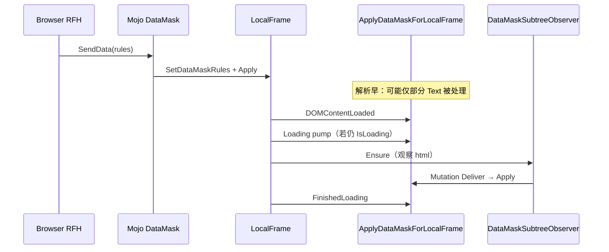
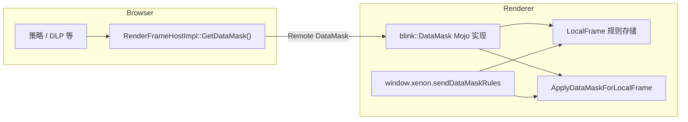

# 帧级数据打码（DataMask）功能说明

本文整理 **Chromium Blink + xenon_overlay** 中为「网页内容打码 / DLP 类策略」做的设计与实现：协议、进程边界、为何 `DataMask` 必须由渲染进程实现，以及 Xenon JS API 与浏览器投递两条路径如何统一到 **`LocalFrame` 上的规则 + `ApplyDataMaskForLocalFrame`**。

---

## 1. 功能设计

### 1.1 目标

- 由**策略侧**（浏览器进程或受控页面脚本）下发 **MaskItem 列表**（正则包含/排除、字典、替换/模糊等）及可选 **XPath 作用域配置**。
- **渲染进程**在 DOM 文本上执行匹配与改写（替换、blur 等），与页面同生命周期、可重复下发更新规则并重新扫描。

### 1.2 Mojo 协议（`blink.mojom`）

定义于 `third_party/blink/public/mojom/frame/data_mask.mojom`：

| 类型 | 作用 |
|------|------|
| `MaskItem` | 单条策略：`regs` / `regs_xor`、`dicts`、`MaskType`（`kReplace` / `kBlur`）、列/内容标记位等 |
| `DataMaskRules` | `mask_items` 数组 |
| `XPathConfig` | `disable_list` / `white_list` / `download_list`（供作用域过滤扩展） |
| **`DataMask`** | 渲染端实现的接口：`SendData(request_id, rules)`、`SendXpathData(config)` |
| **`DataMaskToMain`** | 浏览器端实现的接口：`SendDataToMain(request_id, data)`（例如审计/回传，与 DOM 打码正交） |

### 1.3 单一事实来源（SSOT）

打码的**权威状态**挂在 **`blink::LocalFrame`** 上：

- `SetDataMaskRules` / `GetDataMaskRules`
- `SetDataMaskXPathConfig` / `GetDataMaskXPathConfig`

无论是 **Mojo `DataMask::SendData`**，还是 **同进程 Xenon `window.xenon.sendDataMaskRules`**，最终都应落到这两处，再触发 **`ApplyDataMaskForLocalFrame`**（规则变更后重扫文档）。

### 1.4 渲染侧核心原理：为何不能只「下发时打一次」

浏览器在 **`RenderFrameHostImpl::CommitNavigation`**、**跨进程 iframe 首帧创建**（`RenderFrameCreated` 路径）、以及 **`RenderFrameHostManager` 在部分导航阶段** 会调用 **`DataMaskPolicy(url)`**，内部通过 **`GetDataMask()->SendData`** 把规则送到渲染进程。常见问题：

- **时序**：`SendData` 往往发生在 **文档仍解析中**，DOM 不完整 → 只做一次遍历会 **漏节点**（例如只有标题、没有正文）。
- **动态 DOM**：脚本或解析器后续插入/修改文本 → 已打码节点被替换或新节点未扫描 → **明文回退**。

Blink 侧配套机制（根 observer + loading pump，**不再**在加载期整体隐藏 `<html>`，避免影响正常页面呈现）：

| 机制 | 目的 | 主要代码位置 |
|------|------|----------------|
| **DOMContentLoaded** 后再 Apply | 主文档结构就绪后补扫描 | `LocalFrameClientImpl::DispatchDidDispatchDOMContentLoadedEvent` |
| **FinishedLoading** 后再 Apply | 加载收尾、晚到内容（如 title）补扫描 | `LocalFrame::FinishedLoading` |
| **`documentElement` 子树 MutationObserver** | 子树结构变化 + **文本 characterData** 变化后重扫 | `DataMaskSubtreeObserver` |
| **Loading 任务队列 pump** | 流式解析期间周期性再 Apply | `ScheduleDataMaskApplyPumpIfNeeded` / `RunDataMaskApplyPump`（`TaskType::kInternalLoading`） |

规则清空时 **`ResetDataMaskPresentationState`**：断开 observer、清理 pump 标记。



---

### 1.5 两条投递路径（互补，不重复绑定 `DataMask` 管道）



- **路径 A（跨进程）**：浏览器持 `mojo::Remote<blink::mojom::DataMask>`，调用 `SendData` / `SendXpathData`。接收端是 Blink 里注册的 **`DataMask`** 实现。
- **路径 B（同进程）**：Xenon 注入脚本在渲染进程执行，`RenderFrame` 已对应 `WebLocalFrameImpl`，可直接 `static_cast` 取 **`LocalFrame`**，调用 `Set*` + `Apply*`，**无需**再向 `BrowserInterfaceBroker` 要 `DataMask`（否则易出现「在浏览器错误实现 DataMask」的架构偏差）。

---

## 2. 代码实现（按层次）

### 2.1 Blink：规则存储（`LocalFrame` 概要）

文件：`third_party/blink/renderer/core/frame/local_frame.{h,cc}`

- 成员：`data_mask_rules_`、`data_mask_xpath_config_`（类型为 `mojom::blink::DataMaskRulesPtr` / `XPathConfigPtr`）。
- API：`SetDataMaskRules`、`GetDataMaskRules`、`SetDataMaskXPathConfig`、`GetDataMaskXPathConfig`。

**细节**：此处使用 **mojom-blink** 生成的类型（`mojom::blink::`），与 DOM/字符串等非序列化类型在同一进程内使用一致。打码相关的 **observer、pump** 等见下文 **§2.5**。

### 2.2 Blink：`DataMask` Mojo 实现

文件：`xenon_overlay/blink/renderer/core/frame/data_mask.{h,cc}`（由 `//third_party/blink/renderer/core:core` 编入）

- `GarbageCollected<DataMask>`，实现 `mojom::blink::DataMask`。
- 构造时向 **`InterfaceRegistry`** 注册：  
  `interface_registry->AddInterface<mojom::blink::DataMask>(BindRepeating(...))`  
  这样浏览器侧 `RenderFrameHostImpl::GetDataMask()` 拉起的 pipe 会落到本帧的 `PendingReceiver` 绑定逻辑上。
- `WeakMember<WebLocalFrameImpl> frame_`：帧销毁后不再处理绑定。
- `receiver_.Bind(..., frame_->GetTaskRunner(TaskType::kInternalDefault))`：**Mojo 入口调度到帧的默认任务 runner**，避免与非线程安全模块乱序。
- `SendData`：`SetDataMaskRules` + **`ApplyDataMaskForLocalFrame`**。
- `SendXpathData`：**仅** `SetDataMaskXPathConfig`；**不会**自动 `Apply`（与 Xenon JS `sendDataMaskXPath` 在设置后主动 `Apply` 不同）。若 XPath 要参与过滤，需在 applier 消费 `GetDataMaskXPathConfig()`，或在 `SendXpathData` 末尾补一次 `ApplyDataMaskForLocalFrame`。

**挂载点**：`third_party/blink/renderer/core/frame/web_local_frame_impl.cc` 构造函数中：

```text
data_mask_(MakeGarbageCollected<DataMask>(*this, interface_registry)),
```

`WillBeDetached` / 销毁路径里对 `data_mask_->Dispose()` 断开 receiver（与工程内 `WebLocalFrameImpl` 改动一致）。

### 2.3 Blink：DOM 应用（`data_mask_applier`）

文件：`xenon_overlay/blink/renderer/core/frame/data_mask_applier.{h,cc}`

**入口**

- `CORE_EXPORT void ApplyDataMaskForLocalFrame(LocalFrame& frame)`：在 **当前 `Document`** 上做 **包含根在内的深度优先遍历**（`NodeTraversal::InclusiveDescendantsOf`），仅处理 **`Text`** 节点。
- `CORE_EXPORT void ResetDataMaskPresentationState(LocalFrame& frame)`：规则清空或导航切换时，**释放展示层副作用**（observer、pump 标记），见下文 `LocalFrame` 私有字段与 **friend** 声明。

**前置条件**

- `frame.GetDataMaskRules()` 非空且 **`mask_items` 非空**；否则 `Apply` 直接返回（不做事）。
- `frame.GetDocument()` 非空。

**单条 `MaskItem` 应用（`TryApplyMaskItemToText`）**

- 仅处理 **`is_content_mask == true`**（列名/列值等位当前不参与文本改写路径）。
- 父链上若落在 **`script` / `style`** 元素下则 **跳过**（`IsUnderNonMaskableElement`），避免破坏脚本与样式ソース。
- **排除正则** `regs_xor`：任一匹配则 **不打本条**。
- **包含正则** `regs`：`regs_is_and` 为真时全部匹配才命中，否则 **任一则可**。
- **字典** `dicts`：`String::Contains` 子串，未命中则跳过（`dicts_fuzzy_compare` 等 mojom 字段当前未在 C++ 侧展开）。
- **`MaskType::kBlur`**：在 **父元素** 上合并 `style` 属性，追加 `filter: blur(4px);`（若尚无 `filter:`）。
- **`MaskType::kReplace`**：对 **UTF-8 缓冲** 用 **RE2** 做 `GlobalReplace`，再处理字典替换为 **`replace_text`**；若文本变化则 `text_node.setData(new_text)`。同一文本节点按 `mask_items` 顺序匹配，**命中一条即 `break`**（不再尝试后续 item）。

### 2.4 Blink：`DataMaskSubtreeObserver`（DOM 变化后重打码）

文件：`xenon_overlay/blink/renderer/core/frame/data_mask_mutation_observer.{h,cc}`

- 继承 **`MutationObserver::Delegate`**，在 **`LocalFrame::EnsureDataMaskSubtreeObserver`** 中挂在 **`Document::documentElement()`（即 `<html>`）** 上。
- `MutationObserverInit`：**`childList`**、`subtree`、`characterData` 均为 **true**，因此 **子树节点增删** 与 **文本节点字符变化** 都会 **批量投递** 到 `Deliver`。
- `Deliver` 中直接再次调用 **`ApplyDataMaskForLocalFrame`**，形成「异步微任务批次」里的重扫（与标准 MutationObserver 投递语义一致）。
- **`Disconnect`**：在 `ClearDataMaskMutationObserver` / `ResetDataMaskPresentationState` 路径上调用，避免文档销毁后仍持有 observer。

### 2.5 Blink：`LocalFrame` 中的打码状态与调度

文件：`third_party/blink/renderer/core/frame/local_frame.{h,cc}`（节选语义）

| 成员 / API | 作用 |
|------------|------|
| `data_mask_rules_` / `data_mask_xpath_config_` | Mojo 规则与 XPath 配置（**XPath 尚未在 applier 内消费**，预留） |
| `SetDataMaskRules` | 写入规则；若为空则 **`ResetDataMaskPresentationState`** |
| `EnsureDataMaskSubtreeObserver` | 有规则且存在 `documentElement` 时创建/复用 **`DataMaskSubtreeObserver`** |
| `ScheduleDataMaskApplyPumpIfNeeded` | 仅在 **仍 loading**、有规则、且未排队时，向 **`TaskType::kInternalLoading`** runner `PostTask` **`RunDataMaskApplyPump`** |
| `RunDataMaskApplyPump` | 清 `data_mask_load_pump_scheduled_` 后再 **`ApplyDataMaskForLocalFrame`**（内层会按需再次 `Schedule`，直到结束 loading） |
| `friend ApplyDataMaskForLocalFrame` / `ResetDataMaskPresentationState` | 供 applier 访问 **observer/pump** 等 **私有状态**（与 **`CORE_EXPORT` 一致**，避免 Windows 上导出/友元声明不匹配） |

**其它触发 `ApplyDataMaskForLocalFrame` 的位置**

- `LocalFrameClientImpl::DispatchDidDispatchDOMContentLoadedEvent`：**DOMContentLoaded** 之后。
- `LocalFrame::FinishedLoading`：注释说明 **CommitNavigation 早于 body 解析** 的场景，加载结束时 **再扫全文档**。

### 2.7 Content：浏览器侧 `Remote<DataMask>` 与策略注入示例

文件：`content/browser/renderer_host/render_frame_host_impl.{h,cc}`

- `GetDataMask()`：若未绑定且 `GetRemoteInterfaces()` 可用，则  
  `GetRemoteInterfaces()->GetInterface(data_mask_.BindNewPipeAndPassReceiver())`。
- 对应 **子帧面向渲染进程的 `InterfaceProvider`**，与 Blink 端 `AddInterface<DataMask>` 配对。

**`DataMaskPolicy(const GURL& url)`（当前树中的示例钩子）**

- 在 **`CommitNavigation`** 开头、`RenderFrameCreated`（跨进程子帧）等路径调用，内部构造示例 **`MaskItem`**（如匹配字符串「百度」、`kReplace`、`***XENON***`）并 `GetDataMask()->SendData(...)`。
- **生产环境**应把此处替换为真实策略（按 URL / 企业策略 / Xenon 配置等），而不是硬编码测试规则。

**生命周期**：`render_frame_host_impl_interface_binders.cc` 中 `TearDownMojoConnection` 等处 **`data_mask_.reset()`**，避免帧/nav 后使用旧 pipe。

### 2.8 Xenon：仅绑定「回主进程」接口

文件：`xenon_overlay/chrome/browser/xenon_frame_interface_binder.cc`

- 注册：`XenonPageHost`、`blink::mojom::DataMaskToMain`。
- **不**在这里注册 `DataMask` 的浏览器实现——**`DataMask` 由 Blink 在渲染进程实现**（见上文）。

`DataMaskToMain` 实现示例：`xenon_overlay/chrome/browser/xenon_data_mask_to_main_host_impl.cc`（当前 `SendDataToMain` 以 VLOG 占位，可接审计/策略回写）。

### 2.9 Xenon：渲染进程 JS API

文件：`xenon_overlay/chrome/renderer/js_xenon_api.{h,cc}`、`xenon_data_mask_js_conversions.{h,cc}`

- `sendDataMaskRules(requestId, rulesObject)`：V8 → `base::Value` → `BuildDataMaskRulesFromValue` → **`blink::mojom::blink::DataMaskRulesPtr`**，再：
  - `render_frame()->GetWebFrame()` → **`static_cast<blink::WebLocalFrameImpl*>`** → `GetFrame()` 得 **`LocalFrame*`**；
  - `SetDataMaskRules` + **`ApplyDataMaskForLocalFrame`**。
- `sendDataMaskXPath(config)`：同样取 `LocalFrame*`，`SetDataMaskXPathConfig` + **`ApplyDataMaskForLocalFrame`**（便于将来 applier 使用 XPath 配置后立即生效；与仅 `Set` 的 Mojo `SendXpathData` 行为略有差异，属有意为之）。
- **`sendDataMaskToMain`**：仍通过 **`BrowserInterfaceBroker`** 绑定 **`DataMaskToMain`**，数据进浏览器进程。

**依赖**：`xenon_overlay/chrome/renderer/BUILD.gn` 增加 `//third_party/blink/renderer/core:core`，以便包含 `web_local_frame_impl.h`、`data_mask_applier.h` 并链接实现。

**类型细节**：JS 转换层使用 **`blink::mojom::blink::`**（mojom-blink 生成），与 `LocalFrame` 内 `mojom::blink::` 在命名空间写法上不同，实为同一套 Blink 侧绑定类型；与 `third_party/blink/public/mojom/frame/data_mask.mojom.h`（非 `-blink`）在 **浏览器/通用** 代码中使用的命名空间区分对待，避免混用导致链接或序列化歧义。

---

## 3. 为什么这样实现（原理与惯例）

### 3.1 `DataMask` 必须在渲染进程实现

Chromium 中 **谁能改 DOM、谁能安全遍历 `Document` 与文本节点**，边界非常清楚：**只有 Blink 渲染线程上的代码**适合持有 DOM 引用并做批量改写。浏览器进程只有 `RenderFrameHost` 与 Mojo，**没有** `LocalFrame` / `Document`。

若把 `DataMask` 实现在浏览器并通过 broker 「假装」成渲染接口，既不能直接触达 DOM，也容易与 `InterfaceRegistry` 里真正的渲染端实现冲突，违背 **frame-scoped interface** 的惯例。

### 3.2 `RenderFrameHostImpl::GetDataMask()` 的意义

这是 **策略从浏览器下发到指定帧** 的标准姿势：与 `FindInPage`、`LocalFrame` 等一致——浏览器拿 **Remote**，渲染进程在 **对应 frame token 的 registry** 上绑定 **Receiver**。多帧隔离、随 RFH 生命周期 `reset()`，避免幽灵调用。

### 3.3 Xenon 为何不走 `Remote<DataMask>`

Xenon 的逻辑运行在 **渲染进程** 的 V8 上下文中，与 Blink 已同进程。再走 Mojo 到 `DataMask` 会多一次序列化与调度，且历史上容易错误地在 **浏览器** 注册 `DataMask` 的 binder。

直接 **`WebLocalFrameImpl` → `LocalFrame`** 等价于走 **`DataMask::SendData` 的核心语义**（写规则 + Apply），与 **Mojo 路径共用同一套状态**，满足 **SSOT**。

**实现注意**：`content::RenderFrame::GetWebFrame()` 对本地帧为 `blink::WebLocalFrame*`，在 Chromium 中具体实现类为 `WebLocalFrameImpl`，使用 **`static_cast`** 与同仓库测试用法一致；需校验 **`GetFrame()` 非空**（异常Detached 场景）。

### 3.4 `DataMaskToMain` 单独存在的原因

**方向相反**：渲染进程 → 浏览器，用于上报/同步/审计字符串等，**不参与** DOM 掩码逻辑。与 `DataMask` 职责分离，符合 **单向数据流 + 单一职责**。

---

## 4. 操作步骤（接入与验证）

### 4.1 渲染侧「从规则到屏幕」实现步骤（摘要）

1. **规则入帧**：浏览器 `SendData` 或 Xenon JS `sendDataMaskRules` → `LocalFrame::SetDataMaskRules`。
2. **首次扫描**：立即 `ApplyDataMaskForLocalFrame`（若文档极早可能几乎无 `Text` 节点）。
3. **加载中**：若仍 `IsLoading()`，可通过 **loading pump** 多次 Apply（**不**修改根元素 `visibility`，避免整页先隐后现）。
4. **DOMContentLoaded / FinishedLoading**：再次 Apply，覆盖解析后半段产生的节点。
5. **持续运行**：`EnsureDataMaskSubtreeObserver` 保证 DOM/文本变更后继续 Apply。
6. **规则撤销**：`SetDataMaskRules` 为空 → `ResetDataMaskPresentationState`。

### 4.2 接入与验证清单

1. **浏览器策略**：在合适的导航/策略钩子中，对目标 `RenderFrameHost*` 调用  
   `render_frame_host->GetDataMask().get()->SendData(request_id, rules);`  
   （及需要时的 `SendXpathData`）。  
   注意：需确认帧仍 live、`GetRemoteInterfaces()` 已成功建立。
2. **页面脚本（Xenon）**：调用 `window.xenon.sendDataMaskRules` / `sendDataMaskXPath`，无需连接 `DataMask` pipe。
3. **回传**：`window.xenon.sendDataMaskToMain`，确保 Xenon 的 frame binder 已注册 `DataMaskToMain`。
4. **验证**：加载含可匹配文本的页面 → 下发规则 → 观察文本替换或 blur；检查 `script`/`style` 内文本未被误改。

**范围说明**：规则按 **帧内 `Document`** 遍历；**子 iframe** 拥有独立 `LocalFrame` / `DataMask` pipe，需对相应 `RenderFrameHost` 分别下发。**Shadow DOM**、`textarea` 内部值等路径未在本文档单独展开，以当前 `data_mask_applier` 遍历逻辑为准。

---

## 5. 文件索引（便于 Code Search）

| 区域 | 路径 |
|------|------|
| Mojo | `third_party/blink/public/mojom/frame/data_mask.mojom` |
| Blink 接口实现 | `xenon_overlay/blink/renderer/core/frame/data_mask.{h,cc}` |
| 规则存储 | `third_party/blink/renderer/core/frame/local_frame.{h,cc}` |
| DOM 应用 | `xenon_overlay/blink/renderer/core/frame/data_mask_applier.{h,cc}` |
| DOM 变更观察 | `xenon_overlay/blink/renderer/core/frame/data_mask_mutation_observer.{h,cc}` |
| DOMContentLoaded 钩子 | `third_party/blink/renderer/core/frame/local_frame_client_impl.cc` |
| 注册与生命周期 | `third_party/blink/renderer/core/frame/web_local_frame_impl.{h,cc}` |
| Blink 构建 | `third_party/blink/renderer/core/frame/build.gni` |
| 浏览器 Remote | `content/browser/renderer_host/render_frame_host_impl.{h,cc}` |
| Mojo tear-down | `content/browser/renderer_host/render_frame_host_impl_interface_binders.cc` |
| Xenon 浏览器 binder | `xenon_overlay/chrome/browser/xenon_frame_interface_binder.cc` |
| Xenon ToMain 实现 | `xenon_overlay/chrome/browser/xenon_data_mask_to_main_host_impl.{h,cc}` |
| Xenon JS + 转换 | `xenon_overlay/chrome/renderer/js_xenon_api.{h,cc}`, `xenon_data_mask_js_conversions.{h,cc}` |
| Xenon renderer GN | `xenon_overlay/chrome/renderer/BUILD.gn` |

### 5.1 核心类与 Mojo 类型速查

| 符号 | 所在进程 / 库 | 职责 |
|------|----------------|------|
| `blink::mojom::DataMask` / `MaskItem` / `DataMaskRules` / `XPathConfig` | Mojo 定义（`data_mask.mojom`） | 跨进程序列化载荷；`MaskType` 区分替换与模糊 |
| `content::RenderFrameHostImpl` | 浏览器 | `GetDataMask()` 绑定 pipe；`DataMaskPolicy` 等钩子下发规则（示例实现需替换为生产策略） |
| `blink::DataMask` | 渲染 / Blink | `HeapMojoReceiver` 实现接口；`SendData` → `LocalFrame::SetDataMaskRules` + `Apply`；`SendXpathData` → 仅设 XPath 配置 |
| `blink::WebLocalFrameImpl` | 渲染 / Blink | 构造 `DataMask` 并注册到 `InterfaceRegistry`；析构路径 `Dispose()` |
| `blink::LocalFrame` | 渲染 / Blink | **SSOT**：持有 `DataMaskRules` / `XPathConfig`；loading pump、observer |
| `blink::LocalFrameClientImpl` | 渲染 / Blink | `DOMContentLoaded` 后触发 `ApplyDataMaskForLocalFrame` |
| `ApplyDataMaskForLocalFrame` / `ResetDataMaskPresentationState` | 渲染 / Blink（`data_mask_applier`） | 遍历 `Text` 节点匹配并改写；清理展示层副作用 |
| `blink::DataMaskSubtreeObserver` | 渲染 / Blink | 观察 `<html>` 子树与文本变化，回调中再 `Apply` |
| `xenon::JSXenonApi` | 渲染 / Xenon | `sendDataMaskRules` / `sendDataMaskXPath` 直写 `LocalFrame` + `Apply` |

---

## 6. 已知差异与后续可做事项

- **`SendXpathData`（Blink `data_mask.cc`）** 当前不写 XPath 后自动 Apply；Xenon JS 路径在设置 XPath 后调用了 `ApplyDataMaskForLocalFrame`。若需严格一致，可在 Blink `SendXpathData` 末尾补一次 `Apply`，或在 applier 内统一在读取配置后决定是否需要全量扫描。
- **`request_id`**：Mojo `SendData` 携带的请求号便于将来做浏览器侧应答；Xenon JS 路径目前保留参数但 **未回传**（`(void)request_id`），可按产品需要接 promise/IPC。
- **XPath 与 applier**：在 `data_mask_applier.cc` 中消费 `GetDataMaskXPathConfig()` 后，打码范围可与 aiswork 等产品对齐。

---

## 7. 编码与构建规范（Chromium）

- **头文件包含顺序（`.cc`）**：对应实现头 → 空行 → Chromium 库（字典序，如 `base/`、`content/`、`gin/`）→ `third_party/blink/...`（字典序）→ `v8/` → 本仓库 `xenon_overlay/...`。`.h` 中同样整体按路径字典序；`mojo/` 通常排在 `third_party/blink/` 之前。
- **未使用参数**：Mojo 实现中仅协议需要的参数（如 `SendData` 的 `request_id`）在 C++ 侧用 `int32_t /*request_id*/` 或 `static_cast<void>(var)` 标出，避免静默未使用告警，并与 [Google C++ Style / Chromium](https://chromium.googlesource.com/chromium/src/+/refs/heads/main/styleguide/c++/c++.md) 一致。
- **长行**：`receiver_.Bind(...)` 等调用在超过可读宽度时断行，第二级参数与上一行括号对齐（见 `data_mask.cc`）。
- **GN `visibility`**：`//third_party/blink/renderer/core:core` 默认仅对 `//third_party/blink/*` 可见。嵌入层 `//xenon_overlay/chrome/renderer` 依赖 `core` 时，须在 `third_party/blink/renderer/core/BUILD.gn` 的 `component("core")` 中**显式**增加 `"//xenon_overlay/*"`，禁止在 `xenon_overlay` 侧用不合规的 `public_deps` 绕过可见性。

---

*文档与代码版本对应 Chromium 142 分支上的 xenon_overlay 改动；编译与行为以当前 tree 为准。*
