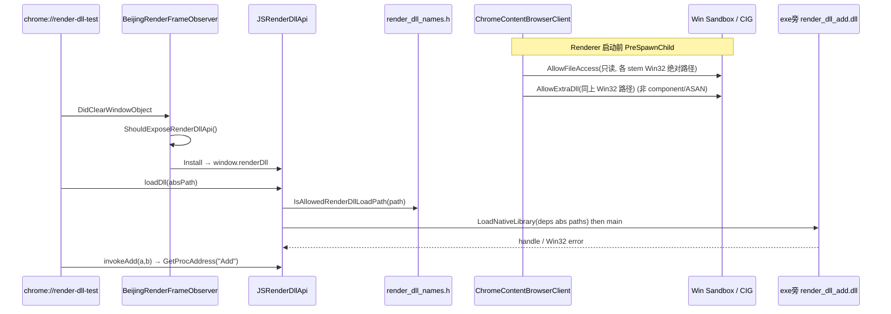

# window.renderDll：渲染进程内原生库按需加载

本文说明非官方桌面构建中，如何在 **Renderer 进程** 内通过 `window.renderDll` 按需加载位于浏览器可执行文件同目录的原生动态库（Win DLL / Mac dylib / Linux .so），并在沙箱与 CIG（Code Integrity Guard）下可用。

与 `chrome://xenon-node/` 的标准 N-API 扩展不同：本功能**不走 Utility / Mojo**，直接在 Renderer 里 `LoadNativeLibrary`，用于验证沙箱白名单与 CIG 例外是否正确。

---

## 1. 目标与非目标

### 目标

- JS 可调用 `window.renderDll.loadDll(absPath)`，在 Renderer 内加载原生库。
- 路径严格限制为 **exe 旁的编译期白名单主模块**（当前为 `render_dll_add`）。
- 保持 Renderer 沙箱 / CIG，**不需要** `--no-sandbox`。
- **不 preload**：不在 sandbox LowerToken 前预加载；仅在 `loadDll()` 时加载。
- 提供可分发的测试页 `chrome://render-dll-test/`（打进 `resources.pak`）。

### 非目标

- 不提供通用任意路径加载（禁止绕过 exe 旁路径校验）。
- 不在 `OFFICIAL_BUILD` 下注入 API 或放行白名单。
- 不实现完整插件框架 / N-API；测试库仅导出 C ABI `Add(a,b)`。

---

## 2. 架构总览



分层职责：

| 层 | 职责 |
|---|---|
| Browser 沙箱配置 | 为 Renderer 注册文件 ACL + CIG 额外 DLL |
| 编译期模块表 | `render_dll_names.h`：stem 列表、主模块、路径拼装 |
| Renderer 注入 | 按 URL 白名单注入 `window.renderDll` |
| JS API | `loadDll` / `unloadDll` / `invokeAdd` / `getStatus` |
| 测试库 + WebUI | `tools/render_dll_add` + `chrome://render-dll-test/` |

---

## 3. 关键文件

| 路径 | 作用 |
|---|---|
| `chrome/common/beijing/render_dll_names.h` | 编译期 stem 列表、路径、`IsAllowedRenderDllLoadPath`、`ForEachRenderDllPathNextToExe` |
| `chrome/common/beijing/BUILD.gn` | `source_set("render_dll_names")` |
| `chrome/renderer/beijing/js_render_dll_api.{h,cc}` | gin Wrappable：`window.renderDll` |
| `chrome/renderer/beijing/beijing_render_frame_observer.{h,cc}` | URL 白名单 + `DidClearWindowObject` 注入 |
| `chrome/renderer/beijing/BUILD.gn` | 编入 renderer beijing |
| `chrome/browser/chrome_content_browser_client.cc` | `AllowFileAccess` + `AllowExtraDll` |
| `chrome/browser/beijing/BUILD.gn` | browser 侧依赖 names |
| `gin/public/wrappable_pointer_tags.h` | `kBeijingRenderDllApi` |
| `tools/render_dll_add/{BUILD.gn,render_dll_add.c}` | 测试用 C ABI 动态库 |
| `chrome/BUILD.gn` | `data_deps += //tools/render_dll_add`（非 official） |
| `xenon_overlay/.../dev_test_pages_webui.{h,cc}` | `chrome://render-dll-test/` / `chrome://local-video-test/` |
| `xenon_overlay/resources/webui/render_dll_test/index.html` | 测试页资源 |
| `xenon_overlay/resources/xenon_resources.grd` | `IDR_RENDER_DLL_TEST_HTML` |
| 侧栏 | `xenon_sidebar_view.cc` → `chrome://render-dll-test/` |

---

## 4. 编译期模块表（`render_dll_names.h`）

### 4.1 Stem 约定

- Stem = GN `shared_library` 名，**无** `lib` 前缀、**无** 扩展名。
- 实际文件名用 `base::GetNativeLibraryName(stem)`：
  - Win: `render_dll_add.dll`
  - Mac: `librender_dll_add.dylib`
  - Linux: `librender_dll_add.so`

### 4.2 列表设计

```cpp
// 依赖在前，JS 可 load 的主库在最后。主 stem 只写一次。
inline constexpr const char* kRenderDllModuleStems[] = {
    "render_dll_dep",  // private shared_library dep
    "render_dll_add",  // main（JS loadDll 只允许这个）
};
inline constexpr const char* kRenderDllMainStem =
    kRenderDllModuleStems[kRenderDllModuleStemCount - 1];
```

| 符号 | 含义 |
|---|---|
| `kRenderDllModuleStems[]` | 需要沙箱放行的全部模块（依赖 + 主库） |
| `kRenderDllMainStem` | 指向数组**最后一项**；`loadDll` 唯一允许加载的主库 |
| `ForEachRenderDllPathNextToExe` | 对每个 stem 拼 `DIR_EXE/<filename>` 并回调（给 Browser 白名单用） |
| `IsAllowedRenderDllLoadPath` | `loadDll` 路径必须与主库绝对路径一致（Win 大小写不敏感） |

当前测试栈刻意用 **shared_library 依赖**（`render_dll_dep`）验证：只白名单主库、依赖未放行时，`loadDll(主库)` 会因依赖解析失败（常见 Win **126**）。生产代码仍**优先** `static_library` 链进主库。

### 4.3 依赖库加载测试（`render_dll_dep`）

| 项 | 说明 |
|---|---|
| 目标 | `render_dll_add.dll` 动态链接 `render_dll_dep.dll`，验证沙箱对依赖模块的 ACL/CIG |
| 源码 | `tools/render_dll_add/render_dll_dep.{c,h}` 导出 `RenderDllDepCombine`；`render_dll_add.c` 的 `Add` 转调它 |
| GN | `shared_library("render_dll_dep")`；`render_dll_add` `deps = [ ":render_dll_dep" ]` |
| 白名单 | stems 中 **先** `render_dll_dep` **后** `render_dll_add`；`AllowFileAccess` / `AllowExtraDll` 对同一批 Win32 绝对路径调用；`loadDll` 先按绝对路径加载依赖再加载主库 |
| JS | 仍只 `loadDll(…/render_dll_add.dll)`；OS 加载器自动拉起同目录 dep |
| 负向验证 | 临时从 `kRenderDllModuleStems` 去掉 `render_dll_dep` 并重建浏览器侧配置后，加载主库应失败 |

### 4.4 新增模块步骤

1. 在 `tools/render_dll_add`（或合适目录）添加 `shared_library("your_stem")`。
2. 把 stem 写入 `kRenderDllModuleStems`（依赖在前 / 主库最后）。
3. 主库 `deps` 链上该 shared_library；产物落在 `out/<dir>/`（与 exe 同级）。编 `chrome` 时 `data_deps` 会编到 `render_dll_add`（并带上其 deps）。
4. 若主库导出符号变了，同步改 `JSRenderDllApi::InvokeAdd`（当前写死 `"Add"`）。

---

## 5. Browser：沙箱与 CIG（Windows）

入口：`ChromeContentBrowserClient` 里配置 Renderer 子进程沙箱（`PreSpawnChild` 相关路径）。

### 5.1 `AllowFileAccess`（文件 ACL）

- 条件：`IS_WIN && !OFFICIAL_BUILD`，且 `Sandbox::kRenderer`。
- 对 `ForEachRenderDllPathNextToExe` 中每个 **Win32 绝对路径**（与 `AllowExtraDll` 同一批）：
  - `AllowFileAccess(kAllowReadonly, path)`
- 依赖须由 `loadDll` 按绝对路径先加载，避免 PE loader 以未匹配路径形态打开 import → **Code=5**。

### 5.2 `AllowExtraDll`（CIG 例外）

- 条件：`!COMPONENT_BUILD && !ADDRESS_SANITIZER`（与上游开启 CIG 的条件一致），且 `!OFFICIAL_BUILD`，且 Renderer。
- 在设置 `MITIGATION_FORCE_MS_SIGNED_BINS` 之后，对每个 stem 路径 `AllowExtraDll`。
- **注意**：`AllowExtraDll` 要求 CIG 已打开（否则 DCHECK）。
- Component / ASAN 构建通常**不开**这套 CIG；此时主要测路径 / ACL，而不是签名策略。
- 未放行时常见 **错误 577 `ERROR_INVALID_IMAGE_HASH`**。

### 5.3 为何不 preload

历史上曾在 Renderer 启动、LowerToken 前预加载以绕过 CIG。当前方案改为：

1. Browser 侧白名单路径 + ExtraDll；
2. 页面调用 `loadDll()` 时再 `LoadNativeLibrary`。

Release（non-component、非 official）已验证可加载成功，故**不再 preload**，避免占启动时间与句柄。

---

## 6. Renderer：注入与 JS API

### 6.1 何时注入 `window.renderDll`

`BeijingRenderFrameObserver::DidClearWindowObject`：

1. 仅主框；
2. `!OFFICIAL_BUILD`；
3. URL 安全上下文足够（`chrome://` 一般已是 secure context；`file://` 非官方额外放行）；
4. `IsRenderDllUrlAllowed(url)` 为真。

**URL 白名单（与 `window.beijing` 不同）：**

| 来源 | renderDll | beijing |
|---|---|---|
| `file://` | 允许 | **不允许**（避免测试页顺带暴露 beijing） |
| `chrome://render-dll-test/` | 允许 | 否（host 不在 beijing 列表） |
| `localhost` / `127.0.0.1` / `::1` / `*.so.com` | 允许 | 允许 |
| `--beijing-allowed-domains=...` | 允许 | 允许 |

注入后属性：`window.renderDll` 只读、不可配置（`DefineProperty`）。

### 6.2 JS API

```js
// 加载：path 必须是 exe 旁主模块的绝对路径
const r = window.renderDll.loadDll(
  "H:\\chromium_142\\src\\out\\Release_64\\render_dll_add.dll");
// 成功: { success: true, path, handle, alreadyLoaded? }
// 失败: { success: false, error, code }

window.renderDll.unloadDll();          // { unloaded: boolean }
window.renderDll.invokeAdd(1, 2);      // number，需已 load 且导出 Add
window.renderDll.getStatus();          // { loaded, path }
```

路径校验失败会 **throw** TypeError（不是 `{success:false}`）。

### 6.3 生命周期

- `WillReleaseScriptContext`（主 world）与 `OnDestruct`：释放 `ScopedNativeLibrary`。
- 同一路径重复 `loadDll`：返回 `alreadyLoaded: true`，避免 `ScopedNativeLibrary` 自重置 abort。

### 6.4 gin 标签

`gin/public/wrappable_pointer_tags.h` → `kBeijingRenderDllApi`。

---

## 7. 测试动态库

### 7.1 源码

| 库 | 导出 | 角色 |
|---|---|---|
| `render_dll_dep` | `RenderDllDepCombine(a,b)` → `a+b` | 私有依赖 |
| `render_dll_add` | `Add(a,b)` → 调用 `RenderDllDepCombine` | JS `loadDll` 主库 |

纯 C ABI，非 Node/N-API。

### 7.2 构建与落盘

```text
autoninja -C out/Release_64 tools/render_dll_add:render_dll_add
# 或编 chrome：非 official 下 chrome/BUILD.gn data_deps 会带上该 target
```

产物必须在 **与 `xenon.exe` / `chrome.exe` 相同目录**，例如：

- `out/Release_64/render_dll_dep.dll`   ← 依赖，须与主库同目录
- `out/Release_64/render_dll_add.dll`
- `out/Release_64/xenon.exe`

缺主库或缺依赖、或依赖未进沙箱白名单时，`loadDll` 常见 **126 MOD_NOT_FOUND**。

---

## 8. 测试页 WebUI

### 8.1 URL

| 页面 | Host | 侧栏 |
|---|---|---|
| Render DLL 测试 | `chrome://render-dll-test/` | RDL |
| 本地 Video 测试 | `chrome://local-video-test/` | VT |

资源打进 `xenon_resources.pak`，不依赖开发机 `file:///H:/...` 绝对路径。

### 8.2 注册链

1. HTML：`xenon_overlay/resources/webui/render_dll_test/index.html`
2. GRD：`IDR_RENDER_DLL_TEST_HTML`
3. Controller：`RenderDllTestWebUIConfig` / `RenderDllTestWebUIController`
4. `XenonBrowserMainExtraParts` → `WebUIConfigMap::AddWebUIConfig`
5. CSP：允许 inline script/style；关闭 Trusted Types（日志用 `innerHTML`）

### 8.3 默认路径

页面加载时：

```js
chrome.send('getDefaultDllPath');
// C++ → __setDefaultDllPath(beijing::RenderDllPathNextToExe().AsUTF8Unsafe())
```

自动填入 exe 旁主模块路径，无需手写本机盘符。

---

## 9. 推荐验证步骤（Win Release）

1. `args.gn`：`is_debug=false`，默认 `is_component_build=false`，`is_official_build` 未开。
2. `autoninja -C out/Release_64 chrome`（或至少保证 `render_dll_add.dll` 与 exe 同目录）。
3. 启动后打开侧栏 **RDL** 或地址栏 `chrome://render-dll-test/`。
4. 确认状态显示 `window.renderDll` 已绑定；路径已自动填充。
5. 点击加载 → 成功；`invokeAdd(3,4)` → `7`。

Debug / component 构建：可测注入与路径校验；CIG/`AllowExtraDll` 可能不生效，勿用其结论否定 Release 行为。

---

## 10. Windows 错误码速查

| code | 含义 | 常见原因 |
|---|---|---|
| 5 `ACCESS_DENIED` | 沙箱文件 ACL | 未 `AllowFileAccess`；或依赖未按绝对路径先加载、被 loader 以未放行路径打开 |
| 126 `MOD_NOT_FOUND` | 找不到模块或依赖 | DLL 未编进当前 out 目录；或依赖 DLL 缺失/未列入 stems |
| 127 `PROC_NOT_FOUND` | 缺导出 | 库已加载但依赖导出不对；或 `Add` 未导出 |
| 577 `INVALID_IMAGE_HASH` | CIG 拒签 | 未 `AllowExtraDll`，或 component 构建误以为有 CIG 例外 |

路径被 JS 层拒绝（非 Win32 code）：抛错  
`loadDll only allows the absolute path next to the browser exe: ...`

---

## 11. Official / 安全边界摘要

| 项 | 行为 |
|---|---|
| `OFFICIAL_BUILD` | 不注入 `window.renderDll`；Browser 不注册 ExtraDll/测试 AllowFileAccess |
| 路径 | 仅主模块绝对路径（exe 旁） |
| 页面 | 仅白名单 URL；测试页为自有 `chrome://render-dll-test/` |
| 加载时机 | 仅 JS 主动 `loadDll`，无启动 preload |
| 与 beijing | 分轨白名单；`file://` 只给 renderDll |

---

## 12. 设计决策备忘

1. **不用 Utility 中转**：少一跳 IPC；代价是必须正确配置 Renderer 沙箱。
2. **不用运行时扫盘 / JSON 配置模块表**：编译期 `constexpr` stems，Browser/Renderer 共用同一头文件。
3. **主 stem = 数组末项**：避免主库名字符串写两遍。
4. **WebUI 替代 file:// 侧栏入口**：打包进 pak，其他人机器可打开；renderDll 额外放行该 host。
5. **验证通过后去掉 preload**：白名单足够时，按需加载即可。
6. **测试用 shared_library 依赖（`render_dll_dep`）**：验证依赖 DLL 是否也进了 AllowFileAccess/AllowExtraDll；正式代码仍优先 static 链进主库。
