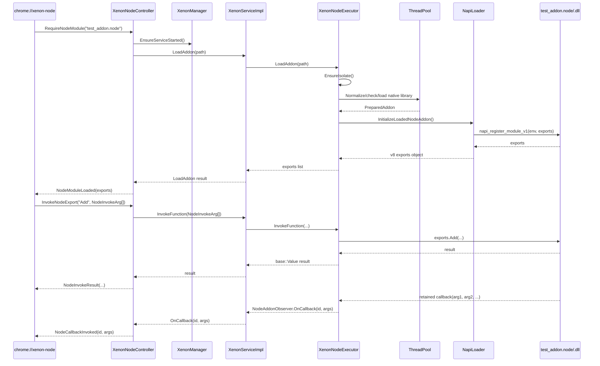

# 标准 N-API 扩展加载流程

本文整理提交 `070e80e2db989ee751debeb9a6d10959a5ef8ee3` 中引入、并在后续迭代中扩展的标准 N-API `.node` 扩展加载链路。当前实现同时服务于 `chrome://xenon-node/` 诊断页和 Electron 容器 renderer；两者都可以像 Electron 一样通过：

```js
const addon = require('test_addon.node');
```

加载并调用使用标准 Node-API ABI 的原生扩展。这里的“标准”指 addon
入口和 ABI，不表示 Xenon 已实现完整 Node.js runtime；当前 shim 对外声明
`NAPI_VERSION=1`，并只实现文末列出的兼容子集。

## 总览

诊断 WebUI 链路分为五层：

1. WebUI 前端提供 `window.require()`，模拟 Node/Electron 的 require 入口。
2. WebUI Typed Mojo 把 `RequireNodeModule` / `InvokeNodeExport` 发给 Browser。
3. Browser 侧 `XenonNodeController` 转发到 `XenonMainService`。
4. Utility 进程里的 `XenonNodeExecutor` 创建 V8 isolate，加载 native addon。
5. N-API shim 把 addon 的标准 N-API 调用适配到 Chromium V8 / base 线程模型。



上图只表示 `chrome://xenon-node/` 的诊断链路。Electron 容器 renderer 使用另一条
低延迟链路：

```text
Hosted renderer require("*.node")
  -> XenonIpcDocumentHost 在 Browser 校验 origin/container/window 身份
  -> Browser 一次性代理 NodeAddonHost receiver 到对应 Utility service
  -> Renderer 直接调用 Utility 的 NodeAddonHost
  -> XenonNodeExecutor / NapiLoader / addon
```

Browser 只负责授权、选择 `container_id` 和转交 Mojo endpoint；绑定完成后不位于
同步 addon 方法调用路径中。这样既保留 Browser 的安全边界，又避免 addon 同步调用
Win32 HWND 时 Renderer、Browser UI 和 Utility 形成环形等待。诊断页仍通过
`XenonNodeController` 返回 Promise；Electron renderer 的函数、构造、实例方法和属性
代理则可以保持其现有同步调用语义。

两条链路最终汇合到同一套 `XenonNodeExecutor` 和 N-API shim。Electron 容器以
`container_id` 作为执行上下文与 callback 隔离键，因此 TH、PL-E 的 addon、实例、
callback、libuv loop 和 `runtime_directory` 不共享。

## 关键文件

### 前端 require 代理

文件：

- `xenon_overlay/resources/webui/xenon_node/require.ts`
- `xenon_overlay/resources/webui/xenon_node/xenon_node.ts`

`require.ts` 做了几件事：

- 暴露 `window.require`。
- 规范化 Windows 路径分隔符和大小写，保证同一个 `.node` 只有一个缓存键。
- 维护 `moduleCache`，同一个模块只加载一次。
- 根据 Utility 返回的导出描述符构建函数、普通值、对象和 class 代理。
- class 方法放在真实的前端 `prototype` 上，支持 `instanceof`，不会把未知属性猜成函数。
- 通过 `$get()` / `$set()` 访问动态属性，通过 `$dispose()` 显式释放远端实例；`FinalizationRegistry` 作为兜底。桥接层使用带 `$` 的保留名称，避免覆盖 addon 自己可能导出的 `dispose()` 方法。
- 用 `__xenonReady` 表示 native module 加载完成。
- 把 JS 参数转换为 mojom wire value。
- 把 mojom wire value 转回 JS 普通值。
- 为 JS callback 分配稳定 callback id，同一个函数重复传入时复用 id。
- 通过 `PageCallbackRouter` 接收 Browser 回调：
  - `NodeModuleLoaded`
  - `NodeInvokeResult`
  - `NodeCallbackInvoked`
  - `NodeCallbackReleased`
  - `NodePropertyResult`
  - `NodeSetPropertyResult`
  - `NodeServiceReset`

函数、构造、方法和属性调用经过 Mojo，因此返回 `Promise`；这是与 Electron 同进程同步 `require()` 的主要差异。

当前前端调用方式仍然是普通函数调用：

```js
const addon = require('test_addon.node');
await addon.__xenonReady;

await addon.Add(10, 20);
await addon.InspectTypes({flag: true, maybeNull: null, items: [1, 'two']});
await addon.BinaryEcho(new Uint8Array([1, 3, 5]));
await addon.MultiCallback(firstCallback, secondCallback);
```

`require.ts` 内部会把普通 JS 值编码成 `mojo_base.mojom.Value` union：

- `null` -> `nullValue`
- `undefined` / `bigint` / `Date` / `Map` / `Set` -> 带保留类型字段的 `dictionaryValue`
- `boolean` -> `boolValue`
- 普通 `number` -> `intValue` 或 `doubleValue`
- `NaN` / `Infinity` / `-Infinity` / `-0` -> 带类型字段的 `dictionaryValue`
- `string` -> `stringValue`
- `ArrayBuffer` / `TypedArray` -> `binaryValue`
- `Array` -> `listValue`
- plain object -> `dictionaryValue`
- callback function -> `NodeInvokeArg{is_callback=true, callback_id=...}`

Browser 回包后，前端再把 `mojo_base.mojom.Value` 还原成普通 JS 值。其中 `binaryValue` 会还原成 `Uint8Array`。循环引用、函数或 symbol 作为普通值时会明确报错，不会静默丢字段。

### WebUI Typed Mojo

文件：

- `xenon_overlay/chrome/browser/ui/webui/xenon_node.mojom`
- `xenon_overlay/chrome/browser/ui/webui/xenon_node_controller.cc`
- `xenon_overlay/chrome/browser/ui/webui/xenon_node_controller.h`

接口分三类：

```mojom
interface Page {
  NodeModuleLoaded(...);
  NodeInvokeResult(...);
};

interface PageHandler {
  RequireNodeModule(string path);
  InvokeNodeExport(...);
};

interface PageHandlerFactory {
  CreatePageHandler(pending_remote<Page> page,
                    pending_receiver<PageHandler> handler);
};
```

当前 `xenon_node.mojom` 的调用协议是：

```mojom
import "mojo/public/mojom/base/values.mojom";

struct NodeInvokeArg {
  bool is_callback;
  int32 callback_id;
  mojo_base.mojom.Value value;
};

struct NodeExportInfo {
  string name;
  string kind;
  bool enumerable;
  bool writable;
  bool has_value;
  mojo_base.mojom.Value value;
  array<NodeExportInfo> children;
  array<NodeExportInfo> prototype;
};

interface Page {
  NodeInvokeResult(int32 request_id,
                   bool success,
                   mojo_base.mojom.Value result,
                   array<NodeCallbackResult> callback_results,
                   string error_msg);
  NodeCallbackInvoked(int32 callback_id,
                      array<mojo_base.mojom.Value> args);
  NodeCallbackReleased(int32 callback_id);
  NodePropertyResult(...);
  NodeSetPropertyResult(...);
};

interface PageHandler {
  InvokeNodeExport(int32 request_id,
                   string module_path,
                   string function_name,
                   array<NodeInvokeArg> args);
  ConstructNodeExport(...);
  InvokeNodeInstance(...);
  GetNodeInstanceProperty(...);
  SetNodeInstanceProperty(...);
  ReleaseNodeInstance(...);
};
```

`XenonNodeController` 是 Browser 侧桥接层：

- 通过 `WebUIBrowserInterfaceBrokerRegistry::GetTrustedRegistry()` 注册 `PageHandlerFactory`。
- `RequireNodeModule()` 确保 utility service 启动，然后调用 `XenonMainService.LoadAddon()`。
- `InvokeNodeExport()` 调用 `XenonMainService.InvokeFunction()`。
- 每个 Controller 分配独立 `client_id`，Utility 按 `client_id` 保存
  `NodeAddonObserver`，避免多个 `chrome://xenon-node/` 页面之间串回调。
- Controller 同时实现 `NodeAddonObserver`，把 Utility 主动推送的 callback
  转给对应页面。
- `XenonManager` 为每次 Utility 启动分配新的 service generation。Utility
  重启后，Controller 会通知前端清理失效实例，重新绑定 observer，并在放行
  后续调用前重载当前页面使用过的模块。
- 模块重放期间只排队 `require`；函数、构造、属性和实例操作明确返回
  “Utility service restarted; retry the operation”。不能把触发重启的调用
  悄悄排队执行，否则调用方已经收到失败，带副作用的 native 操作却可能在
  后台实际发生。
- Browser 再通过 `Page` remote 回调前端。

这里已经从旧式 `chrome.send` 迁到了 Typed Mojo + `PageCallbackRouter`。

### Browser 到 Utility Service

文件：

- `xenon_overlay/public/mojom/xenon_service.mojom`
- `xenon_overlay/chrome/browser/xenon_manager.cc`
- `xenon_overlay/services/xenon_service_impl.cc`

`XenonMainService` 提供加载、调用、对象生命周期和回调 observer：

```mojom
import "mojo/public/mojom/base/values.mojom";

struct NodeInvokeArg {
  bool is_callback;
  int32 callback_id;
  mojo_base.mojom.Value value;
};

interface NodeAddonObserver {
  OnCallback(int32 callback_id, array<mojo_base.mojom.Value> args);
  OnCallbackReleased(int32 callback_id);
};

SetNodeAddonObserver(int32 client_id,
                     pending_remote<NodeAddonObserver> observer);

LoadAddon(string path)
    => (bool success, string error_msg, array<NodeExportInfo> exports);

InvokeFunction(string module_path,
               int32 client_id,
               string function_name,
               array<NodeInvokeArg> args)
    => (bool success,
        mojo_base.mojom.Value result,
        array<NodeCallbackResult> callback_results,
        string error_msg);

ConstructExport(...);
InvokeInstance(...);
GetInstanceProperty(...);
SetInstanceProperty(...);
ReleaseInstance(...);
```

`XenonManager` 使用 `ServiceProcessHost::Launch<mojom::XenonMainService>()` 拉起 utility process，并通过 `DuplicateServiceRemote()` 给 WebUI controller 使用。

`XenonServiceImpl` 本身不直接操作 V8，而是持有：

```cpp
std::unique_ptr<XenonNodeExecutor> node_executor_;
```

这样 service 网络探测、observer、N-API 执行职责分开，后续扩展也更清楚。

### Utility 内 V8 执行器

文件：

- `xenon_overlay/services/xenon_node_executor.cc`
- `xenon_overlay/services/xenon_node_executor.h`

`XenonNodeExecutor` 负责：

- 创建并持有独立 V8 isolate。
- 持有 addon context 和 exports object。
- 加载 addon。
- 枚举导出的 kind、普通值、属性描述符、自有成员和 prototype 成员。
- 调用导出函数、构造 class、调用实例方法并读写实例/导出属性。
- 按 module path 保存模块，按 instance id 保存实例。
- 在 ThreadPool 上解析真实路径并加载 native library，再回到 V8 所在线程
  初始化 addon，避免在 service 主序列执行阻塞文件 I/O。
- 把 `base::Value` 转成 V8 参数。
- 把 V8 返回值转回 `base::Value`。
- 为 callback id 创建可被 addon 长期持有的 V8 function，并通过 observer 推送每次调用的全部参数。
- 在前端显式释放或垃圾回收后释放实例与 callback 映射。

重要实现点：

```cpp
gin::IsolateHolder::Initialize(
    gin::IsolateHolder::kNonStrictMode,
    gin::ArrayBufferAllocator::SharedInstance());

addon_isolate_holder_ = std::make_unique<gin::IsolateHolder>(
    base::SingleThreadTaskRunner::GetCurrentDefault(),
    gin::IsolateHolder::kSingleThread,
    gin::IsolateHolder::IsolateType::kUtility);
```

这里使用 `gin::IsolateHolder`，不要直接裸 `v8::Isolate::New()`。Chromium 里 V8 snapshot、ArrayBuffer allocator、isolate 生命周期已经有成熟封装，utility 里按 gin 的方式进入更稳。

每次进入 V8 使用 `AutoV8Scope`：

```cpp
v8::Locker locker(isolate);
v8::Isolate::Scope isolate_scope(isolate);
v8::HandleScope handle_scope(isolate);
v8::Context::Scope context_scope(context);
```

这对异步回调尤其重要：一旦 isolate 使用了 Locker 机制，后续跨线程/异步回到 V8 都必须遵守 Locker 纪律。

加载成功后，`XenonNodeExecutor` 会枚举 exports：

```cpp
exports->GetOwnPropertyNames(context, v8::PropertyFilter::ALL_PROPERTIES)
```

使用 `ALL_PROPERTIES` 是为了拿到 N-API addon 可能定义为 non-enumerable 的导出函数。

### 结构化值转换

`InvokeFunction()` 的参数和返回值都走 `base::Value`：

- `base::Value::Type::NONE` -> V8 `null`
- `BOOLEAN` -> V8 boolean
- `INTEGER` / `DOUBLE` -> V8 number
- `STRING` -> V8 string
- `BINARY` -> V8 `ArrayBuffer`
- `LIST` -> V8 array
- 普通 `DICT` -> V8 object
- 带 Xenon wire tag 的 `DICT` -> V8 `undefined` / `BigInt` / `Date` / `Map` / `Set` / 特殊 number

返回方向对应把 V8 值转回 `base::Value`：

- `null` -> `base::Value()`
- `undefined` / `BigInt` / `Date` / `Map` / `Set` / 特殊 number -> 带 wire tag 的 `base::Value::Dict`
- boolean/number/string -> 对应基础类型
- `ArrayBuffer` / `ArrayBufferView` -> `base::Value::BlobStorage`
- array/object -> 递归转换

为了避免异常对象或过深对象把调用链拖死，转换有最大递归深度限制。函数对象不会作为普通对象跨 wire 传回；callback 函数必须通过 `NodeInvokeArg.is_callback` 显式传入。

### Callback 分发

前端为 JS callback 分配稳定的 `callback_id`。executor 创建对应 V8 function，native addon 调用该 function 时：

1. executor 转换本次调用的全部 callback 参数。
2. `XenonServiceImpl` 只接受当前 page observer generation 的事件，旧页面事件直接丢弃。
3. `NodeAddonObserver.OnCallback()` 把事件主动推到 Browser。
4. Controller 通过 `Page.NodeCallbackInvoked()` 转给 WebUI。
5. `require.ts` 按 `callback_id` 找到原始函数，并用全部参数调用它。

这支持多个 callback 参数，例如：

```js
await addon.MultiCallback(firstCallback, secondCallback);
```

callback 生命周期不再依附一次 `InvokeFunction` 响应，同一个 native callback 可以在函数返回后持续、多次调用。V8 callback wrapper 使用 weak handle；addon 不再持有时，Utility 发送 `NodeCallbackReleased`，前端解除强引用。

### Promise 返回

executor 会识别 V8 `Promise` 返回值，并在 microtask checkpoint 后读取 settled promise：

- fulfilled promise：把 `promise->Result()` 转成 `base::Value` 返回。
- rejected promise：把 rejection 转换后作为错误回包。
- pending promise：当前直接报错。

这覆盖了 addon 通过 `napi_create_promise()` + `napi_resolve_deferred()` 返回已
resolve Promise 的场景。Utility 已接入真实 libuv event loop，但当前调用
响应没有为 pending Promise 保留异步完成回调，因此长期 pending Promise
仍不是完整 Node runtime 语义。

### N-API Loader

文件：

- `xenon_overlay/chrome/browser/napi/napi_loader.cc`
- `xenon_overlay/chrome/browser/napi/napi_loader.h`

加载流程：

1. 校验 `.node` 后缀并解析真实路径。默认只允许加载 `xenon.exe` 所在目录
   及其子目录中的 addon；开发调试可显式传
   `--allow-external-xenon-node-addons` 放开此限制。
2. `XenonNodeExecutor` 把文件规范化、安全边界检查和
   `base::ScopedNativeLibrary` 加载投递到带 `base::MayBlock()` 的
   ThreadPool 任务。Utility/V8 序列不执行 `NormalizeFilePath()`、
   `realpath()` 或动态库加载等阻塞操作。
3. ThreadPool 回到 Utility 序列后查找标准入口：
   - `napi_register_module_v1`
   - fallback: `node_register_module_v1`
4. 创建 `napi_env__`。
5. 创建 `exports` object。
6. 调用 addon 注册函数：

```cpp
napi_value result = register_func(env, exports);
```

7. 返回 addon 导出的 V8 object，并把 module cache 的词法路径键、
   `napi_env__`、导出描述符和 library 所有权一起保存在
   `XenonNodeExecutor`。

成功后，模块缓存同时持有 `napi_env__` 与
`base::ScopedNativeLibrary`。销毁顺序保证先释放 V8/N-API 状态，再卸载
native library，避免 callback、finalizer 或函数地址指向已卸载模块。
addon 初始化入口运行在独立 handle scope 中，导出对象先提升为 V8
persistent，再关闭临时 scope，避免把初始化期间的所有 `napi_value`
包装长期保留。wrap/external finalizer 由 `napi_env__` 统一托管；GC 时在
weak callback 第二阶段执行，env 销毁时仍未触发的 finalizer 会在 library
卸载前完成。

这意味着 addon 仍按标准 N-API 写法导出：

```cpp
NAPI_MODULE(test_addon, Init)
```

Windows 下测试 addon 也编译成 `test_addon.node`，前端与后端都不再做 `.node -> .dll` 的假映射。

### 非标准 / 静态注册 addon

部分历史 addon 不导出 `napi_register_module_v1`，而是通过 Node 头文件里的构造函数在 DLL attach 阶段调用：

```cpp
napi_module_register(&module);
```

这类 addon 在 Electron/Node on Windows 下通常还会 delay-load `node.exe`，并通过 `win_delay_load_hook.cc` 把 `node.exe` 符号解析到当前进程。当前实现按 Electron 模式处理：

- GN 参数 `enable_xenon_node_uv_compat` 打开时，`xenon.exe` 链接 `//xenon_overlay/chrome/browser:napi_node_exports`，导出 N-API / uv 兼容符号，满足“当前进程就是 Node host”的 Electron 模式。
- 同一个 GN 参数还会产出并携带 `node.exe` ABI 兼容提供者，用于兼容仍按 `node.exe` 导入符号的历史 addon。这个文件是带 `.exe` 文件名的动态符号提供者，会在加载 addon 依赖时进入 Utility 进程；它不是 Node.js runtime，也不会作为独立 Node 进程启动。

`napi_module_register()` 会把注册到的 `napi_module` 放入当前进程 shim
内部注册表。如果 addon 没有显式导出入口，`NapiLoader` 会在加载后遍历
注册项，并根据 `napi_module` 地址是否属于当前 `.node` 映像选择模块。
不能使用“最后注册者”作为归属依据，否则并发或依赖库注册会选错模块。
匹配项会立即从注册表取走，再调用其 `nm_register_func(env, exports)`；
这样加载失败并卸载 library 后不会留下可被下一次扫描解引用的悬空记录。
如果需要临时关闭这条兼容路径，可使用启动参数
`--disable-xenon-node-static-registration`。

因此这条兼容路径有两层开关：

- 编译期：`enable_xenon_node_uv_compat = true`，控制是否构建 Node/uv 兼容导出和 `node.exe` ABI 提供者。
- 运行期：默认允许使用 `napi_module_register` 静态注册 fallback；`--disable-xenon-node-static-registration` 可在本次运行关闭它。

标准 addon 的显式入口 `napi_register_module_v1` / `node_register_module_v1` 不依赖运行期开关；运行期开关只影响非标准静态注册路径。`XenonManager` 会把关闭开关显式转发给 utility service，因为 `ServiceProcessHost` 不会自动转发自定义开关。

本次兼容开关相关修改点：

- `//xenon_overlay/buildflags/features.gni` 新增 `enable_xenon_node_uv_compat`，作为是否构建 Node/uv 兼容导出和 `node.exe` ABI 提供者的 GN 参数；Windows、macOS、Linux 默认开启。
- `//xenon_overlay/buildflags/BUILD.gn` 新增 `ENABLE_XENON_NODE_UV_COMPAT` buildflag，供 C++ 代码条件编译。
- `//chrome/BUILD.gn` 仅在 `enable_xenon_node_uv_compat = true` 时给 `xenon.exe` 链接 `//xenon_overlay/chrome/browser:napi_node_exports`。
- `//xenon_overlay/chrome/browser/BUILD.gn` 在该 GN 参数打开时构建 `napi_node_exports`；Windows 额外构建 `node_exe`，并把它作为 N-API loader 运行数据携带。
- `//xenon_overlay/chrome/browser/napi/napi_switches.h` 定义运行期开关 `--disable-xenon-node-static-registration`；历史 `--enable-xenon-node-static-registration` 保留为兼容命名，但默认已经开启，不再需要传。
- `//xenon_overlay/chrome/browser/napi/napi_loader.cc` 用 `ENABLE_XENON_NODE_UV_COMPAT` 和运行期关闭开关保护静态注册 fallback；默认情况下 addon 调用 `napi_module_register()` 后会继续调用 `nm_register_func`。
- `//xenon_overlay/chrome/browser/xenon_manager.cc` 通过 `ServiceProcessHost::Options::WithExtraCommandLineSwitches()` 向 Utility 显式转发 `--disable-xenon-node-static-registration` 和开发期的 `--allow-external-xenon-node-addons`；Utility launch 不会自动继承自定义开关。

这条路径已用原版 `pc_addon.node` 验证：

- `pc_addon.node` / `dk_addon.node` 放在 `out/Debug_64`。
- `require("H:\\chromium_142\\src\\out\\Debug_64\\pc_addon.node")` 成功。
- 能枚举出 `initAddon`、`setPlayableExt`、`NativeAplayerStack` 等真实导出。
- `await addon.setPlayableExt(["mp4", "mkv"])` 返回正常。

### libuv 运行时

`enable_xenon_node_uv_compat` 打开时，使用官方 libuv，而不是本地模拟：

- `xenon_overlay/third_party/libuv` 以 Git submodule 引入 libuv `v1.43.0`。
- `//xenon_overlay/third_party:libuv` 按 Windows、macOS、Linux 分别编译官方
  平台实现，源文件和平台链接库与该版本上游 CMake 清单对齐。
- `napi_get_uv_event_loop()` 返回真实 `uv_default_loop()`。
- `napi_env__` 同时记录 loop 以及同一 ABI provider 中的 `uv_run` /
  `uv_loop_alive` 函数地址。Windows 的 `node.exe` ABI 提供者拥有独立静态
  libuv 实例，不能用另一个模块中的 `uv_run()` 驱动它。
- `XenonNodeExecutor` 在 Utility/V8 序列上以 `UV_RUN_NOWAIT` 驱动所有
  去重后的 loop，并在每次 pump 后执行 V8 microtask checkpoint。
- 没有活跃 handle 时停止轮询；后续 native 调用重新创建 handle 后会再次
  启动。

首次拉取仓库后需要初始化 submodule：

```powershell
git submodule update --init -- xenon_overlay/third_party/libuv
```

主仓库通过 gitlink 固定到
`988f2bfc4defb9a85a536a3e645834c161143ee0`（libuv `v1.43.0`）。
更新依赖时必须同时审查上游平台源文件清单、更新
`xenon_overlay/third_party/BUILD.gn`，并提交新的 gitlink；不能只在
submodule 工作区里切换版本。

测试 addon 在三个桌面平台都按 Node 约定产出无 `lib` 前缀的
`test_addon.node`。它的 `UvTimer(callback)` 使用真实 `uv_timer_init()` /
`uv_timer_start()`。Windows 已验证 timer 从 `node.exe` ABI 提供者的
libuv loop 触发，并经 Utility、Mojo、WebUI 回调到前端。

### 容器级原生运行目录

Electron 应用中的原生 addon 经常用 `GetModuleFileName(NULL)` 取宿主 exe，
再拼出 `SDK/*.dll` 或其它伴生库的绝对路径。在 Xenon 中实际进程是
`xenon.exe`，而 `process.execPath` 可以是托管应用的 `Thunder.exe`/`xmp.exe` 身份。
如果只修改 JavaScript 中的 `process.execPath`，无法影响 native 代码里的
`GetModuleFileName(NULL)`。

`IpcMainConfig.runtime_directory` 为每个 Electron 容器指定独立运行时根。空值时
按以下顺序推导：

1. `executable_path.DirName()`；
2. 无 `executable_path` 时使用 `app_path`。

Utility 初始化容器时同时完成两件事：

1. 将根目录设到 `XENON_HOSTED_APP_DIR`，供 addon 后续启动的 Xenon player
   child 选择 `<runtime>/player/containor.dll`。每个 `container_id` 使用独立
   Utility Process，因此该环境变量不跨应用共享。
2. 将根目录传给 `XenonNodeExecutor::SetRuntimeDirectory()`，为后续加载的每个
   addon 注册伴生 DLL 解析规则。

Windows 实现不全局替换 loader，而是在单个 addon 模块加载后检查其 PE import
table，只替换以下 IAT slot：

- `LoadLibraryW`
- `LoadLibraryExW`
- `LoadLibraryA`
- `LoadLibraryExA`

hook 从 `_ReturnAddress()` 反查调用者 HMODULE，只有调用者是已注册 addon 时才查询
该 addon 所属容器的运行目录。一次重定向需要同时满足：

1. addon 请求绝对 DLL 路径；
2. 原路径位于真实 Xenon exe 目录下；
3. 保留相对路径后，`runtime_directory` 下的目标文件确实存在；
4. 目标路径不等于原路径。

例如：

```text
H:\...\Release_64\SDK\DownloadSDKProxy.dll
  -> H:\...\Release_64\xenon_player\main\SDK\DownloadSDKProxy.dll
```

这个机制不改写 `GetModuleFileName()`，不拦截 `CreateProcess()`，不影响未注册
module，也不按项目名或 DLL 名特判。addon 销毁时会先恢复 IAT，再释放其
HMODULE，避免留下指向已销毁状态的 slot。

对应回归用例为
`XenonIpcMainContainerTest.NodeAddonRedirectsHostLibrariesToRuntimeDirectory`。测试 addon
请求一个不存在的 host-root DLL 路径，只在临时 `runtime_directory` 放置目标，
用以证明重定向不依赖 TH/PL-E 资源。

### pc_addon 播放容器

原版 `pc_addon.node` 的 Windows 播放链路会通过 `GetModuleFileName(NULL)`
取得当前宿主程序，再用以下参数启动同一个程序：

```text
--server-id=... --client-id=... --process-id=...
```

原 XMP 宿主检测到 `--server-id` 后，仅负责加载
`player/containor.dll` 并调用 `InitContainor`。Xenon 复用同一约定：

- `chrome/app/chrome_exe_main_win.cc` 在加载 Chromium 主 DLL 前调用
  overlay 入口。
- `xenon_overlay/chrome/app/player_container_process_win.cc` 只有在三个
  参数同时存在时才处理，并直接加载同目录
  `player/containor.dll!InitContainor`。
- 这条链路不依赖 `xmp.exe`，也不修改原版 addon。
- 入口随 `enable_xenon_node_uv_compat` 编译开关启用；普通 browser、
  renderer 和 utility 进程不受影响。

`chrome://xenon-node/#pc_addon` 在执行 `openMedia` 前通过
`XenonWebDialog::ShowWithOptions()` 创建或复用播放容器。Browser 返回
当前页面窗口和播放容器的原生句柄，前端自动执行：

```js
await addon.setWndEx(floatWindow, parentWindow);
await addon.getAplayerWnd(callback);
```

收到有效播放器窗口句柄后才构造 `NativeAplayerStack` 并调用
`openMedia(attr)`。因此页面按钮不再依赖 CDP 手动注入窗口句柄。

这里要区分“画面宿主”和“播放器生命周期所有者”：

- `XenonWebDialog` 当前加载 `about:blank`，只提供被原生播放器子窗口挂载
  的 HWND；它是画面容器，不负责 `require()`、`initAddon()` 或
  `NativeAplayerStack`。
- 初始化、播放器实例和 `openMedia()` 仍由 `chrome://xenon-node/` 测试
  页面管理，addon 代码仍运行在 Utility。
- 当前关闭 `XenonWebDialog` 只销毁画面宿主，不会自动调用
  `NativeAplayerStack.closeMedia()`。因此关闭播放窗后媒体可能继续在
  后台播放。这是当前测试链路的已知行为，本次没有把窗口关闭与停播绑定。
- `$dispose()` 只释放 Mojo 代理对应的远端 N-API 实例句柄，不等价于
  addon 的业务方法 `closeMedia()`。

## N-API shim

文件：

- `xenon_overlay/chrome/browser/napi/js_native_api.h`
- `xenon_overlay/chrome/browser/napi/js_native_api_types.h`
- `xenon_overlay/chrome/browser/napi/js_native_api_v8.cc`
- `xenon_overlay/chrome/browser/napi/js_native_api_v8.h`
- `xenon_overlay/chrome/browser/napi/node_api.h`

这层不是完整 Node.js runtime，而是“标准 Node-API ABI 到 V8 的适配层”。

当前支持的能力包括：

- 基础类型创建和读取：
  - undefined/null/boolean/number/bigint/string/symbol/object/array/external
  - UTF-8 / Latin-1 / UTF-16 字符串
- ArrayBuffer / Buffer 兼容二进制：
  - `napi_create_arraybuffer`
  - `napi_get_arraybuffer_info`
  - `napi_is_arraybuffer`
  - `napi_create_buffer`
  - `napi_create_buffer_copy`
  - `napi_get_buffer_info`
  - `napi_is_buffer`
  - TypedArray / DataView 创建、判断和信息读取
- Date、Error、Promise 类型判断
- prototype、strict equals、instanceof
- Promise：
  - `napi_create_promise`
  - `napi_resolve_deferred`
  - `napi_reject_deferred`
- 属性访问：
  - get/set/delete/has property
  - named property
  - element
  - define properties
- 函数：
  - `napi_create_function`
  - `napi_call_function`
  - `napi_get_cb_info`
  - `napi_new_instance`
- reference：
  - `napi_create_reference`
  - `napi_reference_ref`
  - `napi_reference_unref`
  - `napi_get_reference_value`
  - `napi_delete_reference`
- error：
  - throw error/type error/range error
  - exception pending/clear
- wrap/unwrap/external
- async work：
  - `napi_create_async_work`
  - `napi_queue_async_work`
  - `napi_delete_async_work`
- threadsafe function：
  - `napi_create_threadsafe_function`
  - `napi_call_threadsafe_function`
  - acquire/release/ref/unref

二进制实现说明：

- `napi_create_arraybuffer()` 使用 V8 `ArrayBuffer::NewBackingStore()`。
- `napi_create_buffer()` / `napi_create_buffer_copy()` 返回带内部私有标记的
  V8 `Uint8Array`；`napi_is_buffer()` 只识别该标记，不会把任意
  TypedArray 误判为 Buffer。
- `napi_get_buffer_info()` 同时接受 `ArrayBuffer` 和 `ArrayBufferView`。
- 这里没有完整 Node.js `Buffer` class/runtime，只提供当前 addon 测试需要的 N-API buffer 兼容面。

### 异步工作

`napi_queue_async_work()` 用 Chromium `base::ThreadPool::PostTaskAndReply()` 适配：

- execute 在 ThreadPool 线程执行。
- complete 回到创建 async work 的 task runner。
- complete 回到 V8 时必须重新进入 isolate：

```cpp
v8::Locker locker(isolate);
v8::Isolate::Scope isolate_scope(isolate);
v8::HandleScope handle_scope(isolate);
v8::Context::Scope context_scope(env->GetContext());
```

### Threadsafe Function

`napi_call_threadsafe_function()` 把后台线程通知投回创建 tsfn 的主 task
runner，再进入 V8 调 JS callback。实现会维护队列上限和 producer
thread count：非阻塞调用在队列满时返回 `napi_queue_full`；主序列上的阻塞
调用不会自锁，而是返回 `napi_would_deadlock`；最后一个 producer release
且队列排空后才调用 finalizer。`napi_tsfn_abort` 会关闭新调用，并按 N-API
约定用空 `env/js_callback` 清理队列数据。

这支持标准 addon 里常见的后台线程模式：

```cpp
std::thread bg_thread([tsfn]() {
  napi_call_threadsafe_function(tsfn, nullptr, napi_tsfn_blocking);
  napi_release_threadsafe_function(tsfn, napi_tsfn_release);
});
bg_thread.detach();
```

## 测试 addon

文件：

- `xenon_overlay/chrome/browser/napi/test_addon/test_addon.cc`

测试导出函数：

- `Add(a, b)`：同步返回 `a + b`。
- `AsyncAdd(a, b, callback)`：通过 `napi_async_work` 异步计算，再 callback。
- `StartThread(callback)`：后台物理线程通过 `napi_threadsafe_function` 回调 JS。
- `InspectTypes(payload)`：验证结构化值及扩展 wire 类型的双向转换。
- `BinaryEcho(bytes)`：验证 `ArrayBuffer` / buffer 兼容二进制参数与返回值。
- `PromiseValue()`：通过标准 N-API promise 返回 resolved payload。
- `MultiCallback(first, second)`：验证多个 callback 参数按 callback id 分发。
- `ThrowComplexError()`：验证 addon 异常传回 WebUI。
- `UvTimer(callback)`：验证官方 libuv timer 在 Utility 序列回调 WebUI。

这是当前链路的覆盖面：

- 同步 native 调用。
- Chromium ThreadPool 异步完成。
- native 物理线程跨线程通知。
- 结构化值 wire：object/array/bool/null/undefined/string/number/bigint/Date/Map/Set。
- 特殊 number wire：`NaN` / `Infinity` / `-Infinity` / `-0`。
- binary wire：ArrayBuffer / TypedArray / buffer copy。
- settled Promise 返回。
- 多 callback 参数。
- exception 传播。
- 真实 libuv timer 回调。

## 构建链路

相关 target：

- `//xenon_overlay/chrome/browser:napi`
- `//xenon_overlay/chrome/browser:node`
- `//xenon_overlay/chrome/browser:test_addon`
- `//xenon_overlay/services:xenon_service`
- `//xenon_overlay/resources/webui/xenon_node:resources`
- `//chrome:chrome`

Windows 下：

- `node.dll` 导出 N-API shim 符号，供 `test_addon.node` 链接。
- `test_addon.node` 是测试用标准 N-API addon。
- `xenon.exe` 在 `enable_xenon_node_uv_compat = true` 时导出 Node/N-API/uv 兼容符号。
- `node.exe` ABI 提供者和 `xenon.exe` 均静态链接官方 libuv；前者不是
  Node.js 可执行 runtime。
- `chrome.dll` / utility service 使用 loader 加载 `test_addon.node` 或其它 `.node` addon。

建议构建命令：

```powershell
autoninja -C .\out\Debug_64\ xenon_overlay/chrome/browser:node xenon_overlay/chrome/browser:test_addon chrome
```

如果只改 WebUI 资源：

```powershell
autoninja -C .\out\Debug_64\ xenon_overlay/resources/webui/xenon_node:resources
```

如果只改 N-API shim 测试：

```powershell
autoninja -C .\out\Debug_64\ napi_host_unittests
```

## 运行和验证

启动 Chromium：

```powershell
.\out\Debug_64\xenon.exe --remote-debugging-port=9222 chrome://xenon-node/
```

如果登录门禁或其它页面抢了首个 tab，可以通过 CDP 新开：

```text
http://127.0.0.1:9222/json/new?chrome://xenon-node/
```

验证 `pc_addon.node` 这类静态注册 addon 时不再需要额外运行期开关：

```powershell
.\out\Debug_64\xenon.exe --remote-debugging-port=9222 chrome://xenon-node/#pc_addon
```

如需临时关闭静态注册 fallback，可反向启动：

```powershell
.\out\Debug_64\xenon.exe --remote-debugging-port=9222 --disable-xenon-node-static-registration chrome://xenon-node/#pc_addon
```

页面验证：

```js
const addon = require('test_addon.node');
await addon.__xenonReady;

await addon.Add(7, 35); // 42

await addon.AsyncAdd(100, 23, value => {
  console.log(value); // 123
});

await addon.StartThread(message => {
  console.log(message); // Hello from Thread!
});

await addon.InspectTypes({
  title: 'xenon structured payload',
  flag: true,
  maybeNull: null,
  maybeUndefined: undefined,
  largeId: 9007199254740993n,
  createdAt: new Date('2026-07-29T00:00:00.000Z'),
  lookup: new Map([['alpha', 1]]),
  uniqueValues: new Set(['xenon', 7]),
  specialNumbers: [NaN, Infinity, -Infinity, -0],
  items: [1, 'two', false, {nested: 42}],
});

await addon.BinaryEcho(new Uint8Array([1, 3, 5, 7, 9, 11]));

await addon.PromiseValue();

await addon.MultiCallback(
    first => console.log(first),
    second => console.log(second));

await addon.UvTimer(message => console.log(message));

try {
  await addon.ThrowComplexError();
} catch (error) {
  console.log(error);
}
```

`chrome://xenon-node/` 页面已经提供对应按钮：

- 同步加法测试
- 异步加法测试
- 跨线程通知测试
- 复杂类型测试
- 二进制测试
- Promise 返回测试
- 多 Callback 测试
- 异常链路测试
- libuv 事件循环测试
- `pc_addon` 自动播放容器测试

底层单测：

```powershell
.\out\Debug_64\napi_host_unittests.exe --gtest_filter=NapiLoaderTest.* --single-process-tests
```

## 已知边界

当前实现是加载标准 N-API addon 的基础链路，还不是完整 Node/Electron runtime：

- 没有 Node.js module resolution。
- `enable_xenon_node_uv_compat = true` 时有真实 libuv event loop，但没有
  Node.js process、内建模块、Node bootstrap 和完整 Node lifecycle。
- Windows 播放容器目前只是 `XenonWebDialog` HWND；关窗不会自动执行
  `closeMedia()`，播放会话生命周期仍由 `chrome://xenon-node/` 页面管理。
- Promise 目前只支持 settled Promise 结果回包；pending Promise 尚未在
  Mojo 调用层保留异步完成回调。
- Mojo 是异步 IPC，因此函数、构造、实例方法和远端属性读取返回 `Promise`，不能提供 Electron 同进程对象的同步读取语义。
- class 原型和加载时可见的属性会被描述；构造后动态增加的未知函数属性不能用 `instance.foo()` 猜测调用，应通过已描述方法或后续扩展 descriptor 查询协议。
- `Buffer` 兼容面是带标记的 V8 `Uint8Array`，不包含完整 Node.js
  `Buffer` class/runtime。
- N-API shim 是子集实现，新增 addon API 时需要继续补 `js_native_api_v8.cc`。
- `napi_get_node_version()` 返回 `0.0.0 / xenon-napi-compat`，不能据此假定
  Node.js 内建模块或某个真实 Node 版本存在。
- 当前 native library 位于 `kNoSandbox` Utility。默认路径限制只允许
  `xenon.exe` 目录树内的 `.node`；放开外部路径的启动开关仅用于受控调试。

## 常见问题

### 为什么前端要写 `require('*.node')`

目标是对齐 Electron/Node 的开发习惯。前端不应该暴露一个假的 `loadAddon()` API；加载入口就是 `require()`。

当前前端保留 `.node` 文件名，只对 Windows 路径分隔符和大小写做缓存键归一化；native loader 直接加载 `.node` 动态库。

### 为什么不能直接在 Browser 进程加载 addon

native addon 是不可信/高风险代码，应该放到 utility process。即便当前 service 是 no-sandbox，也比直接进入 Browser 主进程更容易隔离和重启。

### 为什么要用 gin

Chromium 内部已经通过 gin 封装了 V8 isolate 初始化、snapshot、ArrayBuffer allocator 和 task runner 绑定。直接裸用 `v8::Isolate::New()` 容易踩生命周期和 allocator 问题。

### 为什么异步回调必须加 `v8::Locker`

addon isolate 一旦使用 Locker，异步完成、threadsafe function 回调等重新进入 V8 的路径都必须持锁。否则 utility process 可能在 `AsyncAdd` 或 `StartThread` 回调阶段崩溃。

### 为什么 exports 枚举用 `ALL_PROPERTIES`

N-API addon 通过 `napi_define_properties()` 定义的属性不一定 enumerable。用默认枚举可能拿不到导出函数，导致前端以为模块加载成功但没有 exports。

## 后续扩展方向

- 支持 pending Promise 的异步完成。
- 支持 addon 构造后动态增加的方法描述符查询。
- 根据需要增加 Node.js module resolution；当前入口只负责 native `.node`。
- 补齐更多 N-API surface。
- 为 Utility 连续崩溃增加退避和失败熔断策略。
