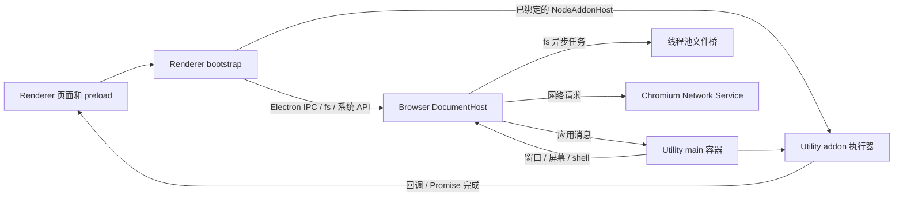

# Electron / Node 适配层架构与性能评估

本轮基线：`8fae275bbf3fc`。评估对象是现有 Chromium overlay 中的托管运行时，
包括 main/renderer bootstrap、Browser broker、Utility 容器与原生 addon 通道。
分析源码、测量工作量，再修改对应热点；不把局部函数测速等同于应用启动速度。

## 1. 当前调用链



| 层 | 现状与性能含义 |
| --- | --- |
| 源码与构建 | main 14、renderer 15、公共 2 个片段，在构建时组合成两份脚本。运行时没有逐片段加载；拆分本身不降低执行开销。 |
| Renderer | 每个受允许的文档安装独立 JS 状态。CommonJS 成功模块复用导出；删除缓存或加载失败后重新解析。同步 fs/addon 调用仍会阻塞调用页面。 |
| Browser | 管理文档和容器归属、窗口等原生能力；文件操作投递到线程池。`sendSync` 对页面保持同步，但 Browser 到 Utility 的应用消息异步转发，避免 UI 线程与原生窗口互等。 |
| Utility main | 执行应用入口和主进程 API；异步 fs 已使用线程池。独立容器保留应用生命周期和故障边界。 |
| Addon | 页面绑定直接的 `NodeAddonHost`，避免每次调用都经 Browser 业务路由。owner token、generation、弱缓存和调用期间保活共同维护对象归属。 |
| 数据传输 | 公共 IPC 使用 V8 structured clone；内部 API 和 addon 使用专用转换。二进制类型、子视图和提交时快照是数据正确性要求。 |

架构的主要成本来自同步往返、重复转换、全量缓冲和事件循环唤醒。
文件数量、函数行数不能直接作为性能指标；当前没有证据支持通过合并进程或
改变 `require` 返回契约来换取性能。

## 2. 本轮实施

### 2.1 CommonJS 热加载避免重复 URL 解析

`moduleFilenameFromSource` 原先对已经是磁盘绝对路径的父模块仍创建 `URL`，
并可能再次创建、排序 URL 映射。Windows 盘符路径会被当作 URL scheme；
POSIX 绝对路径则触发构造异常。即使模块已经缓存，仍会重复这些工作。

现在先使用当前平台的 `path.isAbsolute` 识别磁盘绝对路径，直接返回。
`file:`、`chrome:` 来源继续映射；盘符相对路径、UNC、POSIX 反斜杠文件名
分别按其平台语义处理。不新增缓存，不省略冷加载的真实路径或允许目录检查。

### 2.2 文件读写使用已有二进制通道

原生文件桥已经支持 `data` BLOB 和 `returnBytes`；main 已使用此能力。
renderer 仍把写入数据编码成 Base64、在回程解码读取结果。

renderer 改用已有字节通道，保留字符串编码、Buffer 返回类型、视图的活动范围、
提交时快照、错误与回调时序。读结果兼容旧字符串格式。此改动不修改 Mojo 接口，
不改变磁盘操作次数，不合并独立写入，也不声称实现零拷贝。

### 2.3 原生导出调用减少临时包装

普通函数调用原先在 `ConstructorProxy` 内每次创建一个包装函数，再展开并
收集一次参数，同步分支还创建立即调用的闭包。改成共享调用函数，复用公共
包装已收集的参数数组。构造流程和 `new.target` 仍由原构造包装处理。

不缓存 transport 方法；调用时仍读取当前实现。同步值、原始 Promise、异步
回退、回调和句柄保活沿用原通路。单纯缓存包装函数的试验没有稳定收益，未采用。

## 3. 后续专项的优先级

| 优先级 | 问题与证据 | 下一步与约束 |
| --- | --- | --- |
| 高 | renderer ReadStream 当前先读取完整文件；HTTP 使用 `DownloadToString` 后一次交付，上传/响应仍有 Base64。大文件会占用更多内存并延迟第一块数据。 | 先测峰值内存、首块延迟和真实文件大小；再设计分块传输、背压、取消和错误顺序，覆盖 Range/ASAR 与提前关闭。 |
| 中 | WriteStream 每个 chunk 单独调用 append_file，后端每次打开/追加/关闭文件。 | 测实际日志 chunk 分布和打开次数；若引入持有文件句柄或 writev，必须定义部分写入、错误边界、flush、轮转和关闭期间行为。 |
| 中 | 命名管道桥创建后固定每 5 ms 泵送；addon 执行器加载模块后每 10 ms 泵送，分别最多 200/100 次定时触发每秒。 | 先测空闲 CPU 与唤醒；自有管道 loop 可研究按活跃/closing handle 启停。addon 可能在返回后从外部安排任务，不能因当前 loop 空闲就停表，否则会再次出现登录/播放回调卡住。 |
| 中 | renderer 冷模块解析仍有同步 stat/realpath/read；100 包基线为 1,101 次文件 IPC。 | URL 父模块的首次重复解析在第 7 节处理。后续先按真实依赖图采样，再考虑单次解析事务合并探测；保持符号链接、重试和缓存失效检查。 |
| 已处理一层 | service 参数的额外 Clone 与 addon 逐次 INFO 日志。 | 第 7 节记录自有参数的移动转换及详细日志开关；V8/Mojo 必需的跨进程复制仍然存在。 |
| 待测 | 每个文档加载、编译完整 bootstrap；addon 参数图仍需递归、分配和复制。 | 采样编译/执行耗时与各 payload 大小后决定是否做 V8 code cache 或专用二进制优化。不得用共享上下文破坏页面隔离，也不得跳过必须的快照与保活。 |

上述定时频率是源码中的调度间隔，不是 CPU 占用率。其余优先级是根据调用链
和成本类别提出的工程判断，尚无完整 TH/PLE 启动与持续播放 profile 可用于排序。

## 4. 测量与验收方法

- 保存基线的完整 renderer bootstrap，在同一 Node 进程中对比前后版本。
- 路径和原生派发基准预热后交替多轮，报告中位数、原始样本和环境；调用计数
  与计时分开，避免计数插桩污染耗时结论。
- 文件基准校验实际传输内容、载荷大小和转换次数；真实 Chromium 再验证
  renderer → Browser → 文件桥的 Buffer/TypedArray/DataView 与异步快照。
- 执行完整 JS 契约回归、原生 IPC 回归、正式资源构建，然后复验 TH 自动登录
  与 PLE 播放。已有错误与本轮新增错误分别记录，不以“能打开”代替业务通过。
- 本机实测和日志放在 `out/ipc-architecture-perf-20260917/`；只记录状态、
  公开测试数据和计数，不记录账户凭据、二维码或用户媒体内容。

相关契约及此前验收见 [Electron_Node_适配层优化与模块约定.md](Electron_Node_适配层优化与模块约定.md)。

## 5. 本轮测量结果

Windows 宿主、Node v24.12.0。POSIX 一栏是同一宿主下的路径语义测试，
不是 Linux 实机结果。确定性计数优先于受机器负载影响的耗时。

| 工作负载 | 优化前 → 优化后 | 范围 |
| --- | --- | --- |
| 10 万次热 require，Windows 路径与 1 条 URL 映射 | URL 构造 200,000 → 0；中位 356.92 → 139.15 ms | 完整 renderer bootstrap + 模拟文件桥，5 轮交替，计数另测 |
| 10 万次热 require，POSIX 路径 | URL 构造 100,000 → 0；中位 2,170.84 → 101.78 ms | 同上，避免每次创建 Invalid URL 异常 |
| 上述文件冷/热加载 | 冷文件 IPC 4 → 4；热文件 IPC 0 → 0 | 保持冷加载校验与模块缓存行为 |
| 单次 1 MiB 文件读或写 | 字节载荷 1,398,104 → 1,048,576，约减少 25%；两端 Base64 编解码合计 2 → 0 | 不包含消息元数据；实际 Mojo 消息总长度未测 |
| 1 MiB 同步读 / 写 | 中位读 1.586 → 0.525 ms，写 1.407 → 0.429 ms | 7 轮；JS + 模拟 native 转换，不含磁盘和真实 IPC |
| 30 万次原生导出调用，1 / 3 / 16 个基础参数 | 中位 102.66 → 96.99 / 108.87 → 103.33 / 146.84 → 135.82 ms | 10 轮；仅 JS 派发，模拟同步 transport，无 native 执行时间 |

可复现命令（`before-renderer.js` 为基线生成的完整脚本）：

```text
node xenon_overlay/resources/ipc/renderer_module_resolution_benchmark.cjs before-renderer.js results.json
node --js-base-64 xenon_overlay/tools/benchmark_fs_transport.cjs before-renderer.js results.json
node xenon_overlay/tools/benchmark_native_dispatch.cjs before-renderer.js results.json
```

本轮优化没有减少 addon 同步往返次数，也未测得 TH/PLE 整体启动时间或
播放吞吐的前后变化。文件和 JS 派发的局部收益不能合并为一个应用加速百分比。

## 6. 构建与实际应用验收（2026-09-17）

- JavaScript **431/431、零跳过**；包含 TH 的真实 file-stream-rotator、PLE
  发布 bundle、真实 GC，以及本轮增加的二进制传输和路径回归。
- 原生 IPC **170/170**（排除 `XenonRealAppSmokeTest.*`）；`chrome` 与
  `ipc_main_container_unittests` 构建通过。最终 `resources.pak` 中两份脚本
  与本轮生成文件逐字一致；main 脚本仍与基线相同。
- 原用户配置、9222 启动新版。TH SDK ready、自动登录、头像加载通过；实际
  SQLite addon 的内存查询返回 1，callback 的 Statement 身份保持。
- TH、PLE 各自通过 11 项真实文件桥检查：1 MiB 逐字节回读、DataView 活动
  范围、追加范围、UTF-8、空文件、Promise 写入后修改原 Buffer 的快照、
  callback 读写、WriteStream、ENOENT 和实际二进制请求/回复标志。
  每侧记录 9 个 read_file、10 个 write/append 请求；1 MiB 写请求确为
  1,048,576 字节数据，没有 dataBase64 字段。
- PLE 播放仓库公开测试视频成功，320×180、进度 **193 → 1066 ms**、
  `errCode: 0`。本轮未重新执行真实鼠标拖动、三个菜单截图或侧栏重开验收，
  不沿用上轮用户确认作为本轮实测。清理时当前媒体已变化，保护检查没有关闭
  新媒体；没有用测试操作覆盖用户正在播放的内容。
- 验收快照未见 native FATAL、容器断连、N-API 失败或 app/window 事件失败。
  仍有已有的 nativeTheme/crypto/app API 缺口、isOnline、fetch/getContext、
  fs.watchFile/child_process.exec 和网络错误；对应固定签名在基线日志均出现。
  本轮没有修复这些兼容性缺口，也不将短期未出现的旧告警视为已解决。

结果见上述 `out` 目录中的 `runtime-result.json`、`runtime-evidence.jsonl`、
`shipping-resources.json`、`js-tests.log`、`native-tests.log` 与 `build.log`。

用户随后反馈“验证正常”。该反馈不扩写成未明确提供的逐项鼠标操作验收。

## 7. 继续排查：缓存、模块读取、参数所有权与日志

本节基线是第 6 节已验收的工作区，完整 renderer 脚本保存为
`out/ipc-architecture-perf-round2-20260917/before-renderer.js`。

### 已确认的开销及处理

- **URL 父模块的重复解析**：读取缓存时将 `file:` / `chrome:` 父来源转换为
  磁盘路径，成功加载后的写入却使用原始 URL。转换统一移到 require/resolve
  入口，内部使用相同父路径。Windows/POSIX 两种路径语义的连续 4 次加载
  文件 IPC 均从 **[4, 2, 0, 0] → [4, 0, 0, 0]**。缓存删除、包入口变更、
  执行失败、符号链接目录边界和 URL 映射变更仍重新处理。
- **CommonJS 读取遗漏**：加载器的源码读取直接调用文件桥，仍使用默认
  Base64 回复。现在请求 `returnBytes`，与上一轮普通 fs 读写使用同一已有
  二进制能力；JS、JSON 和 package.json 的内容及错误处理不变。
- **服务参数的重复深拷贝**：服务已拥有 Mojo 解码后的参数，转换到
  `NodeInvokeArg` 时再 Clone 一遍没有必要。`TakeNodeInvokeArgs` 消费自有
  值并移动其元素；异步封装仅移动 arguments 节点，保留同级的路径、方法名
  和 owner token 的借用地址。main executor 的借用参数转换继续复制。
  此处只省去服务层额外复制，不取消 renderer 提交时快照，也不宣称零拷贝。
- **高频调用日志**：上一轮实际运行日志的一次快照共 20,244 行，其中
  InvokeFunction/InvokeInstance/ConstructExport/OnNativeCallback 为 17,635 行，
  占约 **87.1%**。这四类逐次记录改为 `VLOG(1)`，按需用
  `--vmodule=xenon_node_executor=1` 启用；错误和容器/addon 生命周期日志保留。
  该比例只是日志工作量，不能解释为 CPU 或播放性能提升 87.1%。

### 继续排查发现的边界

- 管道桥拥有私有 libuv loop，可在 `uv_run` 返回无工作后停表；所有
  Listen/Connect/Write/Close 入口必须恢复泵送，尤其不能在索引为空时忽略
  pending request 与 closing handle。仍在监听的管道需要轮询以接收外部连接。
  本轮没有改动；addon 的 default/DLL loop 与 Win32 消息泵不可照搬此策略。
- Renderer HTTP 的 abort/destroy 目前只停止 JS 交付，DocumentHost 未持有
  `PerformNetworkRequest` 返回的取消句柄。main 已有实际取消及原生回归。
  后续应以本地慢速响应测量取消后残留传输字节、连接存活与 loader 数，再补齐
  request ID、文档关闭和超时取消；不将“忽略晚返回”视为下载已经停止。
- ReadStream 范围读已用生产 bootstrap 和内存 native 模拟量化：16 MiB
  文件只请求中间 64 KiB，main/renderer 都发出 1 次全文件读取，底层返回
  16 MiB、交付 64 KiB，**返回字节放大 256 倍**。`highWaterMark` 为
  16/64 KiB 时只改变交付块数 4/1；请求不携带范围。交付块共享同一个
  16 MiB backing ArrayBuffer，保留小块可能保留整块。此测量不是磁盘、
  真实 Mojo 或进程内存实测，未外推为 CPU 开销；证据和复现脚本在本轮
  `readstream-range-measurement.json`、`measure-readstream-range.cjs`。
  后续优先设计带范围的原生读取，再补齐真正分块流与取消。

### 第二轮验证

- JS **436/436、零跳过**；原生 **176/176**（仍排除两项商业应用 smoke）。
  新增原生用例验证嵌套 1 MiB BLOB 的底层存储地址保持、异步封装的元数据
  引用有效，以及真实 addon 的双入口、多个参数、构造、实例、callback 接收者
  和 pending Promise 不重复执行。
- `chrome` 和原生测试目标完整构建成功，最终 pak 脚本与生成文件一致。
  常规原生测试中四类调用日志均为 0；指定 `--vmodule` 的定向测试能再次
  输出四类日志，确认诊断开关有效。
- 新版实机 TH SDK ready、自动登录及头像正常。临时内存 SQLite 的三份
  1 MiB 参数正确返回 BLOB，逐字节核对通过，Statement.get 的返回对象和
  callback 接收者均保持同一 Statement。
- TH/PLE 的应用目录内公开模块夹具，连续 require 的文件操作均为
  **[3, 0, 0, 0]**，本地父路径别名为 0 额外操作且导出身份相同。
  这里仅计夹具自身的 stat/realpath/read，不包含已初始化的根目录探测，
  因此首次计数与独立冷 context 基准的 4 不同。临时夹具已删除。
- PLE 测试视频 320×180、进度 **201 → 1064 ms**、错误码 0；通过应用原有
  关闭 IPC 清理测试媒体，再调用原启动通路重开，页面可见且无当前媒体和
  HTML 音视频播放。这不是实际鼠标点击侧栏或拖动验收。
- 验收日志快照没有 native FATAL、容器断连、N-API 失败或 app/window
  事件失败。所对照的固定兼容性报错在上一轮日志也出现，仍未全部修复。

实机探针曾使用应用允许目录之外的夹具而被拒绝；改为应用内临时文件后通过，
没有放宽目录检查。SQLite 探针也修正了把 Database.get 返回的 Database 当作
Statement 的错误断言，最终使用 Statement.get 验证接收者；这些是探针修正，
不是生产代码的回归修复。结果保存在本轮 `runtime-evidence.jsonl` 与
`runtime-result.json`，其他证据为 `native-tests.log`、`diagnostic-levels.json`、
`module-resolution-benchmark.json` 和 `module-source-reads.json`。
